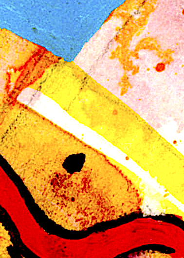
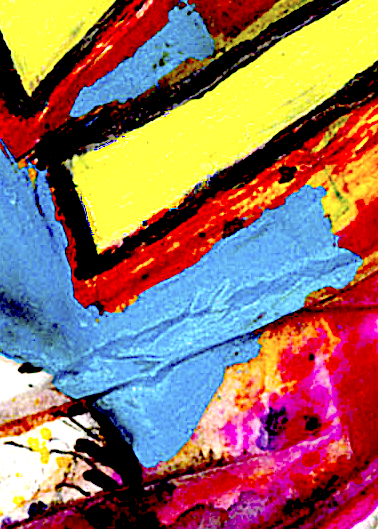

Title: About

## A Workshop-Festival of a new kind

Improtech is both a musical festival and an interdisciplinary workshop that brings together actors and actresses of research and creation from all over the world around the question of musical improvisation in interaction with digital intelligences, in an assumed approach of human-machine co-creativity.

This unparalleled event, co-organized by Ircam and French and international partners (major universities, private institutes, museums, public institutions) has already been held with undeniable success in New York (2012), Philadelphia (2017), and Athens (2019). The edition planned for Tokyo in 2021 as part of the Season of France in Japan could not be held because of the pandemic and has been postponed.

We wanted for a long time, after the American and European connections, to hold a major edition in France, and what better city than Marseille !

Improtech @ Marseille will be held from October 22 to 24, 2022 at the Palais Carli, in the beautiful spaces of the Conservatoire National Pierre Barbizet, with satellite events in the city during the week of October 17.

##An explosive alliance between Improvisation and Digital Intelligence
Improtech is dedicated to the explosive alliance between the age-old art of improvisation and the emerging cultures of digital intelligence. It fosters the co-creative dynamics that can exist between humans and machines, and in so doing, creates new meeting grounds between people, artists and audiences of all backgrounds and levels.

Exploring the relationships between music and science, composition and improvisation, writing and performance, music and other performance arts around the argument of shared creativity between human and digital devices, Improtech has established itself as one of the major events of contemporary research and creation.

In the past, Improtech has linked the French research and creation scene to a major foreign metropolis such as New York or Athens, mixing the great masters of the improvised scene with the young artists of the most original underground scenes identified in each of the host cities.

For the first time, Improtech will be centered on a major French city: Improtech @ Marseille!

## New aesthetic and social patterns
Improtech is a place for the emergence of new aesthetics linked to scientific and technological innovation, and to the way contemporary creators use them to install new social patterns of interaction and communication involving creative algorithms. With each new edition, Improtech allows the actors and the public to judge the great aesthetic, technological and sociological evolutions thanks to the impressive progress of digital intelligence, and in particular of Artificial Intelligence, at the service of the arts.

This is a rare opportunity for intercultural and interdisciplinary encounters at the junction of the arts and sciences between research and creative communities, revealing unique opportunities for new personal and institutional collaborations, to introduce a wide audience to new directions that they suspect but have very little opportunity to discover in a creative and playful setting.

The meeting also allows each time to reveal the eminent position of the chosen city in the history of the improvised scenes, in that of the intercultural relations and hybridizations, even creolisations, proper to the genre. There is little doubt that in terms of dynamism, youthful inspiration, cultural mixes, aesthetic generosity and solidarity, Improtech @ Marseille ! will be a summit in the Improtech series.

## On the Menu
Improtech includes conferences, demonstrations, workshops, musical and multi-art performances (dance, media, mixed realities), installations and concerts bringing together the world's best improvising musicians in selected venues
Artists, researchers, thinkers, students, inventors, DYI (Do It Yourself) enthusiasts come to Improtech to present their work, offer demonstrations and performances, and perform on the concert stages. The public meets personalities from major international research centers and remarkable artistic figures from contemporary, jazz, rock, electronic, traditional or underground music scenes. They are introduced to many scientific and technological fields, from computer science to anthropology, from musicology to critical studies, from philosophy to artificial intelligence, from acoustics to mixed realities.

Improtech @ Marseille ! centered on the Marseille Conservatory will focus on education and pedagogy with master classes, workshops, student projects and concerts under the direction of the great invited figures.

## The framework of Improtech
Improtech provides an exceptional platform to challenge and question individual and collective creativity, joining forces in a buzz of experimentation, teaching, performance, and exchange.
We witness the emergence of new aesthetics linked to scientific and technological innovation, and the way contemporary creators seize on it to install new social patterns of interaction and communication involving creative algorithms.
Improtech capitalizes on each edition and creates its legacy by setting up collaborations between artists and scientists and between various institutions in the partner countries. Experience shows that these collaborations are sustainable beyond the event. For example, the 5-year European research program ERC REACH brings together French, American and Japanese universities that are strongly linked to this event.

Improtech has already brought together some of the best improvisers in the world including Evan Parker, George Lewis, Steve Coleman, Bernard Lubat, Roscoe Mitchell, Geri Allen, Raphael Imbert, Vijay Iyer, Sun Ra, Steve Lehman, Rudresh Manhantappa, Bob Ostertag, Jaap Blonk, David Rosenboom, Matmos, Sylvain Luc, D.mHotep, to name a few.
Improtech was made possible thanks to the commitment of ircam, EHESS, the Onassis STEGI Center and the University of Athens, New York University, Columbia University, University of Pennsylvania, Drexel University, Institut Fançais, Sorbonne University, Région Nouvelle Aquitaine, Princeton University, CalArts, Stanford University, Hyvibe Company, Yamaha Disklavier, Université de Bordeaux, FACE, Uzeste Musical and Compagnie Lubat.

Improtech @ Marseille ! already receives the support of Ircam, the Agence Nationale de la Recherche, the European Research Council, the CNRS, the Ministry of Culture, the French Institute, Sorbonne Center for Artificial Intelligence, Conservatoire National à Rayonnement Régional Pierre Barbizet de Marseille, INSEAMM, IFAMM, ...

Improtech is an ERC REACH action supported by the European Research Council within the Horizon 2020 program (Convention No. 883313).

## The ImproTech Series

 
 

**In 2004** was held at ircam, during the 1st Sound and Music Computing Conference, a workshop on Improvisation and the Computer, that gathered the cream of musicians and researchers operating in the field. The event was a great success and it had a strong impact on the public, the musical scene - and on Ircam as well, by introducing there, for the first time at the highest level, improvisation as a major research topic and a respected field of investigation. Above all, it was a wonderful opportunity to share an exceptional artistic and scientific moment. A trace of this moment is the DVD Contact that captures the performance by David Wessel and Roscoe Mitchell, a founding member of the Art Ensemble of Chicago.

 

**In 2012**, the idea of renewing the experience came up, this time in NYC, where many of the former participants came from, emerged more than once in passionate discussions about the present state of Improvisation involving digital technologies and media. The ImproTech Paris - NYC 2012 workshop was dedicated to the exploration of contemporary bounds between musical improvisation and intelligent digital technologies. Gathering researchers and artists from both research & creation scenes, it favored the idea of using digital intelligence as a source of inspired and sophisticated creation, in a complex, creative interaction of machines with live musicians, as opposed to mere decorative electonic effects. With such venues as NYU, Columbia University and The Roulette concert hall, IK Paris-NY featured improvisation world stars s.a. Geri Allen, Steve Coleman, Roscoe Mitchell, Vijay Iyer or Bernard Lubat.

 

Five years later it was time to renew with the ImproTech workshop - festival formula, and measure the technological, aesthetical, and sociological evolutions since the last gathering. The meeting place was this time in Philadelphia which seemed a natural destination after NYC, for its unique improvised music scene and history, and its perpetual enchantment with the ever floating figures of e.g. Coltrane, Sun Ra, or McCoy Tyner. **ImproTech Paris - Philly took place at the University of Pennsylvania from Dec. 11 to Dec. 13 2017**, with concerts at The Rotunda and the Annenberg Center, and musical events at the ICA. Scholars, students, musicians, makers  came from many places in europe and the US to talk about their work, demo, teach and perform. IK Paris-Philly  flourished on the explosive encounter of prominent research labs and scholars, well established musical figures of Jazz and contemporary music, and the young avant-garde / underground scene of Philadelphia and surroundings.

 

**Improtech 2019** gathers scholars, researchers, musicians, makers, around the idea of **musical improvisation in interaction with digital intelligence**, taking note of the important development of this new creative field.
ikPA'19 creates a link between the european and worlwide research and creation scenes through the symbolic matching of  Paris, where the event [originated at Ircam](http://recherche.ircam.fr/equipes/repmus/SMC04/), and an other emblematic city. **This year Paris will connect with Athens**, in a powerful arc between science and the art of improvisation, after the  [Paris - Philadelphia edition](http://ikparisphilly.ircam.fr) last year, and the [Paris - New-york edition](http://repmus.ircam.fr/improtechpny) a few years ago.

It is thus a unique opportunity for intercultural and interdisciplinary encounters among international research and creation communities.

ImproTech is being held in 2019 with the support of [Onassis STEGI](https://www.onassis.org/onassis-stegi) and the [University of Athens](https://en.uoa.gr/) (UOA), in addition to the workshop's founding organisms, to allow the public to observe the aesthetic, technological and sociological developments that have taken place since previous editions.
This meeting point in the heart of the  Hellenic capital is a stimulating destination because of the city's young and lively improvisation scene, the many men and women who promote research in music science and technology in the Greek universities, and of course the central position of Greek culture in the history of improvised music, from its practice to its theory.

Scholars, students, musicians, will come from many places in world to talk about their work, demo, teach and perform. **iikPA'19** will flourish on the explosive encounter of prominent research labs and scholars, well established musical figures of Jazz, contemporary music, traditional music from the mediterranean area, and the  avant-garde scene of Greece .

**ikPA'19** will combine, around the central theme of improvisation, a great diversity of aesthetic approaches while convening artists and experts covering many knowledge fields, including computer music, artificial intelligence, robotics, musicology / ethno-musicology, philosophy / anthropology, critical studies, acoustics and signal processing.
