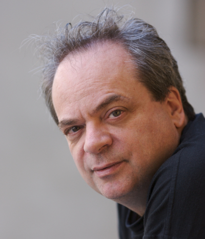

title: Bios

### Improtech Paris-Philly 2017 Participants

---

**Roscoe Mitchell** has been an icon and leader in jazz music and contemporary music for over 40 years. An internationally renowned musician, composer, and innovator, Mr. Mitchell began his distinguished career in the spirited 1960s of Chicago, Illinois. His role in the resurrection of long neglected woodwind instruments of extreme register, his innovation as a solo woodwind performer, and his reassertion of the composer into what has traditionally been an improvisational form have placed him at the forefront of contemporary music for over four decades. A flagship in the field of avant-garde jazz and contemporary music, Mr. Mitchell is a founding member of the world renowned Art Ensemble of Chicago, the Association for the Advancement of Creative Musicians (AACM), and many music ensembles. Mr. Mitchell has recorded over 100 albums and has written hundreds of compositions. His compositions and improvisations range from classical to contemporary, from wild and forceful free jazz to ornate chamber music. Roscoe Mitchell has pursued a long lasting collaboration with [David Wessel (1942-2014)](http://senate.universityofcalifornia.edu/_files/inmemoriam/html/DavidL.Wessel.html) in free-form improvisational works featuring David's custom-designed controller/computer system alongside Roscoes instrumental developments. David and Roscoe gave historical duet performances in two previous Improtech Series Workshop-Festival : in 2004 during the [Sound and Music Computing Conference](smc04.ircam.fr) at Ircam, and in 2012 at the [Improtech Paris - New York](http://repmus.ircam.fr/improtechpny) Workshop.
This Workshop and concerts are dedicated to the memory of David Wessel.  

---

Recently lauded in The New York Times as an “avatar of experimental music,” **David Rosenboom** is a composer-performer, interdisciplinary artist, author and educator, who over five decades has explored the spontaneous evolution of musical forms, multidisciplinary composition and performance, unique languages for improvisation, cross-cultural collaborations, performance art and literature, interactive multi-media and new instrument technologies, art-science research and philosophy, and extended musical interface with the human nervous system. His wide-ranging work is broadly distributed and presented around the world. He holds the Richard Seaver Distinguished Chair in Music at California Institute of the Arts where he is also Dean of The Herb Alpert School of Music. David Rosenboom is author of influential books such as Biofeedback and the Arts, Extended Musical Interface with the Human Nervous System and many articles and monographs. Rosenboom is a Yamaha Artist.  "David Rosenboom ... has become one of the leading lights of interactive computer composition." (The Village Voice). *Photograph by Scott Groller*.  
[www.davidrosenboom.com](http://www.davidrosenboom.com)  

---

**Bob Ostertag** : Composer, performer, historian, instrument builder, journalist,
activist, kayak instructor, Bob Ostertag's work cannot easily be
summarized or pigeon-holed. He has published more than twenty
CDs of music, two DVDs, and five books. His writings on
contemporary politics have been published on every continent and
in many languages. Electronic instruments of his own design are at
the cutting edge of both music and video performance technology.
He has performed at music, film, and multi-media festivals around
the globe. His radically diverse collaborators include the Kronos
Quartet, postmodernist John Zorn, heavy metal star Mike Patton,
transgender cabaret start Justin Vivian Bond, British guitar
innovator Fred Frith, Quebecois film maker Pierre Hébert, EDM star
Rrose, jazz legend Anthony Braxton and many others. He is rumored to have connections to the
shadowy media guerrilla group The Yes Men. He is currently a
professor at the University of California at Davis.
Ostertag began his musical career in 1978, touring Europe with jazz great Anthony Braxton,
playing a keyboard-less modular analog synthesizer. He was not the first person to take a
modular synthesizer on stage, but he was the first person to center his musical practice in a
scene of “free improvisors” using a modular synth as his main ax.
In 1979 he settled in New York City and became a key part of the late 1970s “downtown”
scene along with John Zorn and Eugene Chadbourne. He left music for most of the 1980s and
immersed himself in the Central American revolutionary movements of the time. His goodbye
to the Salvadoran revolution, a composition titled “Sooner or Later,” is considered a classic of
electronic music.
His 2012 book (co-authored with Jane McAlevey) on labor unions in the US was named by
The Nation as “the most important book of 2012.”
The Wire called his previous book, Creative Life, “the most lucid philosophical work on music,
culture, and politics since Steve Reich’s Writings on Music.”  
[bobostertag.wordpress.com/](https://bobostertag.wordpress.com/)

---

**LaDonna Smith** is an American violinist, violist, vocalist, teacher, and musical impresario. A veteran of the Alabama’s legendary Surrealist scene, she has spent four decades pioneering and promoting the field of free improvisation as an art-form capable of ecstatic and explosive emotions, clarity, lyricism and raw human expression. With her highly personal solo style of instant composition and extended techniques, Smith has enjoyed collaborations with fellow improvisers in hundreds of concerts across North America, Europe (including Russia and Siberia), China, Japan and India. Likewise, she has produced many festivals and concerts in her home territory of Birmingham, Alabama, serving as a local outpost for improvised music in the deep South. Co-founded with her longtime duo partner Davey Williams, her TransMuseq record label and The Improviser (an international journal of free improvisation) produced trailblazing documentation and discussion of the emerging free improv idiom. She has performed with Anthony Braxton, Peter Brotzmann, Derek Bailey, Evan Parker, Peter Kowald, Henry Kaiser, John Zorn, Andrea Centazzo, Dave Liebman, Anne LeBaron, Misha Feigin, Shaking Ray Levis, Rova Saxophone Quartet, and Susan Alcorn. Her discography includes recordings on Ictus, Tzadik, Table of the Elements, Leo Records, Meniscus, and Ishtar.  
[ladonnasmith.com](http://ladonnasmith.com)

---

**Susan Alcorn**. One of the world’s premiere musical innovators on her instrument, Baltimore-based Susan Alcorn has taken the pedal steel guitar far beyond its traditional role in country and western swing music. Known among steel guitarists for her virtuosity and authenticity in a traditional context, Alcorn first paid her dues in Texas country & western bands. Soon she began to expand the vocabulary of her instrument through her study of modern classical music (Messiaen, Varèse, Penderecki), the deep listening of Pauline Oliveros, Astor Piazzolla’s nuevo tango, free jazz, and world musics (Indian rags, South American songs, and gamelan orchestra). Her pieces reveal the complexity of her instrument and her musical experience while never straying from a very direct, intense, and personal musical expression. Though primarily a solo performer, Alcorn has collaborated with numerous artists including Pauline Oliveros, Evan Parker, Eugene Chadbourne, Peter Kowald, Chris Cutler, Ellen Fullman, Le Quan Ninh, Sean Meehan, Joe McPhee, LaDonna Smith, Mike Cooper, Jandek, Fred Frith, Maggie Nicols, and Mary Halvorson.
[www.susanalcorn.net/](http://www.susanalcorn.net/)

---

**Matmos** is M.C. Schmidt and Drew Daniel, aided and abetted by many others. Currently based in Baltimore, the duo formed in San Francisco in the mid 1990s. Marrying the conceptual tactics and noisy textures of object-based musique concrete to a rhythmic matrix rooted in electronic pop music, the two are known for their highly unusual sound sources: amplified crayfish nerve tissue, the pages of bibles turning, liposuction surgery, rat cages, a cow uterus, snails, cigarettes, laser eye surgery, latex fetish clothing, life support systems, a five gallon bucket of oatmeal, and a washing machine. Matmos’ work presents a model of electronic composition as a relational network that connects sources and outcomes together; information about the process of creation activates the listening experience, providing the listener with entry points into sometimes densely allusive, baroque recordings. Matmos have released over ten albums on labels such as Matador and Thrill Jockey. They also have a history of rich collaborations with artists like Bjork, Antony, So Percussion, Terry Riley, The Kronos Quartet, David Tibet, Rachel’s, Zeena Parkins, and the Princeton Laptop Orchestra, Daria Martin, Young Jean Lee, and Ayman Harper. Outside Matmos, Schmidt and Daniel have also performed in Baltimore’s High Zero festival and engaged countless collaborators across the American underground and beyond for more than 20 years.  
[vague-terrain.com/](http://vague-terrain.com/)

---

Born in Uzeste in 1945, **Bernard Lubat**, pianist, vibraphonist, keyboard and accordion player, singer, composer and actor, began studying piano in 1957, attending the Bordeaux Conservatory where he discovered the drums, jazz and Milt Jackson. In 1961, he entered the Paris Conservatory where in 1963 he was awarded the prize for best percussionist. He was then taken on by the Jef Gilson Orchestra (1965) where he came into contact with Michel Portal, Bernard Vitet, François Jeanneau, Jean-Louis Chautemps, Henri Texier… He worked with Jean-Luc Ponty and Martial Solal, as a vibraphonist and for Stan Getz and Eddy Louiss as a drummer. At the same time he worked in contemporary music with Diego Masson, playing Varèse, Bartok, Xenakis, he took part in the premier of Luciano Berio's work Chemin 2 at the Scala de Milan and in the recording of Laborintus. In 1975, he established a group with André Ceccarelli, Marc Bertaux and Tony Bonfils. In 1978, he went on to set up the Festival Uzeste Musical (summer festival) and the Compagnie Lubat, a group with a changeable number of players. At the beginning of the 90s, he launched the festival de printemps and the festival d'hiver set up in cooperation with the Cie Lubat artists with Laure Duthilleul (actress), André Minvielle (singer and musician) and Patrick Auzier (musician and  firework designer) and the publishing house, Les Editions du Tilleul, for the production of CDs. Bernard Lubat and his company tour all over France and abroad. He has also been a musical expert working on the OMax/ImproteK/Djazz project in collaboration with IRCAM and EHESS.  
[www.cie-lubat.org/](http://www.cie-lubat.org/)
&nbsp;

---

Born in Madagascar, **Jean-Charles Razanakoto** aka **Charles Kely Zana-Rotsy** began to sing at age 5 and to play the guitar at age 8 in the family band. He started to play on stage at age 11. He received attention because of his open tuning playing and his first hit was the song "Ifarakely" that he composed in a rock/folk style. His international career began when he joined the group of Malagasy zither player Rajery, and followed up with his collaboration with female singer from Tchad Mounira Mitchala. He has been twice the recipient of the RFI Award (Radio France International) in 2003 with Rajery and in 2009 with Mounira. His first solo album "Anilanao" was published in 2003, and his second "Zoma Zoma" in 2011. He has toured in USA and Canada and played many times in France at the Festival Musiques Métisses and in Europe. Graduate from the jazz school ARPEJ in Paris, he has collaborated with musicians such as the late Régis Gizavo and the Hot Club Madagascar with Erick Manana. He has been involved for two years in the Djazz project with EHESS and IRCAM.  
[youtube](https://www.youtube.com/channel/UCE84sS_mHBOPmjN31V7BfRw)

&nbsp;

---

**Marc Chemillier** was born in 1960 and began studying jazz piano in 1971 with Jack Diéval and Pierre Cornevin at the Schola Cantorum in Paris. Later he received a PhD in Computer Science and also has degrees in Mathematics, Musicology, Philosophy and Anthropology. He has been conducting fieldwork among the Nzakara of Central African Republic to study their harp music, and in Madagascar to work on the ethnomathematics of divination, and the trance music of the zither. Now Director of Studies at the EHESS in Paris (School for Advanced Studies in Social Sciences), his main interests focus on the design of a family of improvisation softwares in collaboration with IRCAM (OMax/ImproteK/Djazz), and their use in real live performances to study the impact of such devices in the social context of jazz concerts or traditional music rituals.  
[improtekjazz.org](http://improtekjazz.org)  
[digitaljazz.fr](http://digitaljazz.fr)
        

---

**Pierre Couprie** was born in 1970, he studied instrumental composition, electroacoustic music, musical analysis, and free improvisation at Bordeaux Conservatory. He is an associate professor in digital pedagogy/computer music and a researcher at Sorbonne University (Research Institute in Musicology Lab). His research fields are the musical analysis and the representation of electroacoustic music. He also develops tools for research (iAnalyse, EAnalysis) or musical performance. In 2015, he won the Qwartz Max Mathews Price of technological innovation for his musical analysis software. As an improviser, he is a member of The Phonogénistes and The National Electroacoustic Orchestra (ONE).  
[www.pierrecouprie.fr](http://www.pierrecouprie.fr)  
[logiciels.pierrecouprie.fr](http://logiciels.pierrecouprie.fr)
   

---

**Adrien Mamou-Mani** is the CEO and co-Founder of HyVibe. Prior to creating HyVibe, he was the lead researcher for the Ircam Instrumental Acoustics team and the professor in musical acoustics at Paris Conservatoire. He holds a PhD in Acoustics and Mechanics from the University Pierre et Marie Curie (Paris) and has been a post-doctoral researcher at the Paris Philharmonic Museum and at the Open University Acoustics Laboratory (United Kingdom) as Newton Fellow. Adrien is recognized as a world expert in vibration and control of musical instruments. His instrument prototypes have been used by classical and contemporary soloists in Europe and South America, and have inspired composers to write dedicated pieces for them.  
[hyvibe.audio/](http://hyvibe.audio/)  
 

---

   

---

     
  
     

