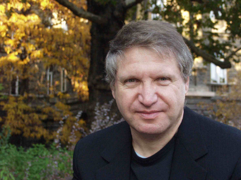

title: Participants

---

[TOC]

---

####Susan Alcorn
One of the world’s premiere musical innovators on her instrument, Baltimore-based Susan Alcorn has taken the pedal steel guitar far beyond its traditional role in country and western swing music. Known among steel guitarists for her virtuosity and authenticity in a traditional context, Alcorn first paid her dues in Texas country & western bands. Soon she began to expand the vocabulary of her instrument through her study of modern classical music (Messiaen, Varèse, Penderecki), the deep listening of Pauline Oliveros, Astor Piazzolla’s nuevo tango, free jazz, and world musics (Indian rags, South American songs, and gamelan orchestra). Her pieces reveal the complexity of her instrument and her musical experience while never straying from a very direct, intense, and personal musical expression. Though primarily a solo performer, Alcorn has collaborated with numerous artists including Pauline Oliveros, Evan Parker, Eugene Chadbourne, Peter Kowald, Chris Cutler, Ellen Fullman, Le Quan Ninh, Sean Meehan, Joe McPhee, LaDonna Smith, Mike Cooper, Jandek, Fred Frith, Maggie Nicols, and Mary Halvorson.
 
[www.susanalcorn.net](http://www.susanalcorn.net)

---

####Camae Ayewa 
is an interdisciplinary artist based in Philadelphia. Moor Mother (Goddess) is her low fi/dark rap/chill step/ blk girl blues/witch rap/coffee shop riot gurl songs/southern girl dittys/black ghost songs/love chants/african warrior spells/kongo hoodoo/holly hill Mississippi root jams/project housing bop/baptism jazz/quantum futurism/anthropology of conscience/superdefstar gospel/Lima dream music/slaveship punk/soultronic beats/death poems project, with which she has toured worldwide and performed at numerous festivals – sharing the stage with King Britt, Islam Chipsy, Claudia Rankine and many others.  As a soundscape artist, her work has been featured at Samek Art Museum, Metropolitan Museum of Art Chicago, Vox Populi, Moogfest, and Everson Museum of Art. Camae is also a singer in punk band The Mighty Paradocs, the voice of the liberation-minded free unit Irreversible Entanglements, and the co-founder of Rockers! Philly – a 10-year long running event series and festival focused on marginalized artists. As a workshop facilitator, she works with youth-centered programs, non profits, and shelters. As a curator of fundraising events, Camae has worked with and serves on the board of Girls Rock Philly, and is a partner at Black Quantum Futurism (with Rasheedah Phillips). Camae is also a poet and author of the forthcoming poetry book Fetish Bones, and is an avid zinemaker, noise therapist, and collector. (📷 Melanie Marsman) 
 
[Pitchfork profile](https://pitchfork.com/features/rising/9968-moor-mother-hardcore-poet/) / [Black Quantum Futurism](https://www.blackquantumfuturism.com) / [Irreversible Entanglements](http://www.intlanthem.com/releases/iarc0014)

---

####Georges Bloch
composer and researcher, got an engineering degree before studying composition in U. C. San Diego (PH. D. in 1988). His compositions revolve around three centers of interest: music and space, interaction and collaboration with other artists. He is Associate professor at Strasbourg University and was instrumental in developing Tonmeister cursus in France, in Strasbourg and in Paris Conservatoire. Because of his interest for opera, he has been linked to music-theater productions as well as studies in film music. As researcher associated to Ircam in Paris, he actually works on the OMax/Somax/DYCI2 family of computer–assisted improvisation systems.
    

---

####Marc Chemillier 
was born in 1960 and began studying jazz piano in 1971 with Jack Diéval and Pierre Cornevin at the Schola Cantorum in Paris. Later he received a PhD in Computer Science and also has degrees in Mathematics, Musicology, Philosophy and Anthropology. He has been conducting fieldwork among the Nzakara of Central African Republic to study their harp music, and in Madagascar to work on the ethnomathematics of divination, and the trance music of the zither. Now Director of Studies at the EHESS in Paris (School for Advanced Studies in Social Sciences), his main interests focus on the design of a family of improvisation softwares in collaboration with IRCAM (OMax/ImproteK/Djazz), and their use in real live performances to study the impact of such devices in the social context of jazz concerts or traditional music rituals.
 
[improtekjazz.org](http://improtekjazz.org) / [digitaljazz.fr](http://digitaljazz.fr)
    

---

####Pierre Couprie 
was born in 1970, he studied instrumental composition, electroacoustic music, musical analysis, and free improvisation at Bordeaux Conservatory. He is an associate professor in digital pedagogy/computer music and a researcher at Sorbonne University (Research Institute in Musicology Lab). His research fields are the musical analysis and the representation of electroacoustic music. He also develops tools for research (iAnalyse, EAnalysis) or musical performance. In 2015, he won the Qwartz Max Mathews Price of technological innovation for his musical analysis software. As an improviser, he is a member of The Phonogénistes and The National Electroacoustic Orchestra (ONE).
 
[www.pierrecouprie.fr](http://www.pierrecouprie.fr)  / [logiciels.pierrecouprie.fr](http://logiciels.pierrecouprie.fr)
  

---

####Max Eilbacher
is an intermedia artist who works primarily with sound, video, and performance. His sound practice draws upon European traditions of electroacoustic and musique concréte composition. With his sound and performance work, he utilizes the computer as an instrument, instigator, and collaborator to create process intensive music and compositions. This relationship with technology is a mix of conceptual and intuitive practices employed with the aim of creating systems that produce complex patterns, interesting timbres, and bewildering performances. He has created work at EMS in Stockholm and the INA GRM in Paris. His music has been released by Northern Spy, NNA Tapes, Spectrum Spools(Editions Mego), and Anomia. He has toured extensively performing and showing in venues, clubs, museums, galleries, and basements all over North America and Europe.His video work focuses around structural dialogues, damaged narratives and psychedelic animations. More recently, Eilbacher has collaborated with electronic musicians, Matmos to create a reinterpretation of John Sanborn and Robert Ashley's Opera for Television “Perfect Lives” which Premiered at Issue Project Room (NYC) and was performed at the Barbican, The Pompidou and The Unsound Festival in Krakow Poland . Other recent projects include playing bass and electron   ics Horse Lords, an instrumental quartet have been featured in New York Times and National Public Radio. His solo music focuses on the abstract side of electronic music and composition. 
 
[www.maxeilbacher.com](http://www.maxeilbacher.com) / [www.horselords.info/strobe.html](http://www.horselords.info/strobe.html)
 

---

####Flannery Cunningham
Composer Flannery Cunningham is fascinated by illusion and auditory perception, the expressivity of voices, and the performative possibilities of interactive electronics.  She aims to write music that surprises and delights.  Among others, she has been commissioned by Sopraltus of the MacPhail Institute, the Minnesota Center Chorale, the Cornell University Chorus, and the College of St. Benedict/St. John’s University.  She has written dramatic works including an oratorio about the 6th-century Irish monk St. Brendan the Navigator and a (pre-Hamilton) opera about the Burr-Hamilton duel.  An active poet, Flannery often writes her own texts and libretti.  She is attracted to both the very old and very new; she has presented on the 14th-century master and fellow poet-composer Guillaume de Machaut at the 48th International Medieval Congress and performed with Cork-based electronic ensemble CAVE at the 2014 International Computer Music Conference.  In addition to acoustic ensembles she writes for live players with real-time electronics, always striving to create an environment that foregrounds the skills and musical voice of the performer. Flannery has also scored, performed, and sound designed for theatrical and dance productions in Oxford, UK and New York. She holds a BA from Princeton University, an MA from University College Cork as a Mitchell Scholar, an MA from Stony Brook University, and is currently pursuing a PhD in composition at the University of Pennsylvania as a Benjamin Franklin Fellow. [flannerycunningham.com](http://flannerycunningham.com)

---

####Ken Deguernel
is a Ph.D. student in computer music, co-supervised by  Emmanuel Vincent (Inria) and Gérard Assayag (IRCAM), whose subject is learning  of musical structures in the context of improvisation. He holds a Master's degree in mathematical engineering from the French National Institute of Applied Sciences, a Master’s degree in theoretical computer science from the University of Rouen and a Master’s degree in acoustic, signal processing, and informatics applied to music from IRCAM. His research interests include music informatics, formal language theory, automata and semigroups theory, probabilistic models and musicology. In particular, his current work focuses on the understanding, the analysis and the modelling of the creative processes activated by musicians during improvisations.
 
[https://members.loria.fr/KDeguernel/](https://members.loria.fr/KDeguernel/)

---

####Melanie Farley 
is a multimedia poet living in Philadelphia. She is the author of things we have in writing *POEMS for (Z)* (dancing girl press, 2016), and you can find her work in a few online magazines like *ENTROPY* and *NAIL V.* In 2015 she conceptualized and founded *SOUND:POETREE:: Fanzine*, an online zine that released 4 issues of cross-genre work by experimental artists from around the world. Her recent work includes a self released EP called *Sound/Voice* that marries poetry and various digital and acoustic tools to better understand what it means to be embodied or human, to wonder whether a cyborg can cry. She has an MFA in Writing from California College of the Arts. [poetforsale.com](http://poetforsale.com)
 
 

---

####Jeff Gregorio
is a PhD candidate at Drexel University, studying Electrical and Computer Engineering under Dr. Youngmoo Kim in the Expressive and Creative Interaction Technologies (ExCITe) Center and the Music & Entertainment Technology lab (MET-lab). His research focuses on various facets of musical expression—how it can be defined, recognized, and quantified for applications in next generation musical instruments and music recommendation systems. He is also an avid musician and multi-instrumentalist. In 2016-17 he was supported by a grant from the John S. and James L. Knight Foundation for tech enhanced music performance, which resulted in collaborative development of a system of wirelessly-communicating, electromagnetically-actuated acoustic drums with ExCITe artist in residence Peter English. In 2017 he was awarded a Philadelphia Geek Award for ”Maker of the Year” for this work. He was also a recipient of the National Science Foundation Graduate STEM Fellowship in K-12 Education (GK-12).  
[www.met-lab.org/jeff-gregorio](http://www.met-lab.org/jeff-gregorio)
 

---

####Sandy James
teaches music technology and is in charge of labs, smart classrooms and computers at the Boyer College of Music and Dance, Temple University. Before Temple, she worked in the commercial software industry as a developer and analyst. Sandra has a Masters in Sonic Arts from University of Rome, Tor Vergata, a Bachelor degree in Computer Science from Temple University, and a Certificate in painting from the Pennsylvania Academy of the Fine Arts. She studied Latin Percussion at Philadelphia’s Latin American Music Association (AMLA), and has studied privately in Cuba and Panamá. Sandra uses a combination of analog sound synthesis and computer AV synthesis for her installations, fixed media pieces and performances. She has built some of her own synthesizers and modules, and has presented pieces created in Csound, Flash, pd, POVRay, Blender and Max / MSP. Sandra has presented papers on custom MIDI and OSC control at the Sorbonne in Paris, France, and the joint College Music Society/ATMI annual meeting in Minnesota. [www.sandrajamesart.com](http://www.sandrajamesart.com)
 

---

####KEROAÄN
is a collaborative research project between **IAN M FRASER and REED EVAN ROSENBERG** exploring composition of electronic music by an artificial intelligence. Pieces are diffused in real time with no human intervention whatsoever as the machine agent manipulates the qualities of chosen non-standard synthesis and microsound techniques. In live diffusions, the machine agent additionally controls laser apertures and an array of strobe lighting which collectively act as a visual projection of the agent's internal state as it structures the performance. A distinctly non-human logic pervades the resultant arrangements of chaotic sounds and high-intensity lighting, presenting an immersive, alien environment.
 
Ian M Fraser (b. 1980) resides in New York. [ianmfraser.com](http://ianmfraser.com)
 
Reed Evan Rosenberg (b. 1986) resides in New Jersey. [kickedrotor.tumblr.com](http://kickedrotor.tumblr.com)
 

---

####Mari Kimura
is a violinist/composer and a leading figure in the field of interactive computer music. As a violinist, Mari is renowned for her mastery of subharmonics—the production of pitches that sound up to an octave below the violin’s lowest string—as well as for her dynamic performances as an improviser and her premieres of many notable compositions by today’s composers, including Luciano Berio and Salvadore Sciarrino, as well as a soloist with such major orchestras including the Tokyo Symphony and the Hamburg Symphony. She has received numerous awards and grants including a Guggenheim Fellowship, a Fromm Commission Award, a residency at IRCAM, and at the Rockefeller Brothers Fund. She is active in the development of a prototype motion sensor “Mugic” for interactive computer music performance, and she is the founding chair of Future Music Lab at the Atlantic Music Festival.  Her latest solo album “Voyage Apollonian” (Innova Recordings) includes her recent works for violin and motion sensor “Mugic”.  A graduate faculty at Juilliard since 1998, this year, Mari was appointed as a Full Professor of Music at the “Integrated Composition, Improvisation, and Technology” program (ICIT) at the University of California, Irvine.
 
[www.marikimura.com](http://www.marikimura.com)  / [www.marikimura.com/videos.html](http://www.marikimura.com/videos.html)

---

####György Kurtag Jr
Arts&Sciences Coordinator in SCRIME at Université de Bordeaux, György KURTAG Jr is Composer, Performer. Researcher in innovative teaching methods of digital musical instruments. Fascinated by the musical behavior, the motivation of his works is inspired by the Collective Intelligence theory. His research include both analysis and capture of performer’s new musical gestures. He is taking part in developing the Méta-Mallette (Puce-Muse - Paris), the Continuator Project (Sony C.S.L - Paris), Dolabip (SCRIME-Bordeaux), Midi controller for Guitar by Shadow (Germany). 
In the 1980s, he followed his mentor, Peter Eötvös to IRCAM (Paris), where he has collaborated with some of the most influential American researchers-composers in the computer music such as John Chowning, Tod Machover, George E. Lewis and David Wessel.  
All these expériences inspired him to create his own musical and digital universe.
 
[www.dailymotion.com/video/x1vrmwd](http://www.dailymotion.com/video/x1vrmwd) / [www.youtube.com/watch?v=MJ8Z5skovLw](https://www.youtube.com/watch?v=MJ8Z5skovLw) / [www.youtube.com/watch?v=M3Tr8mSDYl8](https://www.youtube.com/watch?v=M3Tr8mSDYl8)

---

####Steve Lehman
Described as “a state-of-the-art musical thinker” and a "dazzling saxophonist,” by The New York Times, Steve Lehman (b. New York City, 1978) is a composer, performer, educator, and scholar who works across a broad spectrum of experimental musical idioms. Lehman’s pieces for large orchestra and chamber ensembles have been performed by the International Contemporary Ensemble (ICE), So Percussion, Kammerensemble Neue Musik Berlin, the JACK Quartet, the PRISM Saxophone Quartet, and the Talea Ensemble. His recent recording, Mise en Abîme (Pi, 2014) was called the #1 Jazz Album of the year by NPR Music and The Los Angeles Times. And his previous recording, Travail, Transformation & Flow (Pi, 2009), was chosen as the #1 Jazz Album of the year by The New York Times. 
The recipient of a 2015 Guggenheim Fellowship and a 2014 Doris Duke Artist Award, Lehman is an alto saxophonist who has performed and recorded nationally and internationally with his own ensembles and with those led by Anthony Braxton, Vijay Iyer, Jason Moran, Georgia-Anne Muldrow, George Lewis, Meshell Ndegeocello, and High Priest of Anti-Pop Consortium, among many others. 
Lehman received his B.A. (2000) and M.A. in Composition (2002) from Wesleyan University where he studied under Anthony Braxton, Jay Hoggard, and Alvin Lucier, while concurrently working with Jackie McLean at the Hartt School of Music. He received his doctorate with distinction in Music Composition from Columbia University (2012), where his principal teachers included Tristan Murail and George Lewis. 
He is currently a Professor of Music at The California Institute of the Arts, and lives in Los Angeles.
 
[www.stevelehman.com](http://www.stevelehman.com/)

---

####Bernard Lubat
Born in Uzeste in 1945, Bernard Lubat, pianist, vibraphonist, keyboard and accordion player, singer, composer and actor, began studying piano in 1957, attending the Bordeaux Conservatory where he discovered the drums, jazz and Milt Jackson. In 1961, he entered the Paris Conservatory where in 1963 he was awarded the prize for best percussionist. He was then taken on by the Jef Gilson Orchestra (1965) where he came into contact with Michel Portal, Bernard Vitet, François Jeanneau, Jean-Louis Chautemps, Henri Texier… He worked with Jean-Luc Ponty and Martial Solal, as a vibraphonist and for Stan Getz and Eddy Louiss as a drummer. At the same time he worked in contemporary music with Diego Masson, playing Varèse, Bartok, Xenakis, he took part in the premier of Luciano Berio's work Chemin 2 at the Scala de Milan and in the recording of Laborintus. In 1975, he established a group with André Ceccarelli, Marc Bertaux and Tony Bonfils. In 1978, he went on to set up the Festival Uzeste Musical (summer festival) and the Compagnie Lubat, a group with a changeable number of players. At the beginning of the 90s, he launched the festival de printemps and the festival d'hiver set up in cooperation with the Cie Lubat artists with Laure Duthilleul (actress), André Minvielle (singer and musician) and Patrick Auzier (musician and  firework designer) and the publishing house, Les Editions du Tilleul, for the production of CDs. Bernard Lubat and his company tour all over France and abroad. He has also been a musical expert working on the OMax/ImproteK/Djazz project in collaboration with IRCAM and EHESS.
 
[www.cie-lubat.org](http://www.cie-lubat.org)

---

####Rudresh Mahanthappa
Hailed by Pitchfork as “jaw-dropping… one of the finest saxophonists going,” alto saxophonist, composer and educator Rudresh Mahanthappa is widely known as one of the premier voices in jazz of the 21st century.  
He has over a dozen albums to his credit, including the acclaimed Bird Calls, which topped many critics’ best-of-year lists for 2015 and was hailed by PopMatters as “complex, rhythmically vital, free in spirit while still criss-crossed with mutating structures.”   
Rudresh has been named alto saxophonist of the year for six of seven years running in Downbeat Magazine’s International Critics’ Polls (2011-2013, 2015-2017), and for five consecutive years by the Jazz Journalists’ Association (2009-2013) and again in 2016. He won alto saxophonist of the year in the 2016 JazzTimes Magazine Critics’ Poll and was named the Village Voice’s "Best Jazz Artist" in 2015.  He has also received the Guggenheim Fellowship and the Doris Duke Performing Artist Award, among other honors, and is currently the Anthony H. P. Lee ’79 Director of Jazz at Princeton University.  
His newest album “Agrima” is considered to be one of the top jazz releases of 2017. Photograph © Ethan Levitas.  
 
[http://rudreshm.com](http://rudreshm.com)
      

---

####Adrien Mamou-Mani
is the CEO and co-Founder of HyVibe. Prior to creating HyVibe, he was the lead researcher for the Ircam Instrumental Acoustics team and the professor in musical acoustics at Paris Conservatoire. He holds a PhD in Acoustics and Mechanics from the University Pierre et Marie Curie (Paris) and has been a post-doctoral researcher at the Paris Philharmonic Museum and at the Open University Acoustics Laboratory (United Kingdom) as Newton Fellow. Adrien is recognized as a world expert in vibration and control of musical instruments. His instrument prototypes have been used by classical and contemporary soloists in Europe and South America, and have inspired composers to write dedicated pieces for them.
 
[hyvibe.audio](http://hyvibe.audio)  
 

---

####Matmos
is **M.C. Schmidt and Drew Daniel**, aided and abetted by many others. Currently based in Baltimore, the duo formed in San Francisco in the mid 1990s. Marrying the conceptual tactics and noisy textures of object-based musique concrete to a rhythmic matrix rooted in electronic pop music, the two are known for their highly unusual sound sources: amplified crayfish nerve tissue, the pages of bibles turning, liposuction surgery, rat cages, a cow uterus, snails, cigarettes, laser eye surgery, latex fetish clothing, life support systems, a five gallon bucket of oatmeal, and a washing machine. Matmos’ work presents a model of electronic composition as a relational network that connects sources and outcomes together; information about the process of creation activates the listening experience, providing the listener with entry points into sometimes densely allusive, baroque recordings. Matmos have released over ten albums on labels such as Matador and Thrill Jockey. They also have a history of rich collaborations with artists like Bjork, Antony, So Percussion, Terry Riley, The Kronos Quartet, David Tibet, Rachel’s, Zeena Parkins, and the Princeton Laptop Orchestra, Daria Martin, Young Jean Lee, and Ayman Harper. Outside Matmos, Schmidt and Daniel have also performed in Baltimore’s High Zero festival and engaged countless collaborators across the American underground and beyond for more than 20 years.
 
[vague-terrain.com](http://vague-terrain.com)
 

---

####Katarina Miljkovic
Composer Katarina Miljkovic investigates interaction between science, music and nature through collaborative musical performance. This interest led her to the mathematician Benoit Mandelbrot’s essay *The Fractal Geometry of Nature* and self-similar complex structures resulting in the cycle, *Forest*, “…a dreamy piece, along the lines of Feldman or Brown…entirely captivating” *(Signal to Noise)*.  
In collaboration with *Wolfram Research*, Miljkovic has been working on sound mapping of the elementary rules from Stephen Wolfram’s New Kind of Science. She presented her exploration in this new field at Brown University, NKS conferences in 2004, Waltham, MA, Wolfram Technology Conference 2005, Champaign, Illinois, NKS 2006, Washington, D.C., NKS 2007, University of Vermont and 2009, University of Pisa, Italy, The Musical and Scientific Legacies of Iannis Xenakis, 2006, Toronto, the International Conference on Mathematics and Computation in Music, MCM 2007 and ECMST ~ MASA 2010, Berlin, Boston Cyber Festival, Cambridge Science Festival, Boston First Night,  Klangwerktage 2012, Hamburg, Harry Partch symposium, Boston, 2013 and 2017 Euro MicroFest in Freiburg. Her generative music has been described as “a refined, hypnotic dream” *(Danas)* “a work of musical and visual slow-motion with only a few delicately elaborated musical metaphors” *(Radio Belgrade)*. Her collaborative projects include works with Theater DAH, Belgrade, film director Vlada Petric, Harvard, video artist Milan Popovic, Belgrade, choreographers Dawn Kramer and Stephen Buck, and  Ko Ishikawa, Japan and Christopher Watford, NY. 
[necmusic.edu/faculty/katarina-miljkovic](https://necmusic.edu/faculty/katarina-miljkovic)

---

####Roscoe Mitchell
has been an icon and leader in jazz music and contemporary music for over 40 years. An internationally renowned musician, composer, and innovator, Mr. Mitchell began his distinguished career in the spirited 1960s of Chicago, Illinois. His role in the resurrection of long neglected woodwind instruments of extreme register, his innovation as a solo woodwind performer, and his reassertion of the composer into what has traditionally been an improvisational form have placed him at the forefront of contemporary music for over four decades. A flagship in the field of avant-garde jazz and contemporary music, Mr. Mitchell is a founding member of the world renowned Art Ensemble of Chicago, the Association for the Advancement of Creative Musicians (AACM), and many music ensembles. Mr. Mitchell has recorded over 100 albums and has written hundreds of compositions. His compositions and improvisations range from classical to contemporary, from wild and forceful free jazz to ornate chamber music. Roscoe Mitchell has pursued a long lasting collaboration with [David Wessel (1942-2014)](http://senate.universityofcalifornia.edu/_files/inmemoriam/html/DavidL.Wessel.html) in free-form improvisational works featuring David's custom-designed controller/computer system alongside Roscoes instrumental developments. David and Roscoe gave historical duet performances in two previous Improtech Series Workshop-Festival : in 2004 during the [Sound and Music Computing Conference](smc04.ircam.fr) at Ircam, and in 2012 at the [Improtech Paris - New York](http://repmus.ircam.fr/improtechpny) Workshop. This Workshop and concert are dedicated to the memory of David Wessel.
 
[NY Times profile](https://www.nytimes.com/2017/06/23/arts/music/a-pioneering-black-composer-roscoe-mitchell-keeps-pushing.html) / [ECM Records bio](https://www.ecmrecords.com/artists/1435045892/roscoe-mitchell)

---

####Bob Ostertag
Composer, performer, historian, instrument builder, journalist,
activist, kayak instructor, Bob Ostertag's work cannot easily be
summarized or pigeon-holed. He has published more than twenty
CDs of music, two DVDs, and five books. His writings on
contemporary politics have been published on every continent and
in many languages. Electronic instruments of his own design are at
the cutting edge of both music and video performance technology.
He has performed at music, film, and multi-media festivals around
the globe. His radically diverse collaborators include the Kronos
Quartet, postmodernist John Zorn, heavy metal star Mike Patton,
transgender cabaret start Justin Vivian Bond, British guitar
innovator Fred Frith, Quebecois film maker Pierre Hébert, EDM star
Rrose, jazz legend Anthony Braxton and many others. He is rumored to have connections to the
shadowy media guerrilla group The Yes Men. He is currently a
professor at the University of California at Davis.
Ostertag began his musical career in 1978, touring Europe with jazz great Anthony Braxton,
playing a keyboard-less modular analog synthesizer. He was not the first person to take a
modular synthesizer on stage, but he was the first person to center his musical practice in a
scene of “free improvisors” using a modular synth as his main ax.
In 1979 he settled in New York City and became a key part of the late 1970s “downtown”
scene along with John Zorn and Eugene Chadbourne. He left music for most of the 1980s and
immersed himself in the Central American revolutionary movements of the time. His goodbye
to the Salvadoran revolution, a composition titled “Sooner or Later,” is considered a classic of
electronic music.
His 2012 book (co-authored with Jane McAlevey) on labor unions in the US was named by
The Nation as “the most important book of 2012.”
The Wire called his previous book, Creative Life, “the most lucid philosophical work on music,
culture, and politics since Steve Reich’s Writings on Music.”
 
[bobostertag.wordpress.com](https://bobostertag.wordpress.com)

---

####Joseph Pfender
is a musicologist, composer, and writer. A PhD candidate at New York University, his research has focused on ways in which philosophy of technology and information theory have been incorporated into postwar modernism in musical and interarts practices. His dissertation considers the vernacularized dynamics of knowledge production in American science and technology, by exploring magnetic tape’s historical development from the late 19th-c onwards, analyzing its impact on avant-garde American composers beginning in 1947, and articulating tape’s effects on American artistic production during the Cultural Cold War. Building on experiences in previous fellowships in Shanghai and Hong Kong, he is thinking with scholarship by Lauren Flood, Anna Greenspan, Gabriele de Seta, and others, comparing the horizons of conceivability achieved by both a liberal neocolonialism of musical expression at mid-century, and music in new and febrile channels of global circulation today.
 
[www.josephpfender.wordpress.com](http://www.josephpfender.wordpress.com)

---

####Joo Won Park
wants to make everyday sound beautiful and strange so that everyday becomes beautiful and strange. He performs live with toys, consumer electronics, kitchenware, vegetables, and other non-musical objects by digitally processing their sounds. He also makes pieces with field recordings, sine waves, and any other sources that he can record or synthesize. Joo Won draws inspirations from Florida swamps, Philadelphia skyscrapers, his two sons, and other soundscapes surrounding him. He has studied at Berklee College of Music and the University of Florida, and currently teaches Music Technology at the Wayne State University. Joo Won’s music and writings are available on ICMC DVD, Spectrum Press, MIT Press, PARMA, Visceral Media, MCSD, SEAMUS, and No Remixes labels.
 
[joowonpark.net](http://joowonpark.net)

---

####Bhob Rainey
works with sound, both acoustically and electronically. He, like a lot of people, is interested in quite a few things, but he is especially invested in matters relating to consciousness - its possibilities, limitations, absurdities, threats and futures. As a result, ideas from philosophy, technology, psychology, and the plain old grind worm their way into his work. So do horror and humor. His music is visceral, sometimes. Thoughtful, sometimes. Sometimes both. Rainey is also a computer programmer, for real. If you use SuperCollider, you've probably tinkered with his plugins. If you're using this web site, you're using his code. That may seem trivial, but this is one of the only web sites where you can buy downloadable music, and all of the splits and royalties, etc., go immediately to all parties involved. Why this isn't normal is not clear. In any case, having an intimate knowledge of cutting edge technologies is helpful when both examing the possibilities they offer and putting forth a critique of their application, ideology, etc. He also plays the saxophone.
 
[bhobrainey.com](https://bhobrainey.com)

---

####David Rosenboom
Recently lauded in The New York Times as an “avatar of experimental music,” David Rosenboom is a composer-performer, interdisciplinary artist, author and educator, who over five decades has explored the spontaneous evolution of musical forms, multidisciplinary composition and performance, unique languages for improvisation, cross-cultural collaborations, performance art and literature, interactive multi-media and new instrument technologies, art-science research and philosophy, and extended musical interface with the human nervous system. His wide-ranging work is broadly distributed and presented around the world. He holds the Richard Seaver Distinguished Chair in Music at California Institute of the Arts where he is also Dean of The Herb Alpert School of Music. David Rosenboom is author of influential books such as Biofeedback and the Arts, Extended Musical Interface with the Human Nervous System and many articles and monographs. Rosenboom is a Yamaha Artist.  "David Rosenboom ... has become one of the leading lights of interactive computer composition." (The Village Voice). *Photograph by Scott Groller*.
 
[www.davidrosenboom.com](http://www.davidrosenboom.com)  

---

####Charles Kely
Born in Madagascar, Jean-Charles Razanakoto aka Charles Kely Zana-Rotsy began to sing at age 5 and to play the guitar at age 8 in the family band. He started to play on stage at age 11. He received attention because of his open tuning playing and his first hit was the song "Ifarakely" that he composed in a rock/folk style. His international career began when he joined the group of Malagasy zither player Rajery, and followed up with his collaboration with female singer from Tchad Mounira Mitchala. He has been twice the recipient of the RFI Award (Radio France International) in 2003 with Rajery and in 2009 with Mounira. His first solo album "Anilanao" was published in 2003, and his second "Zoma Zoma" in 2011. He has toured in USA and Canada and played many times in France at the Festival Musiques Métisses and in Europe. Graduate from the jazz school ARPEJ in Paris, he has collaborated with musicians such as the late Régis Gizavo and the Hot Club Madagascar with Erick Manana. He has been involved for two years in the Djazz project with EHESS and IRCAM.
 
[youtube](https://www.youtube.com/channel/UCE84sS_mHBOPmjN31V7BfRw)
 
 

---

####LaDonna Smith
is an American violinist, violist, vocalist, teacher, and musical impresario. A veteran of the Alabama’s legendary Surrealist scene, she has spent four decades pioneering and promoting the field of free improvisation as an art-form capable of ecstatic and explosive emotions, clarity, lyricism and raw human expression. With her highly personal solo style of instant composition and extended techniques, Smith has enjoyed collaborations with fellow improvisers in hundreds of concerts across North America, Europe (including Russia and Siberia), China, Japan and India. Likewise, she has produced many festivals and concerts in her home territory of Birmingham, Alabama, serving as a local outpost for improvised music in the deep South. Co-founded with her longtime duo partner Davey Williams, her TransMuseq record label and The Improviser (an international journal of free improvisation) produced trailblazing documentation and discussion of the emerging free improv idiom. She has performed with Anthony Braxton, Peter Brotzmann, Derek Bailey, Evan Parker, Peter Kowald, Henry Kaiser, John Zorn, Andrea Centazzo, Dave Liebman, Anne LeBaron, Misha Feigin, Shaking Ray Levis, Rova Saxophone Quartet, and Susan Alcorn. Her discography includes recordings on Ictus, Tzadik, Table of the Elements, Leo Records, Meniscus, and Ishtar.
 
[ladonnasmith.com](http://ladonnasmith.com)

---

####Sarah Belle Reid
is a Canadian performer-composer, active in the fields of electroacoustic trumpet performance, intermedia arts, music technology, and improvisation. She is a co-developer of the Minimally Invasive Gesture Sensing Interface (MIGSI) for trumpet: an open-source, wireless interface that captures performance data and provides real-time extended sonic and visual control for improvisation. Reid has presented and performed with MIGSI at institutions and festivals around the world including Stanford University’s Center for Computer Research in Music and Acoustics (CCRMA), the International Conference of New Interfaces for Musical Expression (NIME 2015: Brisbane, Australia), New Media Art & Sound Summit (NMASS 2017: Austin, TX), University of Oregon, UT Austin, and UC Irvine's Women in Music Technology Symposium (2016). As a composer, Reid’s work focuses on liminality and memory imprints both in sound and physical performance—a fascination inspired by Marcel Duchamp’s writings on infrathin—as well as the integration of electronics, hybrid/new instruments, and found objects. In 2017 her composition “Flux” for amplified percussion quartet won the Grammy-nominated Los Angeles Percussion Quartet’s Next Wave Composer Initiative. She is a founding member of the trumpet/modular synthesizer duo Burnt Dot and the Sarah Belle Reid Quartet, dedicated to exploring open forms of spontaneous creation, realization of graphic scores, and electroacoustic collaboration.
 
[www.sarahbellereid.com](http://www.sarahbellereid.com) 

---

####Chris Watford
is a Boston/New York based bassoonist concerned with the expansion of the instrument's capabilities. Praised for giving "smooth varnish" (Boston Globe) to his performances with a "clear consistent tone," Watford works to advance the instrument's relevance within diverse contexts. As a specialist in contemporary music, his performances transcend traditional practice to explore the limits of microtonality, extended techniques, improvisation and electroacoustics. His work with composers often investigates unfamiliar sounds and extreme sonic identities, with a specific dedication to the exploitation of the bassoon's acoustic peculiarities.  
Watford has worked closely with such leading composers as Salvatore Sciarrino, Pierluigi Billone, Tristan Murail, Franck Bedrossian, Christian Wolff, John Harbison, and Elliott Carter. He is a member of Boston's acclaimed new-music sinfonietta Sound Icon and has appeared with the NotaRiotous ensemble, Callithumpian Consort, A Far Cry, Nonce Ensemble, New England Conservatory’s First Monday series, the SEM Ensemble, and the Concord Chamber Music Society, among others, as well as solo performances in London at the UK Microtonal Festival and residencies at the Virginia Arts Festival and Boston University's Center for New Music. [www.chriswatford.com](http://www.chriswatford.com)
 

---

####Mina Zarfsaz
is an interdisciplinary artist, designer and system thinker who works across the fields of art, philosophy, architecture, and design. Her work seeks to invert common tools and social control to create dialogue, exchange critical perspective, generate questions and ideally inspire a better understanding of what we perceive as reality and its representations. Zarfsaz’ work explores the nature of perception and the organization of the everyday in the world around us. Her work is part of a larger set of challenges to two ideas: we consider our bodies separate from our environment, and that our perception happens in our heads without requiring an enactive approach to the environment. In her procedural installations, the walking body is conditioned by the architecture where the body often gets involved in a series of imaging-along— walking around, bending, and situating in order to assemble or dismantle an expectation—that reconstitutes new perceptions, and thereby reinscribes new realities. Zarfsaz has attended Pratt Institute's MFA ComD program and received her MFA from Montclair State University in Studio Arts. She holds a BFA from State University of New York, a BA in Business Administration from University of Alzahra and an Interior Design Certificate from Tehran University. Zarfsaz currently lives and works in Philadelphia, Pennsylvania, and holds teaching appointments at Temple University, and Rowan University. Zarfsaz regularly works as a lecturer and workshop leader; her work has been shown in galleries internationally and across New York: Magnan Metz Gallery, Broadway Gallery, Times Square Museum, and New York State Museum to name a few. Her work is also featured in Artslant, NY Arts Magazine. In 2016, Zarfsaz joined the art collective Vox Populi in Philadelphia as a member and board of directors’ member representative. At Vox she focuses on curatorial and publications programming. She has been granted residencies at Vermont Studio Center and most recently at Icebox Project Space.
 
[www.minazarfsaz.com](http://www.minazarfsaz.com)

---

     
  
     

