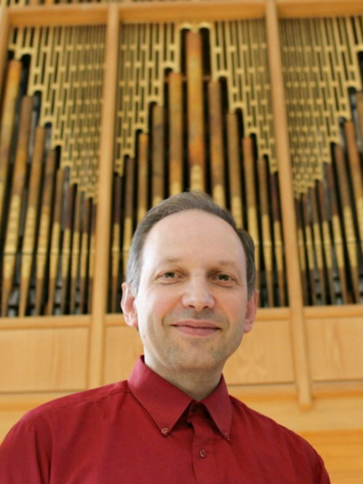
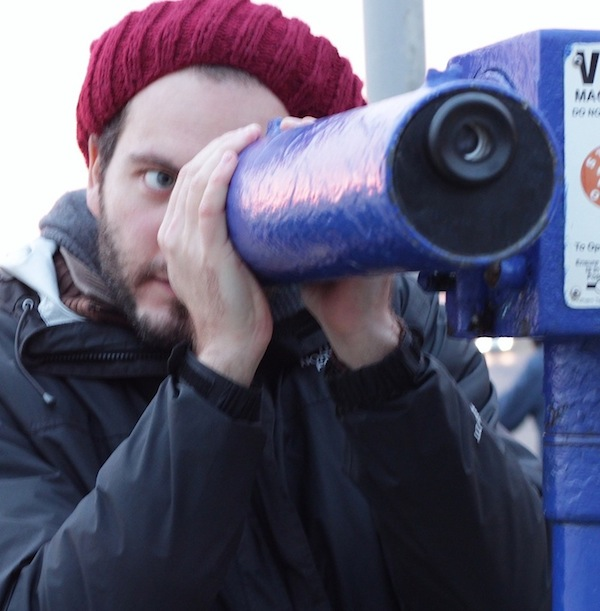
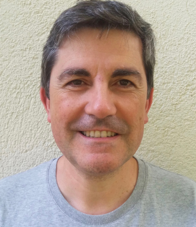
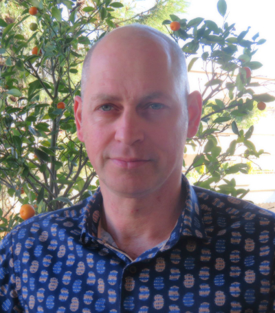
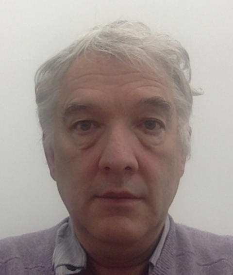

title: Participants

---

[TOC]

---

####Sami Amiris
is a member of Phos Duo, as well as the Musical Director and pianist of the Big Band of Athens and a founding member of the critically acclaimed power jazz trio "NUKeLEUS".

He teaches at the American College of Greece. He is also the author of a series of books for M.M.S. Germany, called "Keyboard Quest", now at production stage.
He has studied music, mathematics, music technology and computer programming. His interests include mathematical music theory, composition, jazz arranging and orchestrations in general, piano performance of jazz and contemporary music, and most of all, contemporary rhythmic theory and practice, especially in conjunction with semigroup theory and combinatorics on words.

[http://www.phosduo.com]() / [https://soundcloud.com/samiamiris/albums]()

 

---

####Pavlos Antoniadis
(PhD University of Strasbourg-IRCAM, MA University of California, San Diego) is a musicologist, pianist and technologist, based in Berlin and Strasbourg. His practice-oriented research has focused on both historic and systematic aspects of 20th and 21st century music, notably the performance practice of complex contemporary and experimental music, as well as on embodied cognition and on the development of tools for technology-enhanced learning & performance. He is a member of the *Interaction- Son-Musique-Mouvement* team at IRCAM, and previously associate of the Laboratory of Excellence GREAM, Université de Strasbourg, where he also taught seminars on computer music and contemporary performance practice. 
As a researcher, Pavlos has fifteen (15) publications in English, German and French on contemporary piano performance, embodied cognition and interactive systems for technology-enhanced learning based on physical movement. He has given fifty (50) talks, often with a performance and/or technological demo element, either as invited speaker / performer in several institutions in Europe and Asia (HfM Dresden, INMM Darmstadt, IRCAM Paris, Orcim Gent, Goldsmiths London, Trinity Dublin, Aristoteleio Thessaloniki, Cité de la Musique et de la Danse Strasbourg, Hong Kong University, Yamanashi Gakuin University Kofu, Wocmat Taiwan, LEAD Dijon, SARC Belfast, UdK Berlin) or in multiple international and national conferences. He was a Musical Research Residency fellow at IRCAM in 2014, where under the supervision of Frédéric Bevilacqua and Dominique Fober (Grame, Lyon) he developed *GesTCom* (*Gesture Cutting through Textual Complexity*), a sensor-based environment for the gestural control and analysis of complex piano notation, for example of works by Xenakis or Ferneyhough. 
As a pianist, Pavlos has performed in Europe, North & South America and Asia with the new music ensembles Work in Progress-Berlin, Kammerensemble Neue Musik Berlin, Phorminx, ERGON, Accroche Note, as well as a soloist with the Thessaloniki State Symphony Orchestra. He has participated in recordings for Mode (2015 German Recording Critics Award / Deutscheschallplattenkritikspreis) and Wergo records. As a soloist, he has worked with composers Mark Andre, Helmut Lachenmann, Brian Ferneyhough, Wolfgang Rihm, Tristan Murail, Richard Barrett, Walter Zimmermann, and has premiered solo piano works by James Erber, Nicolas Tzortzis, Andrew R. Noble, Luis Antunes Pena, Dominik Karski and others. His programming features the most complex contemporary works, extremes of physicality, live electronics, multimedia and musical theatre, often in eclectic dialogue with ancient repertoire from Cabezón to Bartók. He is also active in free improvisation with the composer and improviser Panos Ghikas (London) and has collaborated with the physical theatre group Zero Point (Athens). 
Pavlos holds degrees in piano performance (Piano Diploma, Nakas Athens; Koninklijk Conservatorium Den Haag; MA, UC San Diego) and musicology (BA, Athens National University, PhD Université de Strasbourg in co-direction with the IRCAM, under Pierre Michel and Frédéric Bevilacqua, previously in the Hochschule für Musik Dresden under Jörn Peter Hiekel and Wolfgang Lessing). He has studied on LabEx GREAM, IRCAM, Fulbright, UC San Diego, Nakas conservatory, Internationale Ensemble Modern Academie Frankfurt and Impuls Academie Gratz scholarships. His main piano teachers were Chryssi Partheniade, Ian Pace, Geoffrey Douglas Madge and Aleck Karis.

[https://pavlosantoniadis.wordpress.com/about/]() / [https://soundcloud.com/katapataptwsi]() / [http://ismm.ircam.fr/pavlos-antoniadis/]() / [https://www.youtube.com/channel/UC8G2C0lwe96oa_KuIzfWOeA]()

 

---

####Christophe d'Alessandro
is a researcher and a musician. Titular organist
at Sainte-Elisabeth, he is regularly invited as a performer and
improviser. Directeur de Recherche CNRS, he heads the LAM
(Lutherie-Acoustique-Musique) team at Institut Jean Le Rond D’Alembert,
Sorbonne Université, Paris. His research interests include speech and
singing analysis, synthesis and perception, signal processing for speech
and music, computed music and musical acoustics.His recent projects
include research, composition and performances for organ and live
electronics (CD "The twelve degrees of silence", Hortus edition, “5
diapasons” award, 2012), and singing instruments: Cantor Digitalis (1st
prize at the Margareth Guthman Musical Instrument Competition, Atlanta,
2015), Vokinesis and Voks.

 
 
 
 
 
 
 
 
 
 

---

####Antonis Alexakis
holds a BSc in Mathematics from University of Patras and
an MSc in Knowledge Based Systems from Heriot-Watt University. He has
an active presence in the IT industry for more than 25 years. In the past he has taken part in several EU projects (FP4 & FP5). Lately, he has taken part in MIROR project as an IT expert. His work entails the computational analyses of the musical data gathered within the framework of the above project. He is
currently finishing his PhD at the Department of Music Studies,
University of Athens.   

 
 
 
 
 
 

---

####Christina Anagnostopoulou
is a musicologist and associate professor in music informatics at the Department of Music Studies, University of Athens. Her PhD (Edinburgh) was on computational and cognitive modeling of music analysis. She has taught at the Universities of Edinburgh, Glasgow, and Queen’s Belfast, where she got tenure. Her research interests include computational music analysis, and music in the community. She is also the director of the Music Cognition, Computation and Community (MCCC) Lab in Athens.

 
 

---

####Areti Andreopoulou
is an Assistant Professor in the Laboratory of Music Acoustics and Technology (LabMAT) at the University of Athens, Greece. She has a bachelor’s degree in music studies from the University of Athens (2005) and a Master’s (2008) and a Ph.D degree (2014) in music technology from New York University. Her fields of interest include spatial audio, the design and evaluation of immersive environments, auditory displays, acoustics, and data sonification.

 
 
 
 
 
 
 

---

####Frédéric Bevilacqua
is the head of the [Sound Music Movement Interaction team](http://ismm.ircam.fr/) at IRCAM in Paris (part of the joint research lab Science & Technology for Music and Sound – IRCAM – CNRS – Sorbonne Université). His research concerns the modeling and the design of interaction between movement and sound, and the development of gesture-based interactive systems. 
He holds a master degree in physics and a Ph.D. in Biomedical Optics from [EPFL](https://www.epfl.ch/) in Lausanne. He also studied music at the Berklee College of Music in Boston (and has participated in different music and media arts projects. From 1999 to 2003 he was a researcher at the Beckman Laser Institute at the University of California Irvine. In 2003 he joined IRCAM as a researcher on gesture analysis for music and performing arts. 
He co-authored more than 120 scientific publications and co-authored 5patents. His research projects and installations were presented internationally, including Centre Pompidou, MoMA (USA), ZKM (Allemagne), EMPAC (USA), YCAM (Japon). He was keynote or invited speaker at several international conferences such as the ACM TEI’13. In 2006 he was the co-chair of the International conference New Interfaces for Musical Expression. As the coordinator of the “Interlude project”, he was awarded in 2011 the 1st Prize of the Guthman Musical Instrument Competition (Georgia Tech) and received the award “prix ANR du Numérique” from the French National Research Agency (category Societal Impact, 2013).

 

---

####Georges Bloch
composer and researcher, got an engineering degree before studying composition in U. C. San Diego (PH. D. in 1988). His compositions revolve around three centers of interest: music and space, interaction and collaboration with other artists. He is Associate professor at Strasbourg University and was instrumental in developing Tonmeister cursus in France, in Strasbourg and in Paris Conservatoire. Because of his interest for opera, he has been linked to music-theater productions as well as studies in film music. As researcher associated to Ircam in Paris, he actually works on the OMax/Somax/DYCI2 family of computer–assisted improvisation systems.

    

---

####Jaap Blonk
(born 1953 in Woerden, Holland) is a self-taught composer, performer and poet.
He went to university for mathematics and musicology but did not finish those studies. In the late 1970s he took up saxophone and started to compose music.
A few years later he discovered his potential as a vocal performer, at first in reciting poetry and later on in improvisations and his own compositions. For almost two decades the voice was his main means for the discovery and development of new sounds. From around the year 2000 on Blonk started work with electronics, at first using samples of his own voice, then extending the field to include pure sound synthesis as well. 
He took a year off of performing in 2006. As a result, his renewed interest in mathematics made him start a research of the possibilities of algorithmic composition for the creation of music, visual work and poetry. 
As a vocalist, Jaap Blonk is unique for his powerful stage presence and almost childlike freedom in improvisation, combined with a keen grasp of structure. He has performed around the world, on all continents. With the use of live electronics the scope and range of his concerts has acquired a considerable extension. 
Besides working as a soloist, he collaborated with many musicians and ensembles in the field of contemporary and improvised music, like Maja Ratkje, Mats Gustafsson, Joan La Barbara, The Ex, the Netherlands Wind Ensemble and the Ebony Band. He premiered several compositions by the German composer Carola Bauckholt, including a piece for voice and orchestra. A solo voice piece was commissioned by the Donaueschinger Musiktage. On several occasions he collaborated with visual computer artist Golan Levin, for the Ars Electronica Festival. 
Blonk's work for radio and television includes several commissioned radio plays.
He also makes larger-scale drawings of his scores, as well as visual poetry, which is being exhibited. 
He has his own record label, Kontrans, featuring a total of 25 releases so far. Other Blonk recordings appeared on various labels, such as Staalplaat, Basta, VICTO, Ecstatic Peace, Monotype Records, Terp and Elegua Records. 
His book/CD 'Traces of Speech' was published in 2012 by Hybriden-Verlag, Berlin. Forthcoming is a sequel with the title "Traces of Cookery". 
A comprehensive collection of his sound poetry came out as a book with 2 CDs in 2013, entitled "KLINKT".

 

---

####Mark Bokowiec
Composer & interactive systems designer

Mark is a composer and electronics / interactive systems designer. He is the manager of the electro-acoustic music studios and the Spatialization and Interactive Research Lab (SPIRAL) at the University of Huddersfield UK, where he also lectures in interactive performance and composition. Commissions for interactive instruments include: the *LiteHarp* for the London Science Museum and *A Passage To India* for Wakefield City Art Gallery. Mark has created a variety of interactive works for soloists and interactive technologies including, *Dialogue* (2014) for cellist Seth Parker-Woods and interactive prosthetic SPINE and a variety of pieces for augmented Trombone and various wind instruments. His fixed media electroacoustic works have been widely performed and published, Amera was a selected finalist for the prestigious *Arts Electroniques* des *Concours Internationaux de Bourges* composition prize. CD releases include: Route (2001) and Ghosts (2000) and Visitations (2018) on the MPS label.  Mark Bokowiec and Julie Wilson-Bokowiec (Performer/Vocalist) are award-winning artists that have developed a significant international reputation as innovators in the field of interactive sonic art and are considered experts in the field of live gestural interaction and the manipulation of voice and sound processing with their Bodycoder System and the Bodycoder project initiated in 1995. Their work is frequently programmed at international digital arts festivals and has been supported by The British Council, Banff Centre for the Arts (Canada) and Arts Council of England awards. They have been commissioned by the Science Museum London, Wellcome Trust wing (LSM), Wakefield City Art Galleries among others and have created new works in residencies at Banff Centre for the Arts (Canada), STEIM (Amsterdam) the Confederation Centre for the Arts (PEI Nova Scotia) the Traffo Theatre (Budapest), Dartington College of Arts (UK) among others.

 

---

####Daniel Brown
is the founder of Intelligent Music Systems, a company that develops computer-composed music software for interactive systems. He is also a composer, cellist, and educator. Daniel received a Doctorate of Musical Arts in Composition from the University of California at Santa Cruz in 2012, where he studied under David Cope and Paul Nauert, and a Bachelor of Science in Discrete Mathematics from the Georgia Institute of Technology (USA).  Aside from his training in Western music in the USA, he has studied non-Western musics in India, Korea, and Turkey. His compositions have been performed in the US, Japan, Korea, India, and Central America.

 
 
 
 
 
 

---

####Emilios Cambouropoulos
is currently Associate Professor of Musical
Informatics at the School of Music Studies, Aristotle University of
Thessaloniki. He studied Physics, Musicand Music Technology, and
obtained his PhD in 1998 on Artificial Intelligence and Music at the
University of Edinburgh. As a research associate, he worked at King’s
College London (1998-1999) and at the Austrian Research Institute for
Artificial Intelligence in Vienna (1999-2001). He is founder of the
Cognitive and Computational Musicology Group [http://ccm.web.auth.gr]() at
the School of Music Studies in the context of which he directs a number
of research projects. He has published numerous scientific papers in
scientific journals, books and conference proceedings. Website:
[http://users.auth.gr/emilios/]().

      
 

---

####Clément Canonne
I am a CNRS researcher in the « Analysis of Musical Practices » team at IRCAM since 2015. My researches are mainly focused on collective free improvisation, bringing perspectives from ethnography and experimental psychology. Recent publications on this topic include papers in *Cognition, Music Theory Online, Empirical Musicology Review, Revue de Musicologie, Psychology of Music and Journal of New Music Research*. 
I am also interested in the philosophy of music – in collaboration Pierre Saint-Germier, I have translated in French two volumes of essays from the American philosopher Jerrold Levinson (Vrin, 2015 & 2019)– and in the empirical approaches of aesthetic issues. 
I am currently working on two large scale projects: the ANR-funded project « Musical Improvisation and Collective Action » (2018-2021), which aims to study joint action and emergent coordination through the lens of free improvisation; and an ethnographic inquiry into the material aspects of improvisers’ instrumental practices across many different genres (baroque, jazz, sound art, free improvisation and traditional music).

   

---

####Marc Chemillier
was born in 1960 and began studying jazz piano in 1971 with Jack Diéval and Pierre Cornevin at the Schola Cantorum in Paris. Later he received a PhD in Computer Science and also has degrees in Mathematics, Musicology, Philosophy and Anthropology. He has been conducting fieldwork among the Nzakara of Central African Republic to study their harp music, and in Madagascar to work on the ethnomathematics of divination, and the trance music of the zither. Now Director of Studies at the EHESS in Paris (School for Advanced Studies in Social Sciences), his main interests focus on the design of a family of improvisation softwares in collaboration with IRCAM (OMax/ImproteK/Djazz), and their use in real live performances to study the impact of such devices in the social context of jazz concerts or traditional music rituals.
 
[improtekjazz.org](http://improtekjazz.org) / [digitaljazz.fr](http://digitaljazz.fr)

   

---

####Pierre Couprie
was born in 1970, he studied instrumental composition, electroacoustic music, musical analysis, and free improvisation at Bordeaux Conservatory. He is an associate professor in digital pedagogy/computer music and a researcher at Sorbonne University (Research Institute in Musicology Lab). His research fields cover the musical analysis/transcription/representation of electroacoustic music and the digital musicology. He also develops tools for research (iAnalyse, EAnalysis, MotusLab Tools) or musical performance. In 2015, he won the Qwartz Max Mathews Price of technological innovation for his musical analysis software. As an improviser, he is a member of The Phonogénistes and The National Electroacoustic Orchestra (ONE).
 
[www.pierrecouprie.fr](http://www.pierrecouprie.fr)  / [logiciels.pierrecouprie.fr](http://logiciels.pierrecouprie.fr)

  

---

####Giorgos Dedousis
holds a Master’s of Arts Degree from the City University London, specializing in the field of Composing for Moving Images, and an Integrated Master’s Degree from the Department of Music at the National and Kapodistrian University. He has also completed a Bachelor’s Degree in Informatics and Telecommunications at the National and Kapodistrian University and has studied piano, contemporary singing, theory of music, harmony, counterpoint, fugue and orchestration at the National Conservatory of Athens. He has composed music for theatrical plays, teaches at the Municipal Conservatory of Aspropyrgos and performs at various venues in Greece.

  

---

####Stylianos Dimou
is a Greek composer and electronic performer born in Thessaloniki in 1988. A Fulbright Scholar and participant in numerous international composers meetings, festivals and competitions, Dimou won the International Prize for Composition “Luigi Nono” and was nominated for the Gaudeamus Prize in 2015. Dimou has pursued advanced studies in composition at the Aristotle University of Thessaloniki (2011, MM in Composition) and the Eastman School of Music (2013, MA in Composition), as well as advanced training in computer music at the Cursus program at IRCAM and the the Manifeste Academy. He is currently a composer and researcher at the OeAD organization. closely affiliated with the University of Music and Performing Arts Graz, and a Doctoral Fellow at Columbia University (DMA in Music Composition).

 

---

####Peter Evans
is a trumpet player and improvisor/composer based in New York City since 2003.   Evans is part of a broad, hybridized scene of musical experimentation and his work cuts across a wide range of modern musical practices and traditions.  Peter is committed to the simultaneously self-determining and collaborative nature of musical improvisation as a compositional tool, and works with an ever-expanding group of musicians and composers in the creation of new music. His primary groups as a leader are the Peter Evans Ensemble and Being & Becoming.  Evans has been exploring solo trumpet music since 2002 and is widely recognized as a leading voice in the field, having released several recordings over the past decade.  He is a member of the cooperative groups Pulverize the Sound (with Mike Pride and Tim Dahl) and Rocket Science (with Evan Parker, Craig Taborn and Sam Pluta) and is constantly experimenting and forming new configurations with like minded players.  As a composer, he has been commissioned by the International Contemporary Ensemble (ICE), Yarn/Wire, the Donaueschingen Musiktage Festival, the Jerome Foundation's Emerging Artist Program, and the Doris Duke Foundation. Evans has presented and/or performed his works at major festivals worldwide and tours his own groups extensively.  He has worked with some of the leading figures in new music:  John Zorn, Ingrid Laubrock, Jim Black, Weasel Walter, Ambrose Akinmusere, Matana Roberts, Tyshawn Sorey, Levy Lorenzo, Nate Wooley, Steve Schick, Mary Halvorson, Joe McPhee and performs with both ICE and the Wet Ink Ensemble. He has been releasing recordings on his own label, More is More, since 2011.  2018 will see the release of a new solo album, the first duo album with Levy Lorenzo, a new record by Pulverize the Sound, and the new album by the Peter Evans Ensemble.

---

####Rémi Fox
Saxophonist, improviser and composer, Rémi Fox is part of this new generation of artist who wishes to make the jazz a resolutely contemporary music. He graduated from the Department Jazz and improvised music from the CNSMD of PARIS where he had the opportunity to build a strong musical experience, along with great musicians (being of his generation or more experienced one). All these encounters gave him the opportunity to take part in a great variety of projects, and develop a rich and open musical universe, while strengthening his own personality. During his studies, he entered the Department of Improvisation Generative of CNSMDP (directed by Vincent Lê Quang and Alexandros Markeas) to discover new ways of playing, and to begin with sound textures experimentation. During those years, he always seeked to confront his music to other forms of Art such as dance, video or Visual arts, leading to enriching collaborations with IRCAM, CNC (National Film and the moving image Centre) or Theatres. The “nOx project” (nOx.3, nOx.6, nOx.8), started in 2013, embodies Remi’s wish to now create its own path and musical personality. Through this innovative series, the young artist offers a smart mix between improvisation, contemporary electronic music, and genuine “nOxian” melodies. 
[www.nox3.net](http://www.nox3.net)

 
 
 
 
 
 

---

####Hugues Genevois
is a researcher in musical acoustics, within the LAM team, at the Institut Jean le Rond d'Alembert (Sorbonne Université - CNRS). 
With a scientific background (Master of Science in Physics and Telecom ParisTech Engineering School), Hugues Genevois, became interested very early in musical composition and possibilities offered by computers for sound synthesis. However, if his tastes willingly lead him to concrete music and music from the Far East, it is through contact with Iannis Xenakis that he decides to deepen his writing work. 
After having produced numerous pieces of music on support, his interest in instrumental practice (electric guitar, cello, keyboards) led him to explore the expressive possibilities of the computer. His research focuses in particular on new lutheries and musician/instrument interaction. 
It was in 1997, during a symposium organized with the GMEM, in Marseilles, that he addressed what would later become the main theme of his research: the musical gesture. His approach is poetic as well as technical. It is in this context that he uses for the first time the term calliphony, a sonic and musical equivalent of *calligraphy*, in its Far Eastern sense. 
Also an improviser, he performs in various formations: *ONE* (electroacoustic septet), the *Méta-Orchestre*, the trios *Déjà-Là* (with Laurence Bouckaert and Michel Risse) and *Les complémentaires* (with György Kurtag jr. and Jean Haury), and in duet (*Moon Module* with Laurence Bouckaert, and *Ouï-Ouï* with Marie-Hélène Grimigni). He also founded the experimental rock group *Poppy NoGood*.

 
 

---

####Anastasia Georgaki
is Associate Professor in Music Technology at the Music Department of the University of Athens and head of the Laboratory of Music Acoustics and Technology of the same Department. Since 2018 she is also head of the Master’s program “Music `technology and contemporary practices”. Background in Physics and Music, DEA and PhD in “Music and Musicology  of the XXth Century” (EHESS/IRCAM, Paris). Research interests: *analysis/synthesis of the singing voice, interactive music systems, electroacoustic music, computational archeomusicology and Byzantine musicology, music technology in education and acoustic ecology technology*.  Editor and reviewer of Proceedings of International  Conferences and Special issues in Music Technology. She has organised many international conferences in Greece and abroad. Publications in musicological journals, books and Music Technology Conference proceedings. She collaborates with international research institutes in Greece and abroad. Visitor Professor in Music Departments in Europe. Professional accordion player.

 
 
 

---

####Ian Gold
Ian Gold is Associate Professor of Philosophy & Psychiatry at McGill University in Montreal. He completed a Ph.D. in Philosophy at Princeton University and did postdoctoral training at the Australian National University in Canberra. From 2000 to 2006 he was on the faculty of the School of Philosophy & Bioethics at Monash University in Melbourne and came to McGill in 2006. His research focuses on the study of delusions, theory of mind, and on reductionism in psychiatry and neuroscience.

 
 
 
 
 
 
 

---

####Garry L. Hagberg
is the James H. Ottaway Professor of Philosophy and Aesthetics at Bard College in New York, USA, and has also held a Chair in the School of Philosophy at the University of East Anglia, Norwich, England. Author of numerous papers at the intersection of aesthetics and the philosophy of language, his books include Meaning and Interpretation: Wittgenstein, Henry James, and Literary Knowledge, and Art as Language: Wittgenstein, Meaning, and Aesthetic Theory. His most recent book is Describing Ourselves: Wittgenstein and Autobiographical Consciousness. He is editor of Art and Ethical Criticism, co-editor of A Companion to the Philosophy of Literature, and Editor of the journal Philosophy and Literature. Professor Hagberg is presently writing a new book on the contribution literary experience makes to the formation of self and sensibility, Living in Words: Literature, Autobiographical Language, and the Composition of Selfhood, and three edited volumes, Fictional Characters, Real Problems: The Search for Ethical Content in Literature; Wittgenstein on Aesthetic Understanding; and Stanley Cavell on Aesthetic Understanding, were recently published. Another new book in progress is on aesthetic issues in jazz improvisation, a subject in which he has an interest of long standing both as scholar and performer (he has performed on about a dozen CDs as a jazz guitarist, and is co-author, with Howard Roberts, of the three-volume Guitar Compendium: Technique, Improvisation, Musicianship, Theory published by Advance Music/ Schott). He has delivered many talks and papers at philosophical, literary, and musical meetings and conferences around the world.

---

####Georg Hajdu
was born in 1960 to Hungarian parents and grew up in Cologne where
he obtained diplomas in molecular biology and musical composition from the
University of Cologne and the Cologne university of music, as well as a
doctorate from the University of California, Berkeley. His teachers
include Clarence Barlow and David Wessel. He also audited classes with
György Ligeti in Hamburg. 
In 1996, following residencies at IRCAM and the ZKM, Karlsruhe, he
co-founded the ensemble WireWorks, a group specializing in the performance
of electro-acoustic music. In 1999, he produced his full-length opera Der
Sprung – Beschreibung einer Oper for which renowned author and filmmaker
Thomas Brasch wrote the libretto. In May 2002, his Internet performance
environment Quintet.net was employed in a Munich Biennale opera production
and in the same year Georg Hajdu became professor of multimedia
composition at the Hamburg University of Music and Drama (HfMT). He
established Germany’s first master’s program in multimedia composition and
the Zentrum für Mikrotonale Musik and Multimedia (ZM4). In 2010, he was
artist in residence with the Goethe Institute in Boston as well as
visiting professor at Northeastern University. He was also involved in a
number of large international projects such as CO-ME-DI-A—a European
Culture 2007 project focussing on networked music performance. In 2016,
Georg Hajdu was the chair of the 13th Sound and Music Computing
conference. In 2017, he successfully applied for the highly competitive
five-year "Innovative Hochschule" grant which will fund projects around
the notion of Stage 2.0. 
Hajdu has published compositions which are characterized by a pluralistic
attitude and have earned him several international prizes, the IBM-prize
of the Ensemble Modern among them. He is also the (co-)author of numerous
articles on topics on the borderline of music, technology and science as
well as software applications such MaxScore (with Nick Didkovsky),
Quintet.net, DJster and a real-time version of Stockhausen’s Elektronische
Studie II.

 

---

####Maximos Kaliakatsos-Papakostas
is currently an Adjunct Lecturer and the Department of Audio and Visual Arts, Ionian University, a postdoctoral researcher at the Music Department of the Aristotle University of Thessaloniki and a research associate at the Athena Research and Innovation Centre. He holds a PhD in Computational Intelligence methods for music related tasks, an MSc in Computational Intelligence and a Bachelor’s degree in Mathematics, from the Department of Mathematics, University of Patras. Among his research interests are music data analysis (mainly symbolic but also audio), automated music generation, machine learning and cognitive models for music and computational creativity.

 
 
 
 
 
 
 

---

####Orestis Karamanlis
Born in Athens, Greece. Upon completing a PhD in electroacoustic composition Orestis has been active in composing new music and lecturing in the academia. Currently a scholar at the University of Athens and a visiting fellow at Bournemouth University, he has produced a diverse body of sound-art and new media work which is frequently performed in concert venues and urban spaces. orestiskaramanlis.net.

 
 
 
 
 

---

####Mari Kimura
is a violinist/composer and a leading figure in the field of interactive computer music. As a violinist, Mari is renowned for her mastery of subharmonics—the production of pitches that sound up to an octave below the violin’s lowest string—as well as for her dynamic performances as an improviser and her premieres of many notable compositions by today’s composers, including Luciano Berio and Salvadore Sciarrino, as well as a soloist with such major orchestras including the Tokyo Symphony and the Hamburg Symphony. She has received numerous awards and grants including a Guggenheim Fellowship, a Fromm Commission Award, a residency at IRCAM, and at the Rockefeller Brothers Fund. She is active in the development of a prototype motion sensor “Mugic” for interactive computer music performance, and she is the founding chair of Future Music Lab at the Atlantic Music Festival.  Her latest solo album “Voyage Apollonian” (Innova Recordings) includes her recent works for violin and motion sensor “Mugic”.  A graduate faculty at Juilliard since 1998, this year, Mari was appointed as a Full Professor of Music at the “Integrated Composition, Improvisation, and Technology” program (ICIT) at the University of California, Irvine.
 
[www.marikimura.com](http://www.marikimura.com)  / [www.marikimura.com/videos.html](http://www.marikimura.com/videos.html)

 

---

####George Kosteletos
holds a PhD in Philosophy of Mind and Artificial Intelligence (NKUA), a Master’s Degree in Music Technology (University of York, UK) and a first degree in Physics (NKUA). He currently works as a scientific collaborator of the Medical School (NKUA - 1st Psychiatric Clinic of Aeginition Hospital) and a post-doctoral researcher (NKUA - Sector of Philosophy, Department of Philosophy, Pedagogy and Psychology), studying the cognitive foundations of moral thought and the effect of music on them. He has taught at postgraduate level (NKUA) issues related to Cognitive Science and Philosophy. Moreover, he has participated in international research programs and his research interests are mostly related to the cognitive aspects of morality and music as well as to philosophical issues arising from modern research and practice in the field of Music Technology.

 
 
 
 
 
 
 

---

####György Kurtág Jr
is a composer, performer and researcher specialized in the design of innovative methods for teaching digital instruments. Fascinated by the study of musical behavior(s), his work relies principally on the Collective Intelligence Theory. His research works notably include the capture and analysis of musical gestures.  
He also co-developed the Méta-Mallette (Puce-Muse-Paris), the Continuator Project (Sony C.S.L-Paris), Dolabip (SCRIME-Bordeaux), Midi controller for Guitar by Shadow, (Germany). Nowadays, he is the main Arts&Sciences Coordinator of the SCRIME studio, at the University of Bordeaux. 
In the 1980s, Gyorgy KURTAG Jr  collaborated with some of the most influential American researchers-composers in the computer music such as John Chowning, Tod Machover, George E. Lewis and David Wessel at IRCAM, the wold renowned musical research institute of Paris. 
All these expériences inspired him to create his own musical and digital universe.
 
[www.dailymotion.com/video/x1vrmwd]() / [www.youtube.com/watch?v=MJ8Z5skovLw]() / [www.youtube.com/watch?v=M3Tr8mSDYl8]()

 

---

####Antonis Ladopoulos
is a Jazz Saxophonist, Composer and Educator.  He holds Degrees in Jazz Studies & Performance as well as in Economics. 
For the past 25 years, he has been performing, recording and teaching jazz improvisation.
He is currently on faculty at the Athens University Graduate School, teaching Jazz Improvisation among other courses.  He also teaches a variety of Jazz courses at The American College of Greece.  
Antonis’ main project both as a performer and composer has long been “Phos Duo”, a no boundaries collaboration with pianist Sami Amiris in the direction of creatively improvised Jazz and Contemporary music.

[http://www.phosduo.com]() / [https://soundcloud.com/antonis-ladopoulos/albums]()

 
 
 
 
 
 
 
 
 
 

---

####Harry Lehmann
After receiving a master’s degree in physics and mathematics at the Saint Petersburg State University, with further philosophical studies in Berlin, Harry Lehmann earned a doctorate at the University of Potsdam in 2003 with a dissertation based on a systems-theoretical approach toward aesthetics. In the last years, he initiated a controversy about the digital revolution of music and its impact on New Music and published a great number of essays about this topic in German music journals as well as several books about art philosophy, music philosophy, aesthetics, and art criticism:

- *Die flüchtige Wahrheit der Kunst. Ästhetik nach Luhmann*, München: W. Fink 2006;
- *Die digitale Revolution der Musik. Eine Musikphilosophie*, Mainz: Schott 2012.
- *Autonome Kunstkritik* (Hg.), Berlin: Kulturverlag Kadmos 2012.
- *Gehaltsästhetik. Eine Kunstphilosophie*, Paderborn: Wilhelm Fink, Januar 2016.
- *Ästhetische Erfahrung. Eine Diskursanalyse*, Paderborn: Wilhelm Fink, Oktober 2016.

One can find more information about the author on his website: [www.harrylehmann.net]() or on his YouTube-Canal [https://www.youtube.com/user/HarryLehmannVideo]().

 

---

####Steve Lehman
Described as “a state-of-the-art musical thinker” and a "dazzling saxophonist,” by The New York Times, Steve Lehman (b. New York City, 1978) is a composer, performer, educator, and scholar who works across a broad spectrum of experimental musical idioms. Lehman’s pieces for large orchestra and chamber ensembles have been performed by the International Contemporary Ensemble (ICE), So Percussion, Kammerensemble Neue Musik Berlin, the JACK Quartet, the PRISM Saxophone Quartet, and the Talea Ensemble. His recent recording, Mise en Abîme (Pi, 2014) was called the #1 Jazz Album of the year by NPR Music and The Los Angeles Times. And his previous recording, Travail, Transformation & Flow (Pi, 2009), was chosen as the #1 Jazz Album of the year by The New York Times. 
The recipient of a 2015 Guggenheim Fellowship and a 2014 Doris Duke Artist Award, Lehman is an alto saxophonist who has performed and recorded nationally and internationally with his own ensembles and with those led by Anthony Braxton, Vijay Iyer, Jason Moran, Georgia-Anne Muldrow, George Lewis, Meshell Ndegeocello, and High Priest of Anti-Pop Consortium, among many others. 
Lehman received his B.A. (2000) and M.A. in Composition (2002) from Wesleyan University where he studied under Anthony Braxton, Jay Hoggard, and Alvin Lucier, while concurrently working with Jackie McLean at the Hartt School of Music. He received his doctorate with distinction in Music Composition from Columbia University (2012), where his principal teachers included Tristan Murail and George Lewis. 
He is currently a Professor of Music at The California Institute of the Arts, and lives in Los Angeles.
 
[www.stevelehman.com](http://www.stevelehman.com/)

 

---

####Benjamin Lévy
Nowadays computer musician and research engineer, Benjamin Lévy has a double background in science – mainly computer science with an engineering school degree and a PhD – and in music – with courses of cello, composition, improvisation at Saint-Ouen, Cergy-Pontoise and Paris National Conservatoire.  
He has been working since 2008 with Ircam both for scientific R&D and artistic creation. In particular, he fully renewed the improvisation software OMax between 2008 and 2013. And he also works as a audio developer in private companies specialize in audio technologies.  
As a musician, he participates in various project inside and outside Ircam, tying links with contemporary music, jazz, free improvisation, theater and dance. He collaborates frequently with choreographers met in a traineeship at Abbaye de Royaumont and performs regularly on stage with jazz saxophonist Raphaël Imbert.  
 
 

---

####Eric Lewis
is an associate of philosophy at McGill University, Montreal, specializing in the philosophy of improvisation.  He is the author of Intents and Purposes: Philosophy and the Aesthetics of Improvisation; The Video Art of Sylvia Safdie, and co-editor of Improvisation and Social Aesthetics.  He is involved in the design of digital control surfaces to help enable individuals with physical disabilities make music, the design of digital sound-walk apps, and is presently part of a Greek-based design team working on the development of a digital new media art archive based on improvisatory principles.  He is an active improviser on brass and electronics.

 
 
 
 
 
 
 
 
 
 
 
 

---

####George Lewis
is Professor of American Music at Columbia University. A Fellow of the American Academy of Arts and Sciences and the American Academy of Arts and Letters, and a Corresponding Fellow of the British Academy, Lewis’s other honors include a MacArthur Fellowship (2002) and a Guggenheim Fellowship (2015). Lewis's work has been presented by the BBC Scottish Symphony Orchestra, Ensemble Dal Niente, Ensemble Intercontemporain, London Philharmonia Orchestra, International Contemporary Ensemble, Musikfabrik, Mivos Quartet, London Sinfonietta, Spektral Quartet, and others. An Honorary Member of the American Musicological Society, his 2008 book, *A Power Stronger Than Itself:  The AACM and American Experimental Music* (University of Chicago Press) received the AMS Music in American Culture Award. Lewis is the co-editor of the two-volume *Oxford Handbook of Critical Improvisation Studies* (2016). Lewis holds honorary degrees from the University of Edinburgh, New College of Florida, and Harvard University.
 [https://music.columbia.edu/bios/george-e-lewis](https://music.columbia.edu/bios/george-e-lewis)

 
 
 
 
 
 

---

####Bernard Lubat
Born in Uzeste in 1945, Bernard Lubat, pianist, vibraphonist, keyboard and accordion player, singer, composer and actor, began studying piano in 1957, attending the Bordeaux Conservatory where he discovered the drums, jazz and Milt Jackson. In 1961, he entered the Paris Conservatory where in 1963 he was awarded the prize for best percussionist. He was then taken on by the Jef Gilson Orchestra (1965) where he came into contact with Michel Portal, Bernard Vitet, François Jeanneau, Jean-Louis Chautemps, Henri Texier… He worked with Jean-Luc Ponty and Martial Solal, as a vibraphonist and for Stan Getz and Eddy Louiss as a drummer. At the same time he worked in contemporary music with Diego Masson, playing Varèse, Bartok, Xenakis, he took part in the premier of Luciano Berio's work Chemin 2 at the Scala de Milan and in the recording of Laborintus. In 1975, he established a group with André Ceccarelli, Marc Bertaux and Tony Bonfils. In 1978, he went on to set up the Festival Uzeste Musical (summer festival) and the Compagnie Lubat, a group with a changeable number of players. At the beginning of the 90s, he launched the festival de printemps and the festival d'hiver set up in cooperation with the Cie Lubat artists with Laure Duthilleul (actress), André Minvielle (singer and musician) and Patrick Auzier (musician and  firework designer) and the publishing house, Les Editions du Tilleul, for the production of CDs. Bernard Lubat and his company tour all over France and abroad. He has also been a musical expert working on the OMax/ImproteK/Djazz project in collaboration with IRCAM and EHESS.
 
[www.cie-lubat.org](http://www.cie-lubat.org)

 

---

####Sylvain Luc
“Technique has never been my objective… Music is not a competition. Play music, live music. Music has to be shared. It shouldn’t keep people apart.” Sylvain Luc  
Sylvain Luc was born in 1965 in Bayonne. At age four, he began playing guitar, then violin, and then studied cello for ten years at the Bayonne Conservatory. At age 23, he moved to Paris, where he worked as an arranger, composer and accompanist for popular musicians, such as Catherine Lara, Michel Jonasz, Al Jarreau and others, while still keeping a hand in jazz as a bassist in the Richard Galliano Trio and as a guitarist with Eric Le Lann.  In 1993, Luc became Godin guitars’ worldwide ambassador. Since then, he has continued recording in France and abroad. His first album, “Piaia”, released in 1993, included “Petits Déjà,” a duet with his long-time friend Louis Winsberg.  Also featured are “Ameskeri” with Stéphane Belmondo, “Duet” with Biréli Lagrène, and “Summertime.” Luc launched the famous Trio Sud band with André Ceccarelli and Jean-Marc Jafet. Following the release of their second album, “Sylvain Luc Trio Sud ”, they won the “Victoire de la Musique Jazz” award for best jazz group in 2003. They released a third album, “Young and Fine”, in 2008.  Following the release of his album “Joko” in 2006, Luc toured France and Europe from 2006 to 2007 with renowned musicians Michel Portal, Eric Longsworth, Olivier Ker Ourio, Jacky Terrasson and Pascal Rey. In 2007, he was invited to represent France along with Didier Lockwood, Richard Galliano and Olivier Ker Ourio at the International Agency for Education of Jazz (IAEJ) conference in New York. Afterwards, he spent six weeks giving a series of solo concerts in the U.S., Canada and South America, in association with the International Guitar Night Festival. In 2008, Luc won the “Django d’Or” music award for his achievements and played in the “String Quartet” band with Didier Lockwood, Victor Bailey and Billy Cobham. In 2009, he toured with Richard Bona and Steve Gadd and with Didier Lockwood, Ira Coleman and the Chemirani brothers.  He also performed duets with Philip Catherine and Biréli Lagrène, as well as several solos.

---

####Michelle Agnes Magalhaes
is a Brazilian composer whose music explores the limits between gesture and writing, composition and improvisation. She focus on raw materials, creating complex sounds inside forms that are geometric and structured. Magalhaes also places a high premium on the engagement of the musician's body with her performance, as well as new approaches to traditional instruments and instrumentation. Her compositions are about sound production and physicality. After studying musical composition at the University of Sao Paulo, she received regular compositions lessons from Salvatore Sciarrino (Accademia Chigiana di Siena and Conservatorio Statale di Musica, Latina). She has been awarded fellowships, residences and commissions from Radcliffe Institute (Harvard University), Fapesp, Unesco, Camargo Foundation, Villa Sträuli, Brazilian Culture Minister, Fondazione Giorgio Cini Venezia, Ernst-von-Siemens-Musikstiftung and IRCAM. She has collaborated as a composer with numerous ensembles (Abstraï, Percorso Ensemble, Arsenale, Accroche Note, Promenade Sauvage, ECCE, Bahia Blanca Soloists, Quarteto Prometeo, Flame Ensemble, Ensemble TaG Neue Musik, 20° dans le noir, Talea Ensemble, Ensemble L'Itinéraire, Schallfeld Ensemble and Ensemble Multilatérale. Actually she is artist in residence at IRCAM to develop an interactif collective work in collaboration with ISMM team and Frédéric Bevilacqua, with the support of the VERTIGO project (STARTS program of the European Commission). 
She lives and works in Paris.
 
[https://www.michelleagnes.net](https://www.michelleagnes.nets)

 
 
 
 
 

---

####Lara Morciano
began studying the piano at a young age and obtained her diploma with the highest distinctions at the age of 16 at the Conservatory Tito Schipa in Lecce, Italy. Parallel to her concert activities, she studied composition at the Conservatory Santa Cecilia in Rome, where she earned several diplomas (Composition, Choral music and Choral Conducting, Piano reduction of scores and Analysis), subsequently earning her Master in Composition with Franco Donatoni at the Santa Cecilia's National Academy. In France, after a Diploma of Composition obtained at the Strasbourg’s Conservatory (in the class of Ivan Fedele) she attended in 2005-2006 the Cursus of composition and computer music of Ircam. In 2009 she was awarded a Master of the Arts in Musicology at the University of Paris 8, followed by a PhD in Sciences, Arts, Creation and Research (*SACRe*) at PSL Research University, ENS, CNSMDP and Ircam, under the direction of Gérard Assayag. 
Her compositions have been performed in many festivals including Philarmonie – Paris; Ircam - Centre Pompidou; Presences, Création Mondiale – Radio France; ZKM – Karlsruhe; The Venice Biennale; International Gaudeamus Music Week – Amsterdam; Warsaw Autumn Festival; Opera – Dijon; Musica – Strasbourg; Ultima – Oslo; Bifem – Australia; Nuova Consonanza – Rome… She works with ensembles such as the Ensemble Intercontemporain, Court Circuit and with performers including Hae Sun Kang, Mario Caroli, Claude Delangle and Garth Knox. Her music is broadcast by France Musique, Rai3-RadioTelevisione Italiana, ABC Classic FM, Louis Vuitton Foundation and other transmissions. 
She has received commissions from numerous institutions including the French Ministry of Culture, the Ensemble Intercontemporain, Ircam - Centre Pompidou, Radio France, the Venice Biennale, the ZKM of Karlsruhe. She won the Tremplin 2008 competition (Ircam and Ensemble Intercontemporain) and in 2012 the International Composition Competition Giga-Hertz Award in Germany.

 

---

####Mark Nauseef
Percussionist Mark Nauseef has performed and/or recorded for more than fifty years in an unusually wide variety of musical situations with many leading musicians of various genres from around the world such as, among others, Jack Bruce, Evan Parker, Ikue Mori, L.Shankar, Hamza El Din, Lou Harrison, Bill Laswell, The Velvet Underground, Kyai Kunbul (Javanese Gamelan), Joachim Kühn, The Ladzekpo Brothers (Ghanaian music and dance), The Gamelan Orchestra of Saba (Balinese Gamelan) and Kudsi Erguner. 
Nauseef attended the California Institute Of The Arts (CalArts) where he studied Javanese Gamelan with K.R.T. Wasitodiningrat, Balinese Gamelan with I. Nyoman Wenten, North Indian Pakhawaj drumming with Pandit Taranath Rao, North Indian music theory with Pandit Amiya Dasgupta, Ghanaian drumming and dance with Kobla and Alfred Ladzekpo, Dzidzorgbe Lawluvi and C.K. Ganyo, and 20th Century Western percussion techniques and hand drumming with John Bergamo. Mark also studied frame drum techniques of the Middle East, India and the Caucasus with Glen Velez. 
Nauseef has also worked as a producer. In addition to his own recordings, he has produced many records of various types of music including modern experimental forms as well as traditional forms. Traditional music productions include numerous recordings of traditional Balinese and Javanese music such as the acclaimed and award winning “The Music of K.R.T. Wasitodiningrat”, which was recorded in Java and features the compositions of this master Javanese musician. Other examples include Balinese ensemble recordings “Gamelan Batel Wayang Ramayana” and “Gender Wayang Pemarwan”, which were recorded in Bali.
  [http://www.marknauseef.com](http://www.marknauseef.com)

 

---

####Jérôme Nika
is a researcher and computer music designer. He graduated from the French Grandes Écoles Télécom ParisTech and ENSTA ParisTech. In addition, he studied acoustics, signal processing and computer science applied to music (multidisciplinary Master’s degree ATIAM in sciences and technologies for music, Sorbonne Université, Télécom ParisTech, Ircam), and composition. His PhD work at Ircam (Paris, France),  “Guiding Human-Computer music improvisation” (Young Researcher Prize in Science and Music, 2015; Young Researcher Prize awarded by the French Association of Computer Music, 2016) focused on the introduction of authoring, composition, and control in human-computer music co-improvisation. Through the development of the software instruments ImproteK and DYCI2 in collaboration with Ircam, his research focuses on the integration of scenarios in music generation processes, and on the dialectic between reactivity and planning in interactive human-computer music improvisation. These projects led to numerous collaborations with composers (such as Pascal Dusapin, Marta Gentilucci) and/or improvisers (such as Rémi Fox, Bernard Lubat, Steve Lehman) in the past three years (Annenberg Center, Philadelphia, USA; Centre Pompidou, Collège de France, Le Centquatre, Paris, France; Montreux Jazz festival, Switzerland; etc.).
[http://repmus.ircam.fr/nika](http://repmus.ircam.fr/nika) / [http://repmus.ircam.fr/dyci2/](http://repmus.ircam.fr/dyci2/)

  

---

####Evan Parker
Evan Parker, saxophonist is one of the founding fathers of the European improvised music scene since the late 1960s. From Parliamentary Jazz Awards 2013 : Evan Parker...transformed the language and techniques of the instrument in the late 1960s and has since become one of the most admired and influential saxophone improvisers on the planet. Parker has been rewriting the book on the sounds that can be made with a saxophone for almost half a century, developing a remarkable post-Coltrane technique that has allowed him to play counterpoint on what was designed as a single-line instrument, generate electronics-like textures acoustically, and build a personal soundscape that avoids conventional tunes but has its own arresting lyricism. Parker has worked with comparable revolutionaries like John Zorn and Anthony Braxton, and played in experimental electro-acoustic groups and contemporary-classical ensembles - but he has also brought a sharp edge to more orthodox jazz lineups led by Stan Tracey, Kenny Wheeler and by the Rolling Stones Charlie Watts, and the celebrated South African orchestra Brotherhood of Breath. He has also recorded with singer-songwriter Robert Wyatt, with TV comic Vic Reeves, and has lent his inimitable sound to the more pop-oriented contexts of Scott Walker, David Sylvian and Jah Wobble.
Parker is widely acknowledged as "one of the music's greatest living instrumentalists" (The Times), "one of the world's finest ensemble improvisers" (Chicago Reader) and "one of the modern era's most original voices" (The Wire).
  

---

####George Petras
was born in Athens, Greece in 1966. He holds a PhD in musicology, music technology and composition (National & Kapodistrian University of Athens - NKUA). The title of his doctoral dissertation is "Voice and interactive media in ancient drama. Musicological and technological extensions to the environment Max/MSP".  Also, he has two postgraduate diplomas, one in Arts and Technologies of Sound where he specialized in the composition of electroacoustic music (Ionian University) and another in Music Culture and Communication: Anthropological and philosophical extensions of music (NKUA). He studied Composition at the Athenaeum Conservatory and piano at the Orpheus Conservatory of Athens. He graduated from the Political Science Department of the NKUA. He systematically dealt with the composition and his works have been performed in Athens, in Corfu and at the Music Megaron of Thessaloniki. 
He works at the Greek National School of Dance. Ηe has been involved in the teaching of music from a variety of posts (worked as a Music professor teaching Music theory, Piano and Music Technology in Conservatories, in public schools and Universities etc.). He was responsible for digitizing, documenting and cataloguing of the Music Archive of the National Theatre of Greece. He has worked as a cultural development consultant for the European Program "Artists in Action" and elsewhere. He has published articles in international conferences and scientific journals.

 
 
 
 
 

---

####Pierre Saint-Germier
holds a PhD in philosophy. His interests range over various areas of philosophy, from logic and metaphysics to cognitive science and the philosophy of music. He presently works as a postdoctoral researcher at IRCAM in the project "Musical Improvisation and Collective Action". There, he investigates conceptual analyses of improvisation as an action concept and the way theories of the cognitive architecture of joint action can accommodate the phenomenon of improvisation, taking musical improvisation as a test case. Another question that animates his thoughts is how concepts of agentivity, sociality and normativity apply to the behavior of artificial entities such as software and robots. When he’s bored with philosophy, he also performs jazz and improvised music.

 
 
 
 
 

---

####Hervé Sellin

Pianist, composer, Professor of Jazz and Improvised Music at the Paris Conservatory (CNSM), Professor at Sciences-Po Paris (artistic workshops), “ Chevalier des arts et des lettres “.
Born in 1957, classical studies at the CNSM in Paris (piano, chamber music, harmony, analysis), double prize for piano and chamber music in 1980 in Aldo Ciccolini's class. Then moved on to a career in jazz, which led him to play alongside Art Farmer, Slide Hampton, Chet Baker, Dizzy Gillespie, Clifford Jordan...Johnny Griffin's official pianist for more than 15 years. Accompanied Dee Dee Dee Bridgewater from 1986 to 1990. Django Reinhardt Prize in 1990 for his activities as a soloist, composer and arranger. Recorded with Branford Marsalis in 1991 (Sony music). From 2002 to 2006, on tour with Richard Galliano's group "Piazzolla forever" :  300 concerts worldwide, a CD and DVD (2003/2006) at Dreyfus Jazz. Invited by Wynton Marsalis to the Lincoln Center in New York in October 2003 to create a suite for Tentet. In 2008, the album Hervé Sellin Tentet  "Marciac New York express"  (Cristal Records/dist. Harmonia Mundi) was unanimously acclaimed by critics. Awards : Best French Jazz Record 2008 by the Académie du Jazz, Choc de l’année Jazzman, Disque d’émoi Jazz-Magazine, 4 Clés Télérama. Hervé SELLIN was also awarded a "Django D'or" in December 2009, in the category confirmed artist. In 2017, his album "ALWAYS TOO SOON" (Tribute to Phil Woods), in quartet with Pierrick Pedron, Thomas Bramerie and Philippe Soirat won the award  " CHOC " JazzMagazine. In 2018 Sellin’s solo piano album "Claude Debussy, Jazz Impressions" won  the " CHOC " JazzMagazine.
s
(Photo J.B.Millot)

 
 
 

---

####Xavier Serra
is a Professor of the Department of Information and
Communication Technologies and Director of the Music Technology Group at
the Universitat Pompeu Fabra in Barcelona. After a multidisciplinary
academic education, he obtained a PhD in Computer Music from Stanford
University in 1989 with a dissertation on the spectral processing of
musical sounds that is considered a key reference in the field. His
research interests cover the computational analysis, description, and
synthesis of sound and music signals, with a balance between basic and
applied research and approaches from both scientific/technological and
humanistic/artistic disciplines. Dr. Serra is very active in fields of
Audio Signal Processing, Sound and Music Computing, Music Information
Retrieval and Computational Musicology at the local and international
levels, being involved in the editorial board of a number of journals and
conferences and giving lectures on current and future challenges of these
fields. He was awarded an Advanced Grant from the European Research
Council to carry out the project CompMusic aimed at promoting
multicultural approaches in music information research.

 
 

---

####Danae Stefanou
makes improvised sounds and texts. She is Associate
Professor at the Aristotle University of Thessaloniki where she teaches a
variety of courses on experimental music, critical studies and contemporary
music historiography, and directs the AUTH Experimental and Improvised
Music Ensembles. She has previously worked as Visiting Lecturer / Research
Associate at Royal Holloway, University of London, and as Project Manager
for the Chopin’s First Editions Online and Online Chopin Variorum Edition
projects (2003-2007). In her own research, she examines experimental &
improvised music histories and aesthetics from a variety of ethnographic,
archival and analytical perspectives, and has published widely in
peer-reviewed journals (*JRMA*, *JIMS*, *Musicae Scientiae*) and edited
volumes, including *Contemporary Popular Music Studies *(Springer, 2019),
*Made in Greece: Studies in Greek Popular Music *(Routledge, 2018) and *Cambridge
Companion to Film Music *(CUP, 2016). As an improviser, she regularly
performs solo, in various ad-hoc collaborations, and as one half of the
electroacoustic duo acte vide (with Yannis Kotsonis).  Her releases include
*[herewith]* for solo inside piano (Holotype, 2014), *Crease*, a duo with
guitarist Michalis Moschoutis (Coherent States, 2017), and a contribution
(as acte vide) to the *Anthology of Greek Experimental Electronic Music*
1966-2016  (*sub rosa*, 2019). Her visceral, intensely tactile approach to
the piano has been described as “real-time composition with no safety
net” ([mic.gr](http://mic.gr)) and compared to the sound of electronic and noise
musicians such as Russell Haswell, Kevin Drumm & Phill Niblock  (*The
Quietus*; *Just Outside*).

 
 
 
 
 

---

####Iakovos Steinhauer
Studies of Music Sciences and Art History at the J. W. Goethe-University in Frankfurt/Main. Master of Arts 1999 and admission to the graduate programme. 2005 PhD at the J. W. Goethe-University: “Musical Space und Compositional Object in the Music of Edgard Varèse", published in 2008 (Frankfurter Beiträge zur Musikwissenschaft vol. 34, Hans Schneider Verlag).  2019 Assistant Professor, Department of Music Studies, National and Kapodistrian University of Athens. Publications and lectures at the Universities in Athens, Crete and Frankfurt/M. on music theory.

 
 
 

---

####Angeliki Triantafyllaki
is a research associate and teaching fellow at the Department of Music Studies, University of Athens, and the MA in Education Programme Leader at Mediterranean College Athens. She holds a PhD and MPhil in Education and Educational Psychology from the University of Cambridge, Faculty of Education. She has taken part in international and European research projects and has been awarded by IKY and the British Academy for postdoctoral research on professional teacher development, music education, creativity in learning and teaching and new technologies, and learning and teaching in tertiary education. Her work has been published in a recent monograph (Routledge, UK), in collective volumes and in international scientific journals.

 
 
 
 
 
 

---

####Panagiotis E. Tsagkarakis
Born in Athens, 1975. He studied in the field Audio technology BSc in Salford University (UK) and specialized in real time audio processes and synthesis in interactive environments M.Eng Ionian University (GR). The last few years, his research was focused in immaterial interfaces for interactive performances in the ancient Greek drama, creating interactive prosodic tools and gestural sonification. This research was published both in scientific journals (International Journal of Music New Sound - 2019, International Journal of Music Science, Technology and Art – 2018) and conferences (International Conferences on New Music Concepts - 2018, Sonic and Music Computing Conference - 2018, Digital Culture and Audiovisual Challenges - 2018). In the last decade he designed many Interactive systems for new media theatrical and contemporary dance projects. He developed technologies applicable to each occasion in order to fulfill the given needs. This included the selection of sensor technologies and programming platform as well as programming the sound synthesis engine to produce inspiring and responsive sonic outcome. Part of everyday life was field recordings and audio processing to create the original sound design material.

 
 
 

---

####George Tzanetakis
is a Professor in the Department of Computer Science
with cross-listed appointments in ECE and Music at the University of
Victoria, Canada. He is Canada Research Chair (Tier II) in the
Computer Analysis and Audio and Music since 2010 and received the
Craigdaroch research award in artistic expression at the University of
Victoria in 2012.  In 2011 he was Visiting Faculty at Google
Research. He received his PhD in Computer Science at Princeton
University in 2002 and was a Post-Doctoral fellow at Carnegie Mellon
University in 2002-2003. His research spans all stages of audio
content analysis such as feature extraction,segmentation,
classification with specific emphasis on music information
retrieval. His pioneering work on musical genre classification
received a IEEE signal processing society young author award and is
frequently cited. More recently he has been exploring new interfaces
for musical expression, music robotics, computational ethnomusicology,
and computer-assisted music instrument tutoring. As a saxophone player
he has been a core member of the LaSaM experimental music ensemble
since 2009. He also has participated and performed several times in
the ritual yearly performance in wilderness "And Wolf Shall Inherit
the Moon" by R. Murray Schafer. In 2012 he composed and performed a
piece for the installation CanonX+4:33=100 by Trimpin. These
interdisciplinary activities combine ideas from signal processing,
perception, machine learning, sensors, actuators and human-computer
interaction with the connecting theme of making computers better
understand music to create more effective interactions with musicians
and listeners ([www.cs.uvic.ca/~gtzan]()).

 
 
 
 
 

---

####Dimitris Vassilakis
“An internationally acclaimed, award winning Greek saxophonist/vocalist and composer”
[http://www.dimitriosvassilakis.com](http://www.dimitriosvassilakis.com) 
Has recorded 5 albums for historic jazz label Candid Records based in London.
[http://store.candidrecords.com/index.php?route=product/category&path=61_192](http://store.candidrecords.com/index.php?route=product/category&path=61_192) 
Awarded album of the month from BBC Music magazine and 2nd jazz album of the year from the BBC for "Labyrinth". This album has become the subject of study at several universities and has been presented at Yale University and at musicological conferences. 
Has played and recorded with jazz greats like: David Liebman, Jeff «Tain» Watts, Abdullah Ibrahim, Ralph Peterson, Marc Johnson, Essiet Essiet, Dave Kikoski, Dan Wall, Ron Affif, Andy Sheppard, Theodosii Spassov, Milcho Leviev, Adam Nussbaum, Benito Gonzalez, Jamie Cullum. 
Has appeared at New York clubs Birdland, Lincoln Center Dizzy' s, Zinc, Smalls, Kitano, Jazz Showcase Chicago and major festivals worldwide such as London Jazz Festival, Ronnie Scott's, Smithsonian Festival DC at the American History Museum.  
Has collaborated for many of his educational and concert projects with the Onassis Foundation at Dizzy' s and Jazz at The Lincoln Center, Niarchos Foundation, Yale, Harvard, The British Council, The American Embassy and the Hellenic Foundation For Culture, Hellenic Ministry Of Culture, Hellenic Ministry Of Foreign Affairs.  
Branding with Bentley:
[http://www.dimitriosvassilakis.com/en/press-and-media/54-media-photos/88-bentley-sponsorship.html](http://www.dimitriosvassilakis.com/en/press-and-media/54-media-photos/88-bentley-sponsorship.html) / [http://www.dimitriosvassilakis.com/en/discography.html](http://www.dimitriosvassilakis.com/en/discography.html) 
Presenting his concept “Jazz Democracy” at the United Nations New York April 30th 2018 invited by the Permanent mission of Greece to the UN for International Jazz Day. [https://www.youtube.com/playlist?list=PLfth9JxqdMQFOb32Pz6920eWWfMmRohsJ](https://www.youtube.com/playlist?list=PLfth9JxqdMQFOb32Pz6920eWWfMmRohsJ) 
Since 2015 organizer and artistic director of Mirabello Jazz Festival (Crete) and Rhodes Jazz Festival, plus special researcher at Georgia Institute Of Technology Atlanta USA for jazz and artificial intelligence/robotics. 
Has taught at the Athens, Macedonia, Aristotle Universities and has lectured and presented workshops, residencies and clinics at Yale, Columbia, Queens, Skidmore DePaul, Georgia Tech, Royal Academy, Paris Conservatoire. 
Researcher and lecturer at the Athens Kapodistrian University, teaching at the Master Course in “Jazz and new Technologies” from fall 2017. 
Presenting "jazz mapping AI & Robotics" for Singularity Summit Greece November 2018, “On the syntax and semantics of language”.
[https://www.youtube.com/watch?v=MyEXyn8T3Rs](https://www.youtube.com/watch?v=MyEXyn8T3Rs)

 

---

####Julie Wilson-Bokowiec
is a performer, writer and media artist. She is an accomplished physical performer and musician and has worked with such luminaries as Lindsey Kemp, the Austrian artist Hermann Nitsch and Genesis P-Orridge among others. She has created new works in opera, contemporary dance, performance art and theatre including: *The Red Room* (Canal Café Theatre) nominated for the Whitbread London Fringe Theatre Prize (best production), *Dorian Grey* (LBT/Opera North) and *The Last Cuckoo* nominated for the 20th Mayer-Whitworth Award (Royal National Theatre). Julie is the sole performer of an extensive repertoire of works for the Bodycoder System that range from large theatrical works such as *Spiral Fiction* commissioned by Digital Summer as part of the cultural programme of the Commonwealth Games, Manchester and shorter concert pieces including *Cyborg Dreaming* commissioned by the Science Museum, London, *Lifting Bodies* (The Trafo Theatre, Budapest) and *Zeitgeist* for KlangArt, Osnabruek. Works for voice and Bodycoder system including *Vox Circuit Trilogy *and most recently *V’Oct*(Ritual) and *Pythia:Delphine21* created in residency in Athens and premiered at the International Animart Festival in Delphi Greece 2016. Julie is a regular guest practitioner at the University of Manchester and Manchester MMU.

 

---

####Matt Wright
works internationally as a composer, improviser and sound artist at the edges of concert and club culture. His output stretches from scores for early music ensembles and contemporary chamber groups to digital improvisation, experimental turntablism and website installations to collaborations with dance, theatre and film. As a performer he works with turntables, laptops and surround sound installations to create post-DJ, multichannel music embracing hip hop, avant and improvised traditions. His lives in Canterbury, where he runs the annual WINTERSOUND experimental music and sound festival.  
He works closely with Evan Parker in their live/studio project Trance Map and Trance Map+ (featuring guests such as Toma Gouband, Peter Evans, Spring Heel Jack and Mark Nauseef); with Ensemble Klang in The Hague (including the albums Music at the Edge of Collapse and Cold Highlife); with the Brussels-based Bl!ndman ensemble and composer Eric Sleichim (including NETWORK, directed by Ivo van Hove and starring Breaking Bad actor Bryan Cranston, as well as Beyond/Behind with soprano Claron McFadden); with Champ D'Action in Antwerp (including the LABO international arts residency); with The Six Tones based in Stockholm and Hanoi; with Ensemble Offspring in Sydney; with CEPROMusic in Mexico City and as guest with the Alexander Hawkins Ensemble (on the record 'Unit[e]'); as well as duo projects with Irreversible Entanglements saxophonist Keir Neuringer (Speak Cities), The Chap's Panos Ghikas (Unrealtime Combat), violinist/composer Roger Redgate (Single Combat) and saxophonist/composer Robert Stillman (The Wheel, BBC Radio 3's Exposure Ramsgate).  
His work has been presented at the Sydney Opera House, Le Poisson Rouge (New York), the Muziekcentrum an ‘t IJ (Amsterdam), The Kim Ma Theatre (Vietnam) and Abbey Road Studios, Tate Britain and Tate Modern. He has been commissioned by organisations such as The Huddersfield Contemporary Music Festival (hcmf//) and the MATA Festival (New York), his work being regularly broadcast on radio across Europe, but also including a two-hour focus on his work on the ABC Network in Australia. Reviews of his projects have appeared in the New York Times, the Sydney Morning Herald, Vietnam Today and the Financial Times. He remixed Robert Wyatt's Cuckooland album into a concert-length collaboration with Elaine Mitchener, Tony Hymas and the Brodsky Quartet, and Totem for Den Haag was selected to represent UK new music in Mexico City in 2015. His work is presented on Psi, Migro, Ensemble Klang, Extra Normal and Intakt. 
He studied Composition with Richard Steinitz and with Christopher Fox at the University of Huddersfield; with Steve Martland in London, Louis Andriessen, Martijn Padding and Richard Ayres at The Royal Conservatory of the Netherlands and with Roger Redgate at Goldsmiths College, London. Matt is a Professor of Composition and Sonic Art at Canterbury Christ Church University, regularly gives guest lectures across the UK and Europe and is an Associate Researcher at the Orpheus Institute, Ghent.

 

---

####Ioannis Zannos
has a background in music composition,
ethnomusicology and interactive performance. He has worked as Director
of the Music Technology and Documentation section at the Federal
Institute for Music Research (S.I.M.) in Berlin, Germany, and Research
Director at the Center for Research for Electronic Art Technology
(CREATE) at UCSB. He is teaching audio and interactive media arts at
the Department of Audiovisual Arts of the Ionian University, Corfu.
Publications include: "Ichos und Makam" (Comparative Studies on the
Modal systems of Greek and Turkish Music, 1994) and "Music and Signs"
(edited proceedings of the 1997 conference on Music Semiotics and
Systematic Musicology).  He performs regularly using live coding
techniques with SuperCollider.  With Jean-Pierre Hébert he realized
the installation Narcissus at the NEME Art Gallery in Lemessos,
followed by "Two Worlds".  Latest works include the installation "The
Secret School" and the theatre/dance audiovisual performance
"Osmosis/Migrations", presented in Montreal and Athens as part of EU
Project "Performigrations". Further installations on the topic of
fugitives were presented in 2016 at the Athens Biennale as part of the
project "In Transit", and in 2017 at the "Mind the Fact" festival.

 

---

     
  
     

