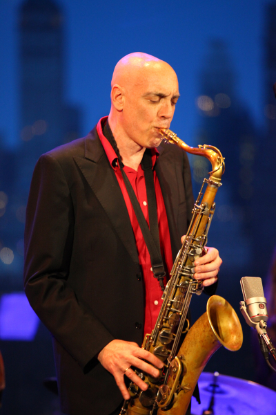

title: Participants

---

[TOC]

---

####Christophe d'Alessandro
Christophe d'Alessandro is a researcher and a musician. Titular organist
at Sainte-Elisabeth, he is regularly invited as a performer and
improviser. Directeur de Recherche CNRS, he heads the LAM
(Lutherie-Acoustique-Musique) team at Institut Jean Le Rond D’Alembert,
Sorbonne Université, Paris. His research interests include speech and
singing analysis, synthesis and perception, signal processing for speech
and music, computed music and musical acoustics.His recent projects
include research, composition and performances for organ and live
electronics (CD "The twelve degrees of silence", Hortus edition, “5
diapasons” award, 2012), and singing instruments: Cantor Digitalis (1st
prize at the Margareth Guthman Musical Instrument Competition, Atlanta,
2015), Vokinesis and Voks.
 
 
 
 
 

---

####Antonis Alexakis
Antonis Alexakis holds a BSc in Mathematics from University of Patras and 
an MSc in Knowledge Based Systems from Heriot-Watt University. He has
an active presence in the IT industry for more than 25 years. In the past he has taken part in several EU projects (FP4 & FP5). Lately, he has taken part in MIROR project as an IT expert. His work entails the computational analyses of the musical data gathered within the framework of the above project. He is
currently finishing his PhD at the Department of Music Studies,
University of Athens.   
 
 

---

####Christina Anagnostopoulou 
Christina Anagnostopoulou is a musicologist and associate professor in music informatics at the Department of Music Studies, University of Athens. Her PhD (Edinburgh) was on computational and cognitive modeling of music analysis. She has taught at the Universities of Edinburgh, Glasgow, and Queen’s Belfast, where she got tenure. Her research interests include computational music analysis, and music in the community. She is also the director of the Music Cognition, Computation and Community (MCCC) Lab in Athens. 

---

####Areti Andreopoulou
Dr. Areti Andreopoulou is an Assistant Professor in the Laboratory of Music Acoustics and Technology (LabMAT) at the University of Athens, Greece. She has a bachelor’s degree in music studies from the University of Athens (2005) and a Master’s (2008) and a Ph.D degree (2014) in music technology from New York University. Her fields of interest include spatial audio, the design and evaluation of immersive environments, auditory displays, acoustics, and data sonification.
 
 
 
 
 
 
 

---

####Georges Bloch
composer and researcher, got an engineering degree before studying composition in U. C. San Diego (PH. D. in 1988). His compositions revolve around three centers of interest: music and space, interaction and collaboration with other artists. He is Associate professor at Strasbourg University and was instrumental in developing Tonmeister cursus in France, in Strasbourg and in Paris Conservatoire. Because of his interest for opera, he has been linked to music-theater productions as well as studies in film music. As researcher associated to Ircam in Paris, he actually works on the OMax/Somax/DYCI2 family of computer–assisted improvisation systems.
    

---

####Daniel Brown
Daniel Brown is the founder of Intelligent Music Systems, a company that develops computer-composed music software for interactive systems. He is also a composer, cellist, and educator. Daniel received a Doctorate of Musical Arts in Composition from the University of California at Santa Cruz in 2012, where he studied under David Cope and Paul Nauert, and a Bachelor of Science in Discrete Mathematics from the Georgia Institute of Technology (USA).  Aside from his training in Western music in the USA, he has studied non-Western musics in India, Korea, and Turkey. His compositions have been performed in the US, Japan, Korea, India, and Central America.
 
 

---

####Emilios Cambouropoulos
Emilios Cambouropoulos is currently Associate Professor of Musical
Informatics at the School of Music Studies, Aristotle University of
Thessaloniki. He studied Physics, Musicand Music Technology, and
obtained his PhD in 1998 on Artificial Intelligence and Music at the
University of Edinburgh. As a research associate, he worked at King’s
College London (1998-1999) and at the Austrian Research Institute for
Artificial Intelligence in Vienna (1999-2001). He is founder of the
Cognitive and Computational Musicology Group [http://ccm.web.auth.gr]() at
the School of Music Studies in the context of which he directs a number
of research projects. He has published numerous scientific papers in
scientific journals, books and conference proceedings. Website:
[http://users.auth.gr/emilios/]().
      

---

####Marc Chemillier 
was born in 1960 and began studying jazz piano in 1971 with Jack Diéval and Pierre Cornevin at the Schola Cantorum in Paris. Later he received a PhD in Computer Science and also has degrees in Mathematics, Musicology, Philosophy and Anthropology. He has been conducting fieldwork among the Nzakara of Central African Republic to study their harp music, and in Madagascar to work on the ethnomathematics of divination, and the trance music of the zither. Now Director of Studies at the EHESS in Paris (School for Advanced Studies in Social Sciences), his main interests focus on the design of a family of improvisation softwares in collaboration with IRCAM (OMax/ImproteK/Djazz), and their use in real live performances to study the impact of such devices in the social context of jazz concerts or traditional music rituals.
 
[improtekjazz.org](http://improtekjazz.org) / [digitaljazz.fr](http://digitaljazz.fr)
      

---

####Pierre Couprie 
was born in 1970, he studied instrumental composition, electroacoustic music, musical analysis, and free improvisation at Bordeaux Conservatory. He is an associate professor in digital pedagogy/computer music and a researcher at Sorbonne University (Research Institute in Musicology Lab). His research fields are the musical analysis and the representation of electroacoustic music. He also develops tools for research (iAnalyse, EAnalysis) or musical performance. In 2015, he won the Qwartz Max Mathews Price of technological innovation for his musical analysis software. As an improviser, he is a member of The Phonogénistes and The National Electroacoustic Orchestra (ONE).
 
[www.pierrecouprie.fr](http://www.pierrecouprie.fr)  / [logiciels.pierrecouprie.fr](http://logiciels.pierrecouprie.fr)
    

---

####Anastasia Georgaki
Anastasia Georgaki is Associate Professor in Music Technology at the Music Department of the University of Athens and head of the Laboratory of Music Acoustics and Technology of the same Department. Since 2018 she is also head of the Master’s program “Music `technology and contemporary practices”. Background in Physics and Music, DEA and PhD in “Music and Musicology  of the XXth Century” (EHESS/IRCAM, Paris). Research interests: *analysis/synthesis of the singing voice, interactive music systems, electroacoustic music, computational archeomusicology and Byzantine musicology, music technology in education and acoustic ecology technology*.  Editor and reviewer of Proceedings of International  Conferences and Special issues in Music Technology. She has organised many international conferences in Greece and abroad. Publications in musicological journals, books and Music Technology Conference proceedings. She collaborates with international research institutes in Greece and abroad. Visitor Professor in Music Departments in Europe. Professional accordion player.

---

####Georg Hajdu
Georg Hajdu was born in 1960 to Hungarian parents and grew up in Cologne where
he obtained diplomas in molecular biology and musical composition from the
University of Cologne and the Cologne university of music, as well as a
doctorate from the University of California, Berkeley. His teachers
include Clarence Barlow and David Wessel. He also audited classes with
György Ligeti in Hamburg.

In 1996, following residencies at IRCAM and the ZKM, Karlsruhe, he
co-founded the ensemble WireWorks, a group specializing in the performance
of electro-acoustic music. In 1999, he produced his full-length opera Der
Sprung – Beschreibung einer Oper for which renowned author and filmmaker
Thomas Brasch wrote the libretto. In May 2002, his Internet performance
environment Quintet.net was employed in a Munich Biennale opera production
and in the same year Georg Hajdu became professor of multimedia
composition at the Hamburg University of Music and Drama (HfMT). He
established Germany’s first master’s program in multimedia composition and
the Zentrum für Mikrotonale Musik and Multimedia (ZM4). In 2010, he was
artist in residence with the Goethe Institute in Boston as well as
visiting professor at Northeastern University. He was also involved in a
number of large international projects such as CO-ME-DI-A—a European
Culture 2007 project focussing on networked music performance. In 2016,
Georg Hajdu was the chair of the 13th Sound and Music Computing
conference. In 2017, he successfully applied for the highly competitive
five-year "Innovative Hochschule" grant which will fund projects around
the notion of Stage 2.0.

Hajdu has published compositions which are characterized by a pluralistic
attitude and have earned him several international prizes, the IBM-prize
of the Ensemble Modern among them. He is also the (co-)author of numerous
articles on topics on the borderline of music, technology and science as
well as software applications such MaxScore (with Nick Didkovsky),
Quintet.net, DJster and a real-time version of Stockhausen’s Elektronische
Studie II.

---

####Mari Kimura
is a violinist/composer and a leading figure in the field of interactive computer music. As a violinist, Mari is renowned for her mastery of subharmonics—the production of pitches that sound up to an octave below the violin’s lowest string—as well as for her dynamic performances as an improviser and her premieres of many notable compositions by today’s composers, including Luciano Berio and Salvadore Sciarrino, as well as a soloist with such major orchestras including the Tokyo Symphony and the Hamburg Symphony. She has received numerous awards and grants including a Guggenheim Fellowship, a Fromm Commission Award, a residency at IRCAM, and at the Rockefeller Brothers Fund. She is active in the development of a prototype motion sensor “Mugic” for interactive computer music performance, and she is the founding chair of Future Music Lab at the Atlantic Music Festival.  Her latest solo album “Voyage Apollonian” (Innova Recordings) includes her recent works for violin and motion sensor “Mugic”.  A graduate faculty at Juilliard since 1998, this year, Mari was appointed as a Full Professor of Music at the “Integrated Composition, Improvisation, and Technology” program (ICIT) at the University of California, Irvine.
 
[www.marikimura.com](http://www.marikimura.com)  / [www.marikimura.com/videos.html](http://www.marikimura.com/videos.html)

---

####George Kosteletos
George Kosteletos holds a PhD in Philosophy of Mind and Artificial Intelligence (NKUA), a Master’s Degree in Music Technology (University of York, UK) and a first degree in Physics (NKUA). He currently works as a scientific collaborator of the Medical School (NKUA - 1st Psychiatric Clinic of Aeginition Hospital) and a post-doctoral researcher (NKUA - Sector of Philosophy, Department of Philosophy, Pedagogy and Psychology), studying the cognitive foundations of moral thought and the effect of music on them. He has taught at postgraduate level (NKUA) issues related to Cognitive Science and Philosophy. Moreover, he has participated in international research programs and his research interests are mostly related to the cognitive aspects of morality and music as well as to philosophical issues arising from modern research and practice in the field of Music Technology.
 
 

---

####György Kurtág Jr
György Kurtág Jr is a composer, performer and researcher specialized in the design of innovative methods for teaching digital instruments. Fascinated by the study of musical behavior(s), his work relies principally on the Collective Intelligence Theory. His research works notably include the capture and analysis of musical gestures.  
He also co-developed the Méta-Mallette (Puce-Muse-Paris), the Continuator Project (Sony C.S.L-Paris), Dolabip (SCRIME-Bordeaux), Midi controller for Guitar by Shadow, (Germany). Nowadays, he is the main Arts&Sciences Coordinator of the SCRIME studio, at the University of Bordeaux. 
In the 1980s, Gyorgy KURTAG Jr  collaborated with some of the most influential American researchers-composers in the computer music such as John Chowning, Tod Machover, George E. Lewis and David Wessel at IRCAM, the wold renowned musical research institute of Paris. 
All these expériences inspired him to create his own musical and digital universe.
 
[www.dailymotion.com/video/x1vrmwd](http://www.dailymotion.com/video/x1vrmwd) / [www.youtube.com/watch?v=MJ8Z5skovLw](https://www.youtube.com/watch?v=MJ8Z5skovLw) / [www.youtube.com/watch?v=M3Tr8mSDYl8](https://www.youtube.com/watch?v=M3Tr8mSDYl8)
---

####Steve Lehman
Described as “a state-of-the-art musical thinker” and a "dazzling saxophonist,” by The New York Times, Steve Lehman (b. New York City, 1978) is a composer, performer, educator, and scholar who works across a broad spectrum of experimental musical idioms. Lehman’s pieces for large orchestra and chamber ensembles have been performed by the International Contemporary Ensemble (ICE), So Percussion, Kammerensemble Neue Musik Berlin, the JACK Quartet, the PRISM Saxophone Quartet, and the Talea Ensemble. His recent recording, Mise en Abîme (Pi, 2014) was called the #1 Jazz Album of the year by NPR Music and The Los Angeles Times. And his previous recording, Travail, Transformation & Flow (Pi, 2009), was chosen as the #1 Jazz Album of the year by The New York Times. 
The recipient of a 2015 Guggenheim Fellowship and a 2014 Doris Duke Artist Award, Lehman is an alto saxophonist who has performed and recorded nationally and internationally with his own ensembles and with those led by Anthony Braxton, Vijay Iyer, Jason Moran, Georgia-Anne Muldrow, George Lewis, Meshell Ndegeocello, and High Priest of Anti-Pop Consortium, among many others. 
Lehman received his B.A. (2000) and M.A. in Composition (2002) from Wesleyan University where he studied under Anthony Braxton, Jay Hoggard, and Alvin Lucier, while concurrently working with Jackie McLean at the Hartt School of Music. He received his doctorate with distinction in Music Composition from Columbia University (2012), where his principal teachers included Tristan Murail and George Lewis. 
He is currently a Professor of Music at The California Institute of the Arts, and lives in Los Angeles.
 
[www.stevelehman.com](http://www.stevelehman.com/)

---

####Bernard Lubat
Born in Uzeste in 1945, Bernard Lubat, pianist, vibraphonist, keyboard and accordion player, singer, composer and actor, began studying piano in 1957, attending the Bordeaux Conservatory where he discovered the drums, jazz and Milt Jackson. In 1961, he entered the Paris Conservatory where in 1963 he was awarded the prize for best percussionist. He was then taken on by the Jef Gilson Orchestra (1965) where he came into contact with Michel Portal, Bernard Vitet, François Jeanneau, Jean-Louis Chautemps, Henri Texier… He worked with Jean-Luc Ponty and Martial Solal, as a vibraphonist and for Stan Getz and Eddy Louiss as a drummer. At the same time he worked in contemporary music with Diego Masson, playing Varèse, Bartok, Xenakis, he took part in the premier of Luciano Berio's work Chemin 2 at the Scala de Milan and in the recording of Laborintus. In 1975, he established a group with André Ceccarelli, Marc Bertaux and Tony Bonfils. In 1978, he went on to set up the Festival Uzeste Musical (summer festival) and the Compagnie Lubat, a group with a changeable number of players. At the beginning of the 90s, he launched the festival de printemps and the festival d'hiver set up in cooperation with the Cie Lubat artists with Laure Duthilleul (actress), André Minvielle (singer and musician) and Patrick Auzier (musician and  firework designer) and the publishing house, Les Editions du Tilleul, for the production of CDs. Bernard Lubat and his company tour all over France and abroad. He has also been a musical expert working on the OMax/ImproteK/Djazz project in collaboration with IRCAM and EHESS.
 
[www.cie-lubat.org](http://www.cie-lubat.org)

---

####Jérôme Nika
is a postdoctoral researcher in the Music Representations team at Ircam (UMR STMS 9912 CNRS). He graduated from the “Grandes Écoles” Télécom ParisTech and ENSTA ParisTech. In addition, he studied acoustics, signal processing and computer science applied to music (multidisciplinary Master’s degree ATIAM in sciences and technologies for music, UPMC Paris 6, Télécom ParisTech, Ircam). His PhD work “Guiding human-computer music improvisation“ (“Young Researcher Prize in Science and Music" in 2015; “Young Researcher Prize" awarded by the French Association of Computer Music in 2016) focused on the introduction of authoring, composition, and control in human-computer music co-improvisation. Through the development of the software ImproteK and within the DYCI2 project, his research focuses on the integration of scenarios in music generation processes, and on the dialectic between reactivity and planning in interactive human-computer music improvisation.  
[http://repmus.ircam.fr/nika](http://repmus.ircam.fr/nika) / [http://repmus.ircam.fr/dyci2/](http://repmus.ircam.fr/dyci2/)
   
 
 

---

####Danae Stefanou
Danae Stefanou makes improvised sounds and texts. She is Associate
Professor at the Aristotle University of Thessaloniki where she teaches a
variety of courses on experimental music, critical studies and contemporary
music historiography, and directs the AUTH Experimental and Improvised
Music Ensembles. She has previously worked as Visiting Lecturer / Research
Associate at Royal Holloway, University of London, and as Project Manager
for the Chopin’s First Editions Online and Online Chopin Variorum Edition
projects (2003-2007). In her own research, she examines experimental &
improvised music histories and aesthetics from a variety of ethnographic,
archival and analytical perspectives, and has published widely in
peer-reviewed journals (*JRMA*, *JIMS*, *Musicae Scientiae*) and edited
volumes, including *Contemporary Popular Music Studies *(Springer, 2019),
*Made in Greece: Studies in Greek Popular Music *(Routledge, 2018) and *Cambridge
Companion to Film Music *(CUP, 2016). As an improviser, she regularly
performs solo, in various ad-hoc collaborations, and as one half of the
electroacoustic duo acte vide (with Yannis Kotsonis).  Her releases include
*[herewith]* for solo inside piano (Holotype, 2014), *Crease*, a duo with
guitarist Michalis Moschoutis (Coherent States, 2017), and a contribution
(as acte vide) to the *Anthology of Greek Experimental Electronic Music*
1966-2016  (*sub rosa*, 2019). Her visceral, intensely tactile approach to
the piano has been described as “real-time composition with no safety
net” ([mic.gr](http://mic.gr)) and compared to the sound of electronic and noise
musicians such as Russell Haswell, Kevin Drumm & Phill Niblock  (*The
Quietus*; *Just Outside*).

---

####George Petras
George Petras was born in Athens, Greece in 1966. He holds a PhD in musicology, music technology and composition (National & Kapodistrian University of Athens - NKUA). The title of his doctoral dissertation is "Voice and interactive media in ancient drama. Musicological and technological extensions to the environment Max/MSP".  Also, he has two postgraduate diplomas, one in Arts and Technologies of Sound where he specialized in the composition of electroacoustic music (Ionian University) and another in Music Culture and Communication: Anthropological and philosophical extensions of music (NKUA). He studied Composition at the Athenaeum Conservatory and piano at the Orpheus Conservatory of Athens. He graduated from the Political Science Department of the NKUA. He systematically dealt with the composition and his works have been performed in Athens, in Corfu and at the Music Megaron of Thessaloniki.

He works at the Greek National School of Dance. Ηe has been involved in the teaching of music from a variety of posts (worked as a Music professor teaching Music theory, Piano and Music Technology in Conservatories, in public schools and Universities etc.). He was responsible for digitizing, documenting and cataloguing of the Music Archive of the National Theatre of Greece. He has worked as a cultural development consultant for the European Program "Artists in Action" and elsewhere. He has published articles in international conferences and scientific journals.

---

####Angeliki Triantafyllaki
Angeliki Triantafyllaki is a research associate and teaching fellow at the Department of Music Studies, University of Athens, and the MA in Education Programme Leader at Mediterranean College Athens. She holds a PhD and MPhil in Education and Educational Psychology from the University of Cambridge, Faculty of Education. She has taken part in international and European research projects and has been awarded by IKY and the British Academy for postdoctoral research on professional teacher development, music education, creativity in learning and teaching and new technologies, and learning and teaching in tertiary education. Her work has been published in a recent monograph (Routledge, UK), in collective volumes and in international scientific journals. 

 

---

####Dimitri Vassilakis
“An internationally acclaimed, award winning Greek saxophonist/vocalist and composer”
[http://www.dimitriosvassilakis.com](http://www.dimitriosvassilakis.com)

Has recorded 5 albums for historic jazz label Candid Records based in London.
[http://store.candidrecords.com/index.php?route=product/category&path=61_192](http://store.candidrecords.com/index.php?route=product/category&path=61_192)

Awarded album of the month from BBC Music magazine and 2nd jazz album of the year from the BBC for "Labyrinth". This album has become the subject of study at several universities and has been presented at Yale University and at musicological conferences.

Has played and recorded with jazz greats like: David Liebman, Jeff «Tain» Watts, Abdullah Ibrahim, Ralph Peterson, Marc Johnson, Essiet Essiet, Dave Kikoski, Dan Wall, Ron Affif, Andy Sheppard, Theodosii Spassov, Milcho Leviev, Adam Nussbaum, Benito Gonzalez, Jamie Cullum.
  
Has appeared at New York clubs Birdland, Lincoln Center Dizzy' s, Zinc, Smalls, Kitano, Jazz Showcase Chicago and major festivals worldwide such as London Jazz Festival, Ronnie Scott's, Smithsonian Festival DC at the American History Museum. 

Has collaborated for many of his educational and concert projects with the Onassis Foundation at Dizzy' s and Jazz at The Lincoln Center, Niarchos Foundation, Yale, Harvard, The British Council, The American Embassy and the Hellenic Foundation For Culture, Hellenic Ministry Of Culture, Hellenic Ministry Of Foreign Affairs. 

Branding with Bentley:
[http://www.dimitriosvassilakis.com/en/press-and-media/54-media-photos/88-bentley-sponsorship.html](http://www.dimitriosvassilakis.com/en/press-and-media/54-media-photos/88-bentley-sponsorship.html) / [http://www.dimitriosvassilakis.com/en/discography.html](http://www.dimitriosvassilakis.com/en/discography.html)

Presenting his concept “Jazz Democracy” at the United Nations New York April 30th 2018 invited by the Permanent mission of Greece to the UN for International Jazz Day. [https://www.youtube.com/playlist?list=PLfth9JxqdMQFOb32Pz6920eWWfMmRohsJ](https://www.youtube.com/playlist?list=PLfth9JxqdMQFOb32Pz6920eWWfMmRohsJ)

Since 2015 organizer and artistic director of Mirabello Jazz Festival (Crete) and Rhodes Jazz Festival, plus special researcher at Georgia Institute Of Technology Atlanta USA for jazz and artificial intelligence/robotics.
Has taught at the Athens, Macedonia, Aristotle Universities and has lectured and presented workshops, residencies and clinics at Yale, Columbia, Queens, Skidmore DePaul, Georgia Tech, Royal Academy, Paris Conservatoire.
Researcher and lecturer at the Athens Kapodistrian University, teaching at the Master Course in “Jazz and new Technologies” from fall 2017.

Presenting "jazz mapping AI & Robotics" for Singularity Summit Greece November 2018, “On the syntax and semantics of language”.
[https://www.youtube.com/watch?v=MyEXyn8T3Rs](https://www.youtube.com/watch?v=MyEXyn8T3Rs)

---

     
  
     

