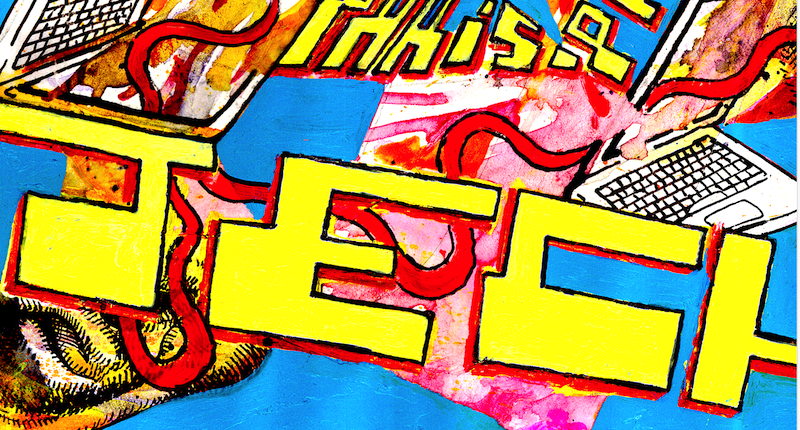

title: Committee

---

### General Chair

Pr. Gérard Assayag, Ircam - STMS Lab  
Pr. Marc Chemillier, EHESS - Cams Lab  
Pr. Pierre Couprie, Paris-Sorbonne - IReMus Lab  
Pr. Eugene Lew, University of Pennsylvania - Music Dpt  

---

### Organising Committee

Sylvie Benoit, Ircam  
Turner Williams, Ars Nova Workshop

---

### Science / Art Advisory Board

Carlos Agon, Pr. Université Pierre et Marie Curie, Head Ircam-STMS research Lab  
Brigitte d’Andréa-Novel, Pr. Mines ParisTech  
Elaine Chew, Pr. Queen Mary University of London, Director of Music Initiatives, Centre for Digital Music  
Maxime Crochemore, Pr. King’s College of London  
Andrew Hugill, Pr. Centre for Creative Computing, Bath Spa University  
György Kurtág, Art/Science coordinator, SCRIME, University of Bordeaux  
George Lewis, Pr., Area Chair of Composition, Columbia University  
Bernard Lubat, Dir. Compagnie Lubat,  Uzeste Music Festival - Hestajada de las Arts  
Peter Nelson, Pr. University of Edinburgh, Personal Chair of Music and Technology  
Tae Hong Park, Pr. New York University, Director of Composition program  
Robert Rowe, Pr., New York University, Director of Music Technology  
Pierre Alexandre Tremblay, Pr. Huddersfield University, composition and improvisation  
Atau Tanaka, Pr. Goldsmiths University of London  
Hugues Vinet, Head Innovation and Research Resources Dpt, Ircam  
Michael Young, Pr. University of Sunderland, Deputy Vice-Chancellor  
  

---

     
  
     

