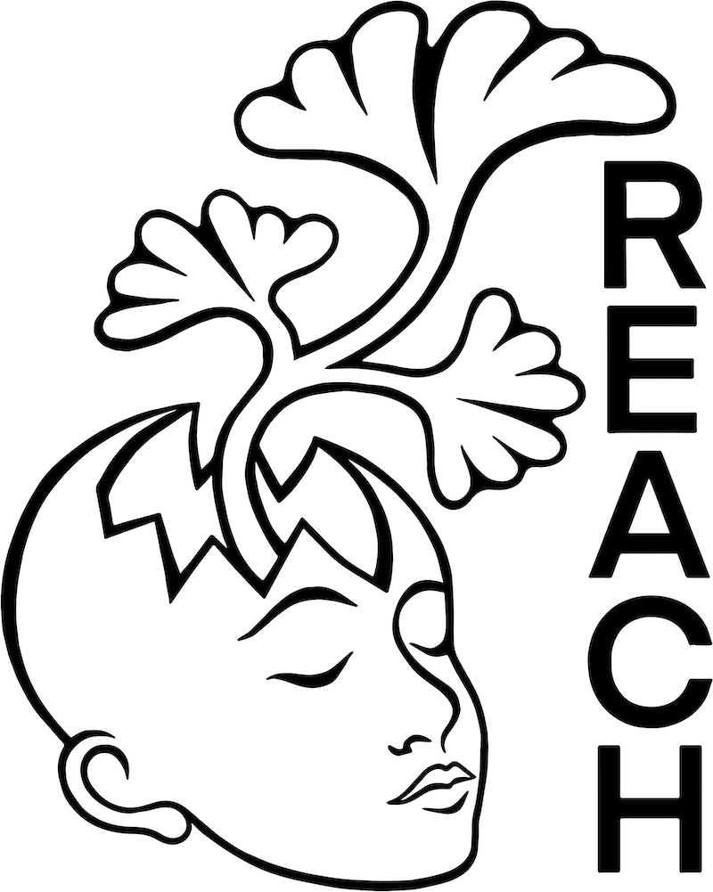
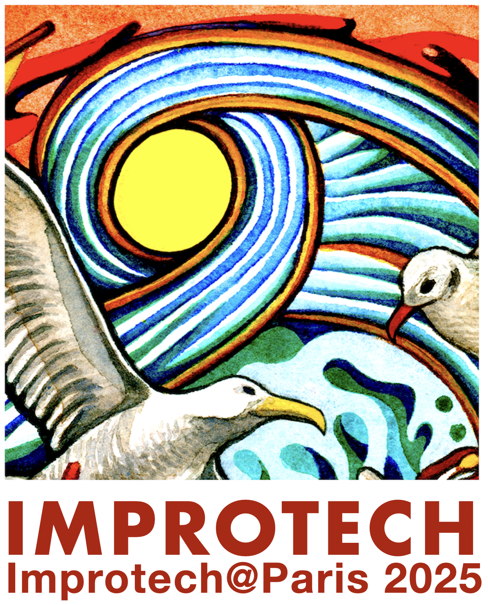

title: Organisation

---

###  General Chair

Gérard Assayag, IRCAM  
Pr Marc Chemillier, EHESS  
Marco Fiorini, Sorbonne Université

### Organisation Team

Vasiliki Zachari, IRCAM  
José-Miguel Fernandez, IRCAM

### Production

Cyril Beros, Head Production Dpt, Ircam  
Jonathan Durand, Production Dpt, Ircam  
Raphael Bourdier, Production Dpt, Ircam  
Lorraine Sarrazin, Production Dpt, Ircam  

### Sound, Computer Music Design

Sylvain Cadars, Ircam  
Manuel Poletti, Music Unit  
Grégoire Lavaud, Ircam  

### Communication

Marine Nicodeau, Communication Dpt, Ircam  
Clotilde Couturier, Communication Dpt, Ircam  

### Science / Art  Advisory Board / Steering 

Anastasia Georgakis, Kapodistrian University of Athens  
Pierre Couprie, U. of Evry/Paris-Saclay  
Emilios Cambouropulos, Aristotle University of Thessaloniki  
Suguru Goto, Geidai University of the Arts, Tokyo  
Brigitte d’Andréa-Novel, Ecole des Mines / Sorbonne Université  
Eugene Lew, University of Pennsylvania  
Fabrice Vieira, Uzeste Musical  
Hugues Genevois, Sorbonne Université  
Elaine Chew, Queen Mary University of London  
Maxime Crochemore, King’s College of London  
Shlomo Dubnov, University of California at San Diego  
Andrew Hugill, Bath Spa University  
György Kurtág, University of Bordeaux   
George Lewis, Columbia University   
Bernard Lubat, Uzeste Musical 
Peter Nelson, University of Edinburgh  
Tae Hong Park, New York University  
Robert Rowe, New York University  
Pierre Alexandre Tremblay, Huddersfield University  
Atau Tanaka, Goldsmiths University of London  
Jean-Baptiste Barrière, Artist
Miller Puckette, IRCAM

#Credits

###Produced & supported by

 

   

 

###Under the high patronage of

 
 

   

 

###A Research & Creation Action of

 
 

**Improtech** workshop-festival is an original creation by © Gérard Assayag and Marc Chemillier.  
Improtech is an ERC REACH action supported by the European Research Council within the Horizon 2020 program (Convention No. 883313) and by the Agence Nationale de la Recherche under grant MERCI ANR-19-CE33-0010

 

[Art Work & Graphic Design] © [Turner Williams](https://turnerwilliamsjr.com/)

  
  

  

