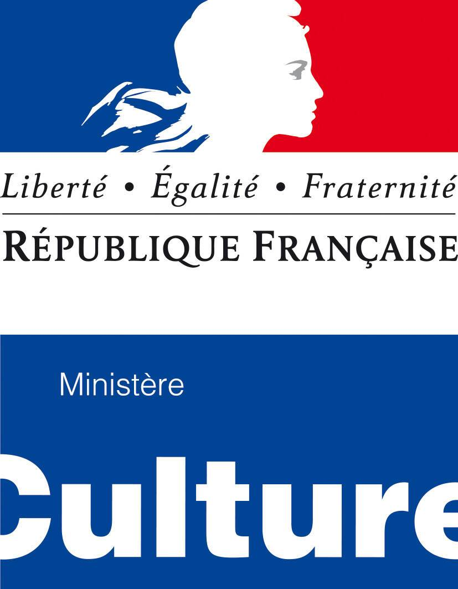
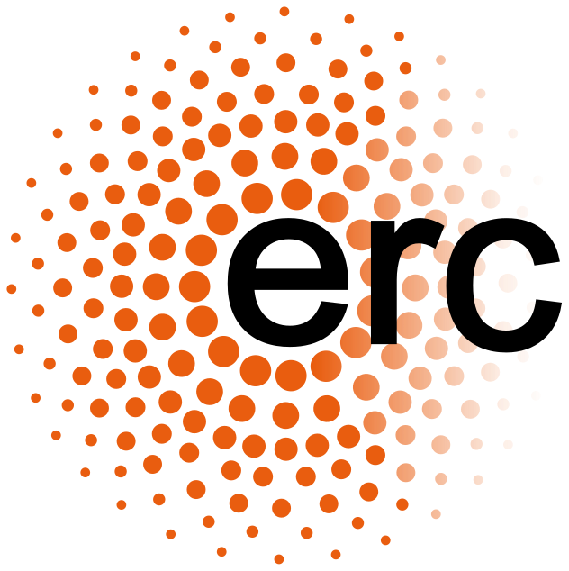

title: Organisation

---

###  General Chair

Gérard Assayag (Research Director, IRCAM)  
Marc Chemillier (Research Director, EHESS)  
Bernard Lubat, Fabrice Vieira (Compagnie Lubat, Uzeste Musical)

### Organisation Committee

Vasiliki Zachari (IRCAM) administration  
Martine Bois (Uzeste) administration  
Isabelle Pauly (Uzeste)  logement, transport  
Celine Rutaly (Uzeste) production  
David Brunet (Uzeste) régisseur plateau  
Patrick Lafrance (Uzeste) ingénieur son  
Guillaume Prudon (Uzeste) Regisseur général  

### Collaborators and Partners

Sylvie Benoit, Artistic advisor  
Jeff Joly, Popmyfilm,	Film maker  
Turner Williams Jr, Graphic Design  

### Volunteers

### Science / Art  Advisory Board

Anastasia Georgakis, Kapodistrian University of Athens  
Cristos Carras, Onassis STEGI, Athens  
Pierre Couprie, U. of Evry/Paris-Saclay  
Emilios Cambouropulos, Aristotle University of Thessaloniki  
Suguru Goto, Geidai University of the Arts, Tokyo  
Brigitte d’Andréa-Novel, Ecole des Mines / Sorbonne Université  
Eugene Lew, University of Pennsylvania  
Turner Williams, Artist  
Hugues Genevois, Sorbonne Université  
Elaine Chew, Queen Mary University of London  
Maxime Crochemore, King’s College of London  
Shlomo Dubnov, University of California at San Diego  
Andrew Hugill, Bath Spa University  
György Kurtág, University of Bordeaux   
George Lewis, Columbia University   
Bernard Lubat, Compagnie Lubat  
Peter Nelson, University of Edinburgh  
Tae Hong Park, New York University  
Robert Rowe, New York University  
Pierre Alexandre Tremblay, Huddersfield University  
Atau Tanaka, Goldsmiths University of London  

 

  

#Credits

###Produced & supported by

 

  

 

###Under the high patronage of

 

 

###A Research & Creation Action of

 

**Improtech** workshop-festival is an original creation by © Gérard Assayag and Marc Chemillier.  
Improtech is an ERC REACH action supported by the European Research Council within the Horizon 2020 program (Convention No. 883313) and by the Agence Nationale de la Recherche under grant MERCI ANR-19-CE33-0010

 

[Art Work & Graphic Design] © [Turner Williams](https://turnerwilliamsjr.com/)

  
  

 

   
 

