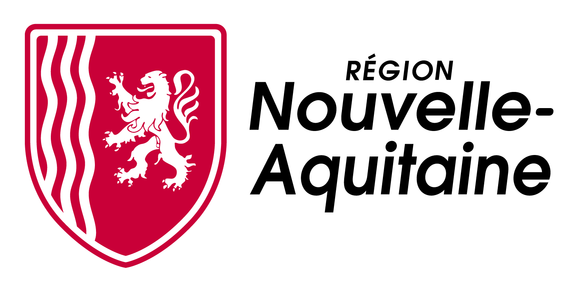

title: Programme

 
---
 

Improtech Paris - Tokyo 2024
during the Max Summer School 2024 – Tokyo University of the Arts

Cocreative Improvised Interaction Ecosystems

MSS advanced course / Improtech Workshop #1 to #4 by the REACH project team :  Marco Fiorini, Mikhail Malt, Marc Chemillier, Gérard Assayag, Nicolas Brochec, Jose-Miguel Fernandes.

29 July, Monday

16:30 - 18:00 MSS advanced course / IK Workshop  #1
Introduction to REACH co-creative software.
This course will present a set of tools that enable interactive improvisation between the human and the machine. Tools such as Omax, Somax2, Djazz, Dicy2 allow Max to improvise in collaboration with humans by capturing human performances, navigating through music corpuses and latent spaces of musical features, and adapting continuously to the evolving musical context using generative model and audio / midi rendering.
18:00 - 19:30 Improtech lecture session #1
Miller Puckette (Ircam), Advanced improvised interaction systems
Marc Chemillier (EHESS) & al, Keeping the swing, AI cocreative musicianship in collective idiomatic settings

30 July, Tuesday 

16:30 - 18:00 MSS advanced course / IK Workshop #2
Introduction to Somax2
This course will focus on the cocreative AI improvisation environment Somax2, detailing its basic concepts, the applicative user interface, the main controls, interaction strategies and musical scenarios, with concrete musical examples and demos..
18:00 - 19:30 Improtech lecture session #2
Shlomo Dubnov (UCSD, Qualcomm Institute), Advanced Machine Learning and Music Information dynamics for Deep and Shallow CoCreative Systems
Nicolas Brochec, Marco Fiorini (Geidai, Ircam) : Real-Time Recognition of Instrument Playing Techniques for Mixed Music and CoCreative Interaction

31 July, Wednesday 

16:30 - 18:00 MSS advanced course / IK Workshop #3
Somax2 advanced course
This course will dive into the advanced use of Somax2, including mastering of expert controls in the UI, accessing and programming the Max Library interface, scripting for real life performances, and taking advantage of multi-agent network connectivity.

18:00 - 19:30 Improtech lecture session #3
Mari Kimura (UC Irvine), Natural Gestural Control in Instrumental Interaction with Generative Live Electronics
Jose-Miguel Fernandes and Lara Morciano (Ircam) The Somax2Collider environment for Spatial Interactive Agents. The making of Lara Morciano’s Lithophonics for ensemble.

1 August, Thursday 

16:30 - 18:00 MSS advanced course / IK Workshop #4
Somax2 under the hood
The internal technical parts of Somax2 will be explained, including the client - server Max / Python architecture ; the AI core responsible for machine listening, representation learning, and adaptive generativity ; the segmentation and recognition of audio streams and the reactive strategies.

18:00 - 19:30 Improtech lecture session #4
Nao Tokui (Qosmo Inc.), Surfing Human Creativity with AI
Suguru Goto (Geidai), On Creation of a New Piece with Generative Electronics

2 August, Friday

16:00 IMPROTECH CONCERT #1

REACHing OUT! 
Joëlle Léandre (Bass) and the Who/Men (G. Assayag, M. Fiorini, M. Malt, generative electronics) 
Collectif Trans(e)-musical
Justin Vali (Malagasy zither, voice), Marc Chemillier (Generative electronics), and friends.
Knock
Miller Puckette (live electronics),  Irwin (percussion, live electronics)

Strings
Jean-Marc Montera (Table Guitar), Turner Williams Jr (Shahi Baaja), and friends.

Collider
Lara Morciano (composer, pianist),  Jose-Miguel Fernandez (generative electronics)

20:00 IMPROTECH CONCERT #2
Piece1
Suguru Goto (composer, generative electronics)
Piece2
Ko Sahara (composer, generative electronics)
Spectral Light
Steve Lehman (Saxophone, live electronics) and friends
Mugix
Mari Kimura (Violin, generative electronics) and Friends
Tokyo Bout à Bout
Georges Bloch (composer, generative electronics) and Friends
Piece3
Takeyoshi Mori (composer, generative electronics)
Piece4
Nicolas Brochec (composer, generative electronics)

##Vendredi 11 août
 
####*11h – Théâtre Amusicien l'Estaminet – performance / débat*
**Artisticiel**  
par Bernard Lubat, Marc Chemillier, Gérard Assayag

 
####*12h00 – Théâtre Amusicien l'Estaminet – conférence*
**REACH : Raising Co-Creativity in Cyber-Human Musicianship**  
par Shlomo Dubnov (Directeur du Center for Research in Entertainment and Learning, Qualcomm Institute, Calit2
University of California, San Diego)

 
####*15h – Théâtre Amusicien l'Estaminet – conférences / ateliers / performances*
Chair : Pierre Couprie

**Voix au naturel ou à l'électronique**  
par Jaap Blonk (voix), Fabrice Vieira (voix)

**Flux Bikes**  
par Rob Frye

**Sardine Live Coding**  
par Raphaël Forment, Rémi Georges

 
####*21h 30 – Chapiteau Marie Lubat – concert IMPROTECH N° 1*
**Trio**  
Marco Fiorini (guitare, ordinateur Somax2), Francesco Diodati (guitare), Lorenzo Colombo (percussions)

**Maciek Lasserre MCK [S] feat. Gaston Bandimic (Sénégal)**  
Maciek Lasserre (saxophone, percussions, sampler), Gaston Bandimic (rap)

**Collectif Trans(e)-musical**  
Justin Vali (cithare, voix), Charles Kely Zana-Rotsy (guitare, voix), Marc Chemillier (ordinateur Djazz), Lucas Lemoine (électronique), Sabina Covarrubias (vidéo)

**Plug & Pray**  
Benoît Delbecq (claviers, électronique) & Josef Dumoulin (claviers ,électronique)

**Trio**  
Benny Sluchin (trombone), Mikhail Malt (ordinateur Somax2), Pavlos Antoniadis (piano)

**Trio**  
Evan Parker (saxophones), Mari Kimura (violon, électronique MUGI), Laurent Mariusse (percussion)

 
####*00h – Tonnelle Café du Sport – projection*
Captations des concerts Improtech à New York & Philadelphie & Athènes

 

  

 

##Samedi 12 août
 
####*10h – Théâtre Amusicien l'Estaminet – conférences / ateliers / performances*
Chair: Sabina Covarrubias

**Programmation Faust et improvisation collective**  
par Yann Orlarey (INRIA, équipe EMERAUDE)

**Jardim das Cartas: écologie de la présence**  
par Jonatas Manzoli

**MUGIC, contrôle gestuel**  
par Mari Kimura (University of California, Irvine)

 
####*15h – Théâtre Amusicien l'Estaminet – conférences / ateliers / performances*
Chair : Daniel Brown

**La mainvielle à roue**  
par André Minvielle

**Somax2, hommage à Xenakis**  
par Marco Fiorini (Ircam), Mikhail Malt (Ircam), Lorenzo Colombo (percussionniste), Pavlos Antoniadis (Université de Ioannina)

**BBDMI Body Brain Digital Music Instrument**    
Alain Bonardi (Université Paris 8), David Fierro (Université Paris 8), Atau Tanaka (Goldsmith College), Stephen Whitmarsh (Paris Brain Institute - ICM)

 
####*20h – Tonnelle Café du Sport – apéro mélimélo*
Electro-panic jazz  
Fabrice Vieira (électro voix), François Corneloup (saxophone), Bernard Lubat (électro drums)

 
####*21h 30 – Chapiteau Marie Lubat – concert IMPROTECH n°2*
**REACHing OUT !**  
Joëlle Léandre the Who/Men : Joëlle Léandre (contrebasse, voix), Mikhail Malt, Marco Fiorini, Gérard Assayag (ordinateurs Somax2), invité Jean-Brice Godet (clarinette)

**Sardine !**  
Raphaël Forment et Rémi Georges (ordinateurs, Sardine live coding)

**Paris bout-à-bout en abyme**  
Jaap Blonk (voix), Hervé Sellin (piano), Georges Bloch (ordinateur OMax et Somax2, voix), Nurith Aviv (vidéo)

**Trio**  
Rob Frye (percussions, vents), Laurent Mariusse (percussion), Turner Williams (shahibaja)

**Duo**  
Evan Parker (saxophones), Jean-Marc Foussat (synthétiseurs)

**Rencontres du 7ème type**  
Pierre Couprie (live electronics), Mari Kimura (violon, électronique MUGI), György Kurtag (handsonic), Jean-Marc Montera (guitares)

 
####*00h – Tonnelle Café du Sport – projection*
Captations des concerts Improtech à New York & Philadelphie & Athènes

 

  

 

##Dimanche 13 août
 
####*10h – Théâtre Amusicien l'Estaminet – table ronde*
**« Musique à voir »**  
Présentation des projets musique-technologie lauréats de l'appel à projets Cultures connectées organisée avec le soutien de la région Nouvelle-Aquitaine et les participations exceptionnelles de Miller Puckette, créateur du célèbre logiciel Max pour l'interaction audio-visuelle et de Shlomo Dubnov chercheur internationalement reconnu en intelligence artificielle, table ronde animée par Marc Chemillier

* *10h-10h15* Shlomo Dubnov (introduction sur l’intelligence artificielle dans les arts du spectacle)
* *10h15-10h30* Jean-Marie Collin (demo live d’interaction sons-images avec karlax)
* *10h30-10h45* Damien Skoracki (projet Ekosystem), ballade dans une installation sonore organique.
* *10h45-11h15* Youri Fernandez, Dômes Studio Bayonne, projet KYF! avec le batteur Fred Faure, concert augmenté d'interaction musique-vidéo-lumières, projet HAL2000
* *11h15-11h30*  David Couturier (projet Shangri-La Or norme), concert immersif d'après une bande-dessinée
* *11h30-12h* débat sur musique et visuel avec Georges Bloch et Sabina Covarrubias

 

Avec le soutien de 

 
####*14h – Théâtre Amusicien l'Estaminet – conférence*
Chair : Mikhail Malt

**La Surprise et l'imprévu**  
par Miller Puckette (U. California at San Diego, créateur du logiciel Max), conférencier invité

**Co-présence et incarnation dans les interactions improvisées cyber-humaines**  
par Pierre Saint-Germier (Ircam, CNRS), conférencier invité

 
####*16h – Théâtre Amusicien l'Estaminet – table ronde*
**« De quoi l'intelligence artificielle est-elle le nom ? »**  
avec les ingénieurs de l'UJICT, représentants artistiques...
Fabien Barontini, Bernard Lubat, Shlomo Dubnov, Pierre Saint-Germier

 
####*20h – Tonnelle Café du Sport – apéro canto*
Free Taxe Taxi  
Bernard Lubat et les élèves du Conservatoire National Supérieur de Paris

 
####*21h 30 – Chapiteau Marie Lubat – concert IMPROTECH n° 3*
**Double duo**  
Evan Parker (saxophones), Jean-Marc Foussat (synthétiseurs) / Joëlle Léandre (contrebasse, voix), Gérard Assayag (ordinateur Somax2)

**Duo vocal**  
Jaap Blonk (voix), Fabrice Vieira (voix, électronique)

**Quatuor**  
Cyril Benhamou (flûte, claviers), Stylianos Dimou (électronique), Jean-Brice Godet (clarinette), Laurent Mariusse (percussions)

**Duo**  
André Minvielle (voix) et Camel Zekri (guitare augmentée)

**Aïe l’IA !**  
Shlomo Dubnov (ordinateur IA générative et participative)

**Lubax Lux**
Bernard Lubat (piano, voix), Sylvain Luc (guitare), Marc Chemillier, Gérard Assayag (ordinateurs)

 
####*00h – Tonnelle Café du Sport – dance floor live remix*
**Bal d'improtech**  
 Entremélimélomélant acoustic-électropanik pour danser en dehors des clous.

 

  

 

# Contenu Workshops et conférences

 

###REACH : Raising Co-Creativity in Cyber-Human Musicianship	(Keynote)
Shlomo Dubnov (Directeur du Center for Research in Entertainment and Learning, Qualcomm Institute, Calit2
University of California, San Diego)

Le projet REACH vise à comprendre, modéliser et développer la co-créativité musicale entre les humains et les machines par le biais d'interactions improvisées, permettant aux musiciens de tout niveau de formation de développer leurs compétences et d'accroître leur potentiel créatif individuel et social. Shlomo Dubnov en présente les aspects liés au machine learning et l'intelligence artificielle, qui permettent de voir une co-improvisation par un agent digital comme un transfert continu d'information à partir d'un signal de contrôle (le musicien humain), en maximisant l'information mutuelle  (concept de théorie de l'information) de sorte à garder une cohérence et une pertinence dans la polyphonie des voix. Shlomo montrera aussi les applications les plus récentes de l’IA en matière de générativité musicale.

###Co-présence et incarnation dans les interactions improvisées cyber-humaines (Keynote)
Pierre Saint-Gernier (Ircam , CNRS)

Si l'on prend au sérieux les recherches menées en sciences cognitives sous la bannière de l'Embodied Cognition Program les approches strictement logicielles en IA musicale, par opposition aux approches robotiques, semblent souffrir d'une limitation intrinsèque en se coupant des ressources que représente l'incarnation des agents. L'utilisation de techniques d'apprentissage automatique permettant à des agents artificiels d'improviser dans le style d'un corpus défini relance cependant cette question en suggérant la possibilité que certaines propriétés cruciales de l'incarnation soit transmises via le corpus d'apprentissage, s'il est lui-même produit par des agents incarnés. Cette présentation vise d'une part à explorer cette hypothèse d'un point de vue théorique en isolant conceptuellement deux dimensions de l'incarnation des agents musicaux qui sont souvent confondues, et en présentant un protocole permettant de la tester expérimentalement.

###BBDMI Body Brain Digital Music Instrument
Alain Bonardi (Université Paris 8), David Fierro (Université Paris 8), Atau Tanaka (Goldsmith College), Stephen Whitmarsh (Paris Brain Institute - ICM)

Faire de la musique à partir des signaux électriques des muscles et du cerveau en s’appuyant sur les technologies EMG et EEG.

L’utilisation des signaux physiologiques du cerveau et du corps humains dans l’interaction homme-machine est devenue majeure, constituant le domaine de recherche de l’informatique physiologique. Les musiciens ont été à l’avant-garde du développement d’instruments de musique numériques adoptant des interfaces physiologiques, mais leurs efforts sont restés au niveau de l’expérimentation,  souvent isolés des communautés scientifiques concernées.
Du côté industriel, les technologies EMG ou EEG appliquées à la musique et aux arts numériques sont en général développées de façon propriétaire, sans donner accès aux savoirs ni aux technologies mises en œuvre. Dans une perspective de sciences ouvertes étendue à l’industrie, BBDMI vise le développement libre d’un instrument de musique physiologique robuste et utilisable par des musiciens et des artistes sans connaissances spécialisées dans les domaines des neurosciences et de l’analyse du signal.

###Somax2, hommage à Xenakis
Marco Fiorini (Ircam), Mikhail Malt (Ircam), Lorenzo Colombo (percussioniste), Pavlos Antoniadis (Université de Ioannina)

Somax2 est un logiciel  pour la co-improvisation musicien - machine basé sur une écoute automatique, un moteur réactif et un modèle génératif qui fournissent une improvisation stylistiquement cohérente tout en s'adaptant continuellement au musicien (ou à d’autres agents Somax2). Somax2 utilise un modèle de mémoire cognitive et des algorithmes d’IA pour apprendre des matériaux musicaux et trouver les correspondances avec les éléments mélodiques, texturaux et rythmiques du mmusicien.
A partir de leur pièce "A.I. Komboï “ (Hommage à Iannis Xenakis) Marco Fiorini et Lorenzo Colombo montreront comment l’IA peut aider à créer un morceau de musique cohérent après avoir été instruite pour utiliser le matériel de clavecin composé par Xenakis, réagir au matériel de percussion par une écoute active, créer une musique improvisée cohérente en temps réel. Mikhail Malt parlera de même de ses hommage à Keren pour trombone (avec Benny Sluchin) ou Evryali pour piano (avec Pavlos Antoniadis) de Xenakis.

### Programmation Faust et improvisation collective
Yann Orlarey (INRIA, équipe EMERAUDE)

Vous ne connaissez rien à la programmation, c’est l’occasion d’apprendre ! Plongez dans la création sonore et venez découvrir comment produire et transformer des sons grâce au langage de programmation Faust. Aucune expérience préalable en programmation requise, venez simplement avec un ordinateur portable.
FAUST (acronyme anglais de Functional AUdio STream) est un langage de programmation dédié purement fonctionnel, conçu pour les applications de traitement du signal audio et permettant notamment le live coding.
Inventé par Yann Orlarey, il y a une vingtaine d’années, ce langage permettant la synthèse et le traitement du son, a rendu le développement du calcul numérique pour le signal musical  plus accessible, avec notamment un système de déploiement vers un grand nombre de plate-formes.
Il connait un succès majeur dans l’ensemble des lieux de recherche et de création dans le monde.

###MUGIC
Mari Kimura (U.C. Irvine)

MUGIC est un capteur en forme de gant WIFI facile à utiliser, adapté à l'apprentissage et à l'enseignement de la musique électronique, des graphiques interactifs et à la création de sons, au contrôle des effets, à la modification des paramètres d'éclairage, à la génération de visuels et à bien d'autres choses encore. MUGIC permet d'étendre le contrôle sur le système musical numérique et de traduire les mouvements en données musicalement significatives.
MUGIC est présenté par son inventrice, Mari Kimura, violoniste à l'avant-garde des capacités techniques et expressives de l'instrument. En tant qu'interprète, compositrice, chercheuse et entrepreneuse, Mari a ouvert de nouveaux mondes sonores et de nouvelles possibilités musicales pour le violon, notamment à l’aide du contrôle gestuel numérique présenté ici.

###Sardine Live Coding
Raphael Forment (U. Jean Monnet et Paris 8) et Rémi Georges (Live codeur)

Sardine est un environnement pour l'improvisation musicale algorithmique (live coding) conçu en Python 3.10+. Sardine transforme l'interpréteur Python en instrument de musique réactif permettant l'écriture de motifs rythmiques et mélodiques interprétés au vol. L'environnement est conçu de manière modulaire, permettant au musicien de lier Sardine à n'importe quel instrument électronique (MIDI/OSC/SuperCollider) ou d'étendre l'environnement de jeu en utilisant toutes les ressources de Python et de l'ordinateur. Sardine propose une approche multimodale de l'improvisation. Plusieurs langages pensés pour la manipulation de patterns algorithmiques peuvent être utilisés conjointement, facilitant la manipulation des objets musicaux et le flux des idées lors du jeu sur l'instrument. Sardine peut également se synchroniser au travers de divers protocoles (MIDI, Ableton Link) afin de s'intégrer au sein d'un ensemble musical plus vaste.

###Jardim das Cartas : Ecologie de la Présence
Jônatas Manzoli (NICS, Centre interdisciplinaire de communication sonore de l'Université de Campinas au Brésil) et Micael Antunes (chercheur doctorant au NICS)

L'installation Jardim das Cartas rassemble des vidéos, de la danse, de la poésie, des voix et des paysages sonores dans des performances vidéo et des improvisations homme-ordinateur, permettant des interactions entre le son, l'image et le mouvement. Les visiteurs y sont immergés dans des rhizomes de médium numériques pour stimuler leur imagination avec des sensations multimodales.  
L'atelier présente le processus créatif et une nouvelle méthode de co-improvisation, intégrant le corpus sonore et les appareils mobiles de Jardim das Cartas aux outils d'écoute et d'apprentissage de Somax2.  
Jônatas Manzoli, qui a dirigé le NICS, le Centre interdisciplinaire de communication sonore de l'Université de Campinas au Brésil, et Micael Antunes, chercheur doctorant au NICS, dirigeront la présentation.

###Flux Bikes

Rob Frye (multi-instrumentiste)

«  Mes instruments sont les bois (saxes, flûtes, clarinettes), des guitares, des percussions, un échantillonneur et un synthétiseur. C'est plutôt conventionnel. J'utilise également des micros de contact pour amplifier les petits sons d'objets quotidiens, ce qui fait de n'importe quel objet un instrument amplifié. Cela m'a conduit à jouer de la musique répétitive et rythmique sur des roues ou des pneus de bicyclettes [Flux Bikes]. Non, ce n'est pas comme Frank Zappa. Pas du tout. L'acquisition (ou la découverte) de nouveaux instruments est un moyen amusant pour moi de trouver de nouveaux sons et de faire une pause par rapport aux axes que je joue souvent. L'une des façons dont j'aime travailler est de me lancer un défi et de voir quel processus je peux trouver pour obtenir des résultats. Par exemple, j'essaie de voir à quel point je peux rendre groovy et polyrythmique le son d'une roue de vélo, qui n'a que quelques sons. »

###La mainvielle à roue
André Minvielle (voix, mainvielle)

La mainvielle à roue projette des sons venus d'ailleurs en tournant la manivelle. C'est le retour de manivelle. Oralité, agencement des timbres, du rythme, de l'harmonie, du chaos comme de la création ! J’ai proposé à Jacques Granchamp facteur d’instruments toulousain, de me fabriquer une vielle à roue comme Marcel Duchamp aurait fait un tableau. C’est avec enthousiasme que Jacques me fabriquait une « main-vielle à roue » avec « tapier ». C’est en suivant que j’eus l’idée de projeter au rythme de sa manivelle de la lumière et des images. C’est Arno Tartary le compagnon des premiers pas du projet « Suivez l’accent » qui se chargea de trouver un procédé, élaboré ensuite par Pierre Boulant…

###Voix au naturel ou à l'électronique
par Jaap Blonk (voix), Fabrice Vieira (voix, électronique)

Workshop sur la poésie sonore par Jaap Blonk, qui présentera un historique de la poésie sonore depuis le cabaret Voltaire, ainsi que quelques techniques spécifiques. Fabrice Vieira se joindra à Jaap Blonk pour montrer comme il utilise la technologie pour ses performances vocales en solo et l’atelier se terminera par un duo vocal Jaap Blonk et Fabrice Vieira.

###La Surprise et l'imprévu

par Miller Puckette (U. Californie à San Diego, créateur du logiciel Max)

L'une des raisons possibles d'utiliser l'improvisation dans les spectacles musicaux est sa capacité à surprendre, à se dérouler de manière imprévisible. Mais la capacité à surprendre ne dépend pas du tout de l'imprévisibilité : nous pouvons être surpris à nouveau par un enregistrement que nous connaissons bien. L'imprévisibilité ne garantit pas non plus la surprise : une séquence de notes aléatoire sans mémoire est maximalement imprévisible mais peu surprenante.
Que se passe-t-il alors ?

Surprise and unpredictability

One possible reason to use improvisation in musical performances is its capacity to surprise, to play out unpredictably.  But the capacity to surprise doesn't depend at all on unpredictability: we can be surprised anew by a recording we already know well.  Nor does unpredictability guarantee surprise: a memoryless, random sequence of notes is maximally unpredictable but not very surprising.
What is going on here?

---

 

  

 

 

 

  

 
