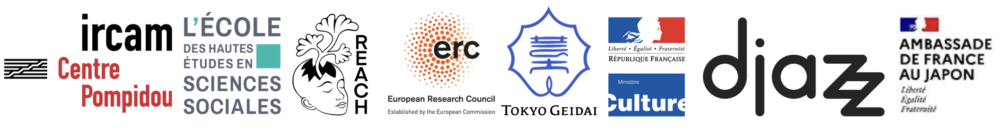

title: Improtech Festival off
status: Hidden

---

This is the Improtech Paris - Tokyo Off program  : Gigs in clubs and small venues by Improtech musicians

## July 27

Joëlle Léandre, Min Tahala  
Egg Farm, Saitama

Jean-Marc MONTERA [g]  
YOKOGAWA Tadahiko [vn]  
FUKUOKA Yutaka [vox] artiste invité  
Nanahari, Tokyo  
19h30  
https://maps.app.goo.gl/PLEjUd13boQZFCnU8

Turner Williams, Rob Noyes
Give me a little more  
Nagoya

## July 28

Marco Fiorini + Anaïs del Sordo, Turner Williams Jr, Rob Noyes  
Hako gallery - Yoyogi-Uehara, Tokyo  
19h  
https://www.tokyogigguide.com/en/gigs/event/32313-marco-fiorini-anais-del-sordo-turner-williams-jr-rob-noyes

## July 29

Joelle Léandre Solo Improvisaiton  
Barber Fuji, Tokyo  
19h  
https://barberfuji.sakura.ne.jp/  

##July 30

JUSTIN VALI, MARC CHEMILLIER, Nao Tokui  
Bar Isshee, Sendagi, Tokyo  
http://www.bloc.jp/barisshee/  

JOELLE LEANDRE/OTOMO YOSHIHIDE  
Polaris, Ogawamachi, Tokyo  
https://polaristokyo.com/schedule/20240730  

## July 31

Ciné-concert de Justin Vali, Marc Chemillier et le cinéaste Takeshi Kamei  
World Kitchen Baobab, Tokyo  

## August 1

GEORGES BLOCH/TAKETERU KUDO/TAKASHI SEO  
Konnoh Hashimangu Shrine, Shibuya, Tokyo  
19h  

## August 3

Jean-Marc Montera meets MIYA & Kota Arai  
Koen-Dori Classics - Shibuya, Tokyo  
19:00  
https://www.tokyogigguide.com/en/gigs/event/32254-jean-marc-montera-meets-miya-kota-arai

Anaïs del Sordo [voice]  
Marco Fiorini [electric guitar, Somax2 generative electronics]  
Turner Williams Jr [Shaahi baaja]  
Rob Noyes [12 strings acoustic guitar]  
Permian, Shinagawa, Tokyo
8pm  
https://permian.tokyo/schedule/august/

Justin Vali et Marc Chemillier  
Métisse live! vol.4 Justin Vali & Marc Chemillier / Bamboo harp “Valiha” and the front line of Malagasy vibes  
Metisse Festival, Nanto, Toyama Prececture  
https://metisse.jp/en/program/239/  

## August 4 

■Anaïs del Sordo (voice)  
■Marco Fiorini (electric guitar, Somax2 generative electronics)  
■Turner Williams Jr (Shaahi baaja)  
■Rob Noyes (12 strings acoustic guitar)  
Otooto, Kitazawa, Tokyo
1:30pm  
http://www.otooto.jp/event  

Projection du film Vata de Takeshi Kamei (https://2020.nipponconnection.com/en/film/2382/vata) suivie de Justin Vali en solo
https://www.facebook.com/kameitakeshi/

 
 

---

 

  

 

 

 

  

 
