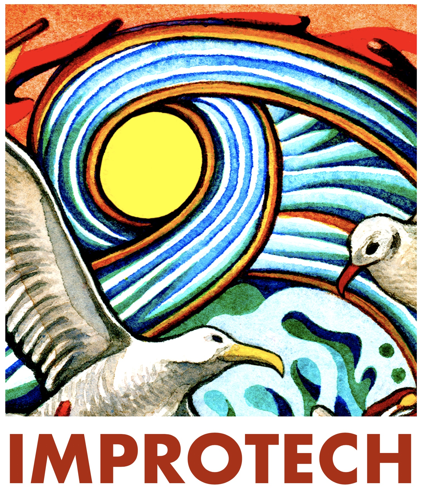

title: Archives

---

### Previous Improtech Editions

[General Improtech Page](http://improtech.ircam.fr) (with video documentation of previous editions)

[Tokyo edition 2024](http://improtech.ircam.fr/ikparistokyo)

[Uzeste edition 2023](http://improtech.ircam.fr/ikuzeste)

[Paris - Athina edition 2019](http://ikparisathina.ircam.fr) 

[Paris - Philadelphia edition 2017](http://ikparisphilly.ircam.fr)

[Paris - New-york edition 2012](http://repmus.ircam.fr/improtechpny)

[Ircam original workshop at SMC'04](http://recherche.ircam.fr/equipes/repmus/SMC04/)

### Improtech Logos and posters

 

  

 

  

 

  

 

 

  

 
 

 

  

 
 

br>

  

 
 

 
 

  

 
 

[Art Work & Graphic Design] © [Turner Williams](https://turnerwilliamsjr.com/)
