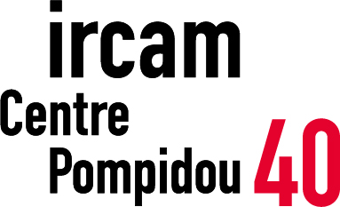

Title: Improtech Paris - Philly 2017 
Status: hidden 
save_as: index.html
Date: 2017-10-23 10:20
Tags: ircam, improvisation, performance, human machine interaction, improtech, omax, artificial intelligence, digital intelligence, machine musicianship
Authors: Gerard Assayag
Summary: Improtech Paris - Philly 2017 gathers scholars, technologists, musicians, makers, around the idea of musical improvisation with digital intelligence 

#### Workshop - Festival, December 11th - 13th, 2017 at the University of Pennsylvania 
 
 
**11th - 13th**, **Workshop** keynotes, presentations, demos and performances at U.Penn, Drexel U. and ICA,  from 9:30 - 18:00  
**11th**, **Evening concert #1** at the Annenberg Center for the Performing Arts  
**13th**, **Evening concert #2** at The Rotunda  
 
 

Improtech Paris - Philly (ikPP) gathers scholars, technologists, musicians, makers, around the idea of **musical improvisation with digital intelligence** (IDI), taking notice of the emergence and development of this new creative field.
ikPP creates a **link between the european and american research and creation scenes** through the symbolic matching of two of their more eminent emblems, Paris and Philadelphia, just as it did a few years ago with Paris and New York.

Five years after its [first iteration in New-York](http://repmus.ircam.fr/improtechpny) the **ImproTech workshop - festival** formula is back again to see the technological, aesthetical, and sociological evolutions that happened since the last gathering.  The meeting place in Philadelphia seems a natural destination, for its unique improvised music scene and history, and its perpetual enchantment with so many ever floating historical musical figures.

The **ImproTech Paris - Philly workshop** will take place at the University of Pennsylvania from **Dec. 11 to Dec. 13** 2017, with **two evening concerts** at the Annenberg Center for the Performing Arts (**dec. 11th**) and The Rotunda (**dec. 13th**), and social events at the Institute of Contemporary Art (ICA).
 
Scholars, students, musicians, makers will come from many places in europe and the US to talk about their work, demo, teach and perform. **ikPP** will flourish on the explosive encounter of prominent research labs and scholars, well established musical figures of Jazz and contemporary music, and the young avant-garde / underground scene of Philadelphia and surroundings.
  

---

##Practical
 
Check **detailed program** [here]({filename}/pages/Program.md), **participants** [here]({filename}/pages/Bios.md), and **venues**  [here]({filename}/pages/Venues.md)

The Improtech Paris-Philly workshop is **open to all and free**.  
Concert #1 is **free for students**, Concert #2 is **free**.

**Please [RSVP]({filename}/pages/RSVP.md) if you intend to come to any of these events.**  

---

---

##Highlights

 
### Concerts

ImproTech brings together artists, musicians, composers and researchers from several continents, all motivated by the possibilities offered by creative improvised interactions between humans and machines of all sorts.  
**ImproTech Paris-Philly :: Concert #1** offers a staggering sampling of such creative alliances, featuring legendary figures of free improvisation, **Roscoe Mitchell, Bob Ostertag and Bernard Lubat**; experimental music icons David Rosenboom and Michael Young; and renowned favorites of the new scene, Steve Lehman, LaDonna Smith, Susan Alcorn, Miya Masaoka, Mari Kimura, Hatchers, György Kurtág Jr and Pierre Couprie. These artists will interact/interface with electronics, synthesis in many forms, mathematical/algorithmic music systems, artificial intelligence agents, spatialization systems and hybrid instruments.

### Workshop

**Keynote** Speakers : **David Rosenboom** (CalArts), **Bob Ostertag** (UC Davis)

**Round Table** : The Figure of the Musician / Researcher, David Wessel Legacy

**36 presentations** including talks, demos, performances

###Participants
 
«  A legend in the field of avant-garde jazz and contemporary music, Mr. **Roscoe Mitchell** is a founding member of the world renowned **Art Ensemble of Chicago**, the Association for the Advancement of Creative Musicians (**AACM**), and many music ensembles. » 

«  Described as “**a state-of-the-art musical thinker**” and a "dazzling saxophonist,” by The **New York Times**, **Steve Lehman** (b. New York City, 1978) is a composer, performer, educator, and scholar who works across a broad spectrum of experimental musical idioms...His recent recording, Mise en Abîme (Pi, 2014) was called the **#1 Jazz Album of the year** by NPR Music and The Los Angeles Times. And his previous recording, Travail, Transformation & Flow (Pi, 2009), was chosen as the **#1 Jazz Album of the year** by The New York Times...» 

«  Born in Uzeste in 1945, **Bernard Lubat**, pianist, vibraphonist, keyboard and accordion player, has played with  **Michel Portal**, Bernard Vitet, François Jeanneau, Jean-Louis Chautemps, Henri Texier… He worked with **Jean-Luc Ponty and Martial Solal**, as a vibraphonist and for **Stan Getz and Eddy Louiss** as a drummer. At the same time he worked in contemporary music with Diego Masson, playing Varèse, Bartok, Xenakis, he took part in the **premiere of Luciano Berio's work Chemin 2 at the Scala de Milan and in the recording of Laborintus**. Lubat has founded the world reknowned **Uzeste Music Festival**... » 

« Composer, performer, historian, instrument builder, journalist, activist, kayak instructor, **Bob Ostertag**'s work cannot easily be summarized or pigeon-holed. He has published more than twenty CDs of music, two DVDs, and five books. His writings on **contemporary politics** have been published on every continent and in many languages. **Electronic instruments of his own design** are at the cutting edge of both music and video performance technology. ... He is rumored to have connections to the shadowy **media guerrilla group The Yes Men**… » 

«**Camae Ayewa** is an interdisciplinary artist based in Philadelphia. **Moor Mother** (Goddess) is her low fi/dark rap/chill step/ blk girl blues/witch rap/coffee shop riot gurl songs/southern girl dittys/black ghost songs/love chants/african warrior spells/kongo hoodoo/holly hill Mississippi root jams/project housing bop/baptism jazz/quantum futurism/anthropology of conscience/superdefstar gospel/Lima dream music/slaveship punk/soultronic beats/death poems project, with which she has toured worldwide and performed at numerous festivals» 
 
**[Read more...]({filename}/pages/Highlights.md)**  

---

---

  

    

