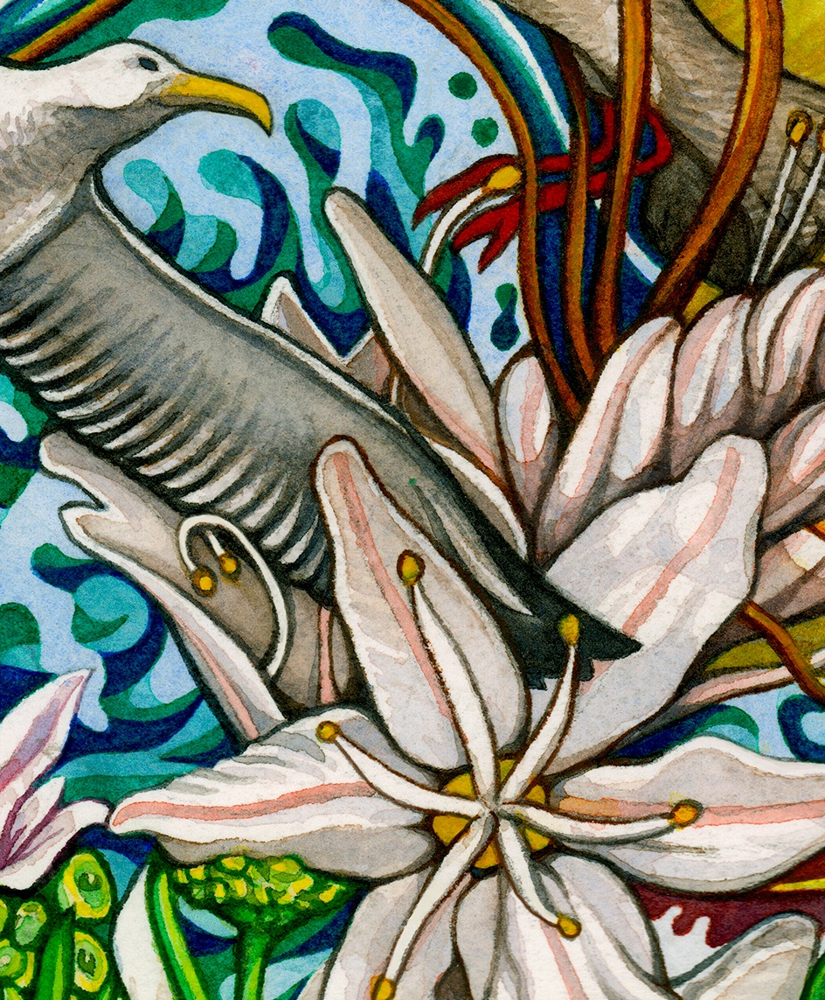

Title: Improtech Paris 2025
Status: hidden
save_as: index.html
Date: 2025-10-18 17:01
Tags: improtech, ircam, improvisation, cocreativity, computer music, performance, human machine interaction, omax, somax, djazz, artificial intelligence, digital intelligence, machine musicianship, computational creativity, cyber human systems, Reach
Authors: Gerard Assayag
Summary: Improtech Paris gathers scholars, technologists, musicians, makers, around the idea of musical improvisation with digital intelligence

#### Workshop - Festival à Paris --  2 au 7 décembre, 2025
Organisé dans le cadre du projet européen **[REACH](https://reach.ircam.fr)**, le festival international **Improtech@Paris** combine l’art universel de **l’improvisation** et les cultures de l’**intelligence numérique** à travers une série de conférences, d’ateliers interdisciplinaires, d’installations, de performances et de concerts. Après avoir parcouru trois continents et réuni des figures de proue du domaine, Improtech revient à l’Ircam, l’un de ses fondateurs, pour une 6e édition qui met l’accent sur l’**espace et la composition/improvisation** et rend hommage au compositeur américain **George Lewis**, une référence incontournable dans le domaine de l’IA musicale.  

L’Ircam accueille Improtech dans sa salle de concert unique au monde, l’**Espace de projection**, incitant à **une triple synthèse** : celle de la culture instrumentale acoustique et de l’Intelligence artificielle créative, celle de l’improvisation soliste et de l’écriture pour ensemble mixte, et enfin celle de la spatialisation et de l’immersion sonore renouvelées elles aussi par l’IA créative.  

 

**Improtech @ Paris** accueille plusieurs personnalités exceptionnelles, dont le grand jazzman new- yorkais **Steve Lehman**, **Joëlle Léandre**, la diva de la contrebasse, le compositeur, tromboniste et pionnier de l’IA musicale **George Lewis**, la décoiffante soprano colombienne **Johanna Vargas**, **Justin Vali** le grand virtuose de la cithare malgache, l’électro- hackeur **NSDOS**, le poète sonore **Jaap Blonk**, les **solistes de l'Ensemble Intercontemporain** **Nicolas Crosse et Aurélien Gignoux**, le **Spat'Sonore** de spatialisation physique tentaculaire, la **Batterie Fragile** d'**Yves Chaudouët** et des porcelainiers de Limoges et bien d’autres encore.  
Le concert de clôture à la Dynamo – Banlieues Bleues de Pantin met en vedette les saxophoniste et guitariste de jazz contemporain **Steve Lehman et Miles Okazaki**, mondialement reconnus comme figures de proue du genre, dans une **master class** publique et un concert d’improvisation en compagnie des **Somax Brothers** de l’Ircam sur leurs drôles de machines gonflées à l’IA.

Au programme: **deux concerts à l'ircam**, le 2 et le 5 décembre, **un concert à la Dynamo **- Banlieues Bleues le 7 décembre. **Conférences et workshops/performances** du 3 au 5 décembre, **Installations - concerts** le 6 décembre à l'ircam.

**[Programme complet et réservations](https://improtech.ircam.fr/ikparis/pages/programme.html)**

 

Organized as part of the European [REACH project](reach.ircam.fr), the Improtech international workshop-festival is dedicated to combining the universal art of improvisation with digital intelligence cultures through a series of conferences, interdisciplinary workshops, installations, performances, and concerts. After traveling across three continents and bringing together leading figures in the field, **Improtech returns to Ircam**, one of its founders, for an edition that will focus on space and composition/improvisation and pay tribute to American composer **George Lewis**, an essential reference in musical AI. 

This year, Ircam will host Improtech  concerts in its unique concert hall, Espace de projection, encouraging **a triple synthesis**:  that of acoustic instrumental culture with the original interactive artificial intelligence developed by the REACH project, that of solo improvisation with writing for mixed ensembles, and finally that of spatialization and sound immersion, also renewed by creative AI. This groundbreaking combination, supported by leading artistic figures in **composition, improvisation, performance, and technology**, will undoubtedly create a dazzling version of this sixth Improtech.

**[Detailed Programme](https://improtech.ircam.fr/ikparis/pages/programme.html)**

 
 

##Highlights
 

This edition of IMPROTECH in Paris will welcome a number of truly exceptional personalities, including celebrated multi-award New-York jazzman **Steve Lehman**, **Joëlle Léandre**, the double-bass diva with life time achievement award, celebrated composer, trombonist and Music AI pioneer **George Lewis**, **Bernard Lubat** the legendary french multi-instrumentist founder of the Uzeste Festival, contemporary classical composers **Lara Morciano**, **Miles Okazaki** guitar virtuoso who worked with **Steve Coleman** and **John Zorn**, **Nicolas Crosse** the extravagant bass player from Ensemble Intercontemporain (EIC), dazzling Colombian Soprano **Johanna Vargas**, electronic hacker and dancer **NSDOS**, the great Malagasy zither virtuoso **Justin Vali**, Composer and computer music designer, legendary dutch sound poet **Jaap Blonk**, **Jose-Miguel Fernandez**, **Marco Suarez-Cifuentes**, exploring the limits of hybrid acoustic/digital composition, sound artist, composer and koto virtuoso **Miya Masaoka**,  **Jean-marc Montera**, avant-garde guitarist specializing in free improvisation and sound experimentation, **Turner Williams Jr** the the spirited musician  playing the syncretic orient-occident instrument shahibaaja, **Gyorgy Kurtag Jr** and his vibrant synthesizers, composer **Nicolas Brochec** exploiting his research on extended techniques recognition with flutist **Kamami Koga**, **Tamami Tono** celebrated Shō player, Gagaku and computer music composer, with bugaku dancer **Minako Ito**, composer **Georges Bloch** with legendary **Jaap Blonk** sound poet and **Benny Sluchin** former Ensemble Intercontemporain trombonist, **Lorenzo Colombo** virtuoso percussionist from the Royal Danish Academy of Music, **Alberto Gatti** the composer exploring audio-tactile vibration devices and space agents, **Anaïs del Sordo** singer with a spirit of experimentation, creativity and extended sonic exploration, virtuoso violonist and inventor of the Mugic© system **Mari Kimura**, celebrated composer **Sivan Eldar**, Electroacoustic composer,performer and designer **Pierre Couprie**, **Thierry Miroglio** an essential reference in contemporary percussions and **Elaine Chew** a prominent pianist and researcher in Music Theranostics.

 

  

 

A special dedicace this year is for **George Lewis** composer, pioneer of musical AI, and great inspirer of all our research projects on autonomous improvising agents. George presents a piece performed by **Joelle Leandre** and **Miya Masaoka**, with the **SoVo** system resulting from common research with [REACH](reach.ircam.fr) and composer and software engineer **Damon Holzborn**.

The **Who/Men** from Ircam (Marco Fiorini, Mikhail Malt, Gérard Assayag, Manuel Poletti) along with **Marc Chemillier** and **Sylvain Cadars** will create a sonic space thanks to the cocreative AI tools from the [REACH](https://reach.ircam.fr) project.

 

  

 

Workshops and performances will see the **Spat'Sonore**, a vast, sprawling instrument with ramifications like “climbing plants in copper tubes topped with corolla pavilions, new instruments like **Federico Visi** Sophtar, International Contemporary Ensemble vibrant percussionist **Levy Lorenzo**, Sheng Master **Li Chin Li**, soulful guitarist **Alain Blesing** with flutist **Claudie Boucau**, the great flautist **Cassia Carrascoza Bomfim** in a telematic performance from Brazil and many others, the dadaist *Batterie Fragile* (Fragile Drum) made of porcelaine by plastician **Yves Chaudouët** interacting with musicians and generative electronics, great Live Coders and electronic artists **Atsushi Tadokoro**, **Raphaël Forment**, **Rémi Georges**, **Guillaume Piccaretta** and several other stunning artists and researchers.

Workshops and lectures will cover a vast panorama of advanced machine learning and machine listening, gestural and spatial control, software environments, Creative Artificial Intelligence, including inevitable esthetical and epistemological questions.

 

  

 

In addition to the  programme at Ircam an exceptional event will enlight this year's Improtech with a a performance at The Dynamo in Pantin featuring celebrated Jazz Saxophonist and Guitarist **Steve Lehman** and **Miles Okazaki** in a contemporary-jazz impro master class and concert, in company of the inevitable who/men aka the Somax Brothers.

 

  
  

 

See the **[full Improtech program here.]({filename}/pages/Program.md)**

 

## A New alliance
 

Improtech is dedicated to the explosive alliance between the age-old art of improvisation and the emerging cultures of digital intelligence. It fosters the co-creative dynamics that can exist between humans and machines, and in so doing, creates new meeting grounds between people, artists and audiences of all backgrounds and levels.

Exploring the relationships between music and science, composition and improvisation, writing and performance, music and other performance arts in "cyber-human" settings, Improtech has established itself as one of the major events of contemporary research and creation.

**[Get a glimpse at previous editions concerts and events here!](https://improtech.ircam.fr/)**

 

## On the Menu
 

**ikParis'25** encompasses conferences, demonstrations, workshops, master classes, musical or multimedia performances / installations, and concerts bringing together some of the world's finest musicians and researchers in beautiful venues.

**ikParis'25** combines a great diversity of aesthetics, mixing musicians from the international jazz, contemporary, live electronics or traditional scene, and the young avant-garde scene.

**ikParis'25** brings artists, researchers, engineers, thinkers, students, inventors, DYI enthusiasts covering a broad spectrum of knowledge fields, from computer science to anthropology, from musicology to critical studies, from philosophy to artificial intelligence, from acoustics to mixed realities...

**Improtech Paris** will focus on education and pedagogy with master classes, workshops, student projects and concerts under the direction of the great invited figures.

**[Read more about ImproTech philosophy and history]({filename}/pages/About.md)**

 
 

  

 
 

