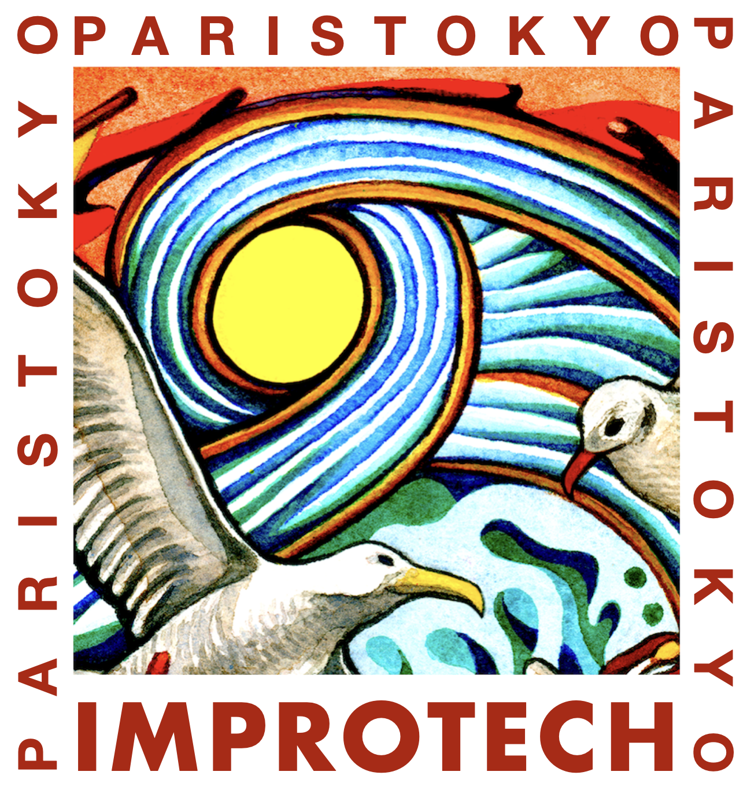

Title: Improtech
Status: hidden
save_as: index.html
Date: 2019-01-28 10:20
Tags: ircam, improvisation, performance, human machine interaction, improtech, omax, artificial intelligence, digital intelligence, machine musicianship, artificial intelligence, computational creativity, cybe human systems
Authors: Gerard Assayag
Summary: Improtech Paris - Athina 2019 gathers scholars, technologists, musicians, makers, around the idea of musical improvisation with digital intelligence

###  ~~ NEWS ~~ [Improtech Paris-Tokyo 2024](https://improtech.ircam.fr/ikparistokyo), will be held f July 29 to August 2 in Tokyo 

 
 

#### This is the general Improtech Home Pages
 

### A New alliance
Improtech is dedicated to the explosive alliance between the age-old art of improvisation and the emerging cultures of digital intelligence. It fosters the co-creative dynamics that can exist between humans and machines, and in so doing, creates new meeting grounds between people, artists and audiences of all backgrounds and levels.

Exploring the relationships between music and science, composition and improvisation, writing and performance, music and other performance arts in "cyber-human" settings, Improtech has established itself as one of the major events of contemporary research and creation.

**Improtech** is both a **musical festival** and an **interdisciplinary workshop** bringing together actors of research and creation from all over the world fostering **musical improvisation** in interaction with **digital intelligences**, in an assumed approach of human-machine **co-creativity**.

### Next Improtech Editions

After praised editions in New York, Philadelphia and Athens, **Improtech @ Uzeste !** (ikUzeste'23) will be held from August 10 to August 13, 2023 at Uzeste, the beautiful occitan village place of the mythical Hestajada de les arts, the music festival founded by Bernard Lubat. Furthermore, it will be the **tenth anniversary** of the creation of Improtech, in NYC in 2012 (well anniversary should have been celebrated last year, but was cancelled as the workshop didn't take place this year and was postponed to 2023)

Go to the [Uzeste edition 2023](https://improtech.ircam.fr/ikuzeste) web site.

### Previous Improtech Editions

[Uzeste edition 2023](https://improtech.ircam.fr/ikuzeste)

[Paris - Athina edition 2019](http://ikparisathina.ircam.fr)

[Paris - Philadelphia edition 2017](http://ikparisphilly.ircam.fr)

[Paris - New-york edition 2012](http://repmus.ircam.fr/improtechpny)

[Ircam original workshop at SMC'04](http://recherche.ircam.fr/equipes/repmus/SMC04/)

### Visuals from Paris-Athina 2019

 
#### Highlights from concerts

<iframe src="https://player.vimeo.com/video/428831250?autoplay=1" width="720" height="405" frameborder="0" allow="autoplay; fullscreen" allowfullscreen></iframe>

#### Documentary

<iframe src="https://player.vimeo.com/video/430770039" width="720" height="405" frameborder="0" allow="autoplay; fullscreen" allowfullscreen></iframe>

#### Opening, Keynote and Full Concerts
Retrieve [movies on Vimeo](https://vimeo.com/showcase/6364851) or parse choose from the video menu below:

<iframe src="https://vimeo.com/showcase/6364851/embed" width="720" height="405" allowfullscreen frameborder="0"></iframe>
 

 
 
 

  

