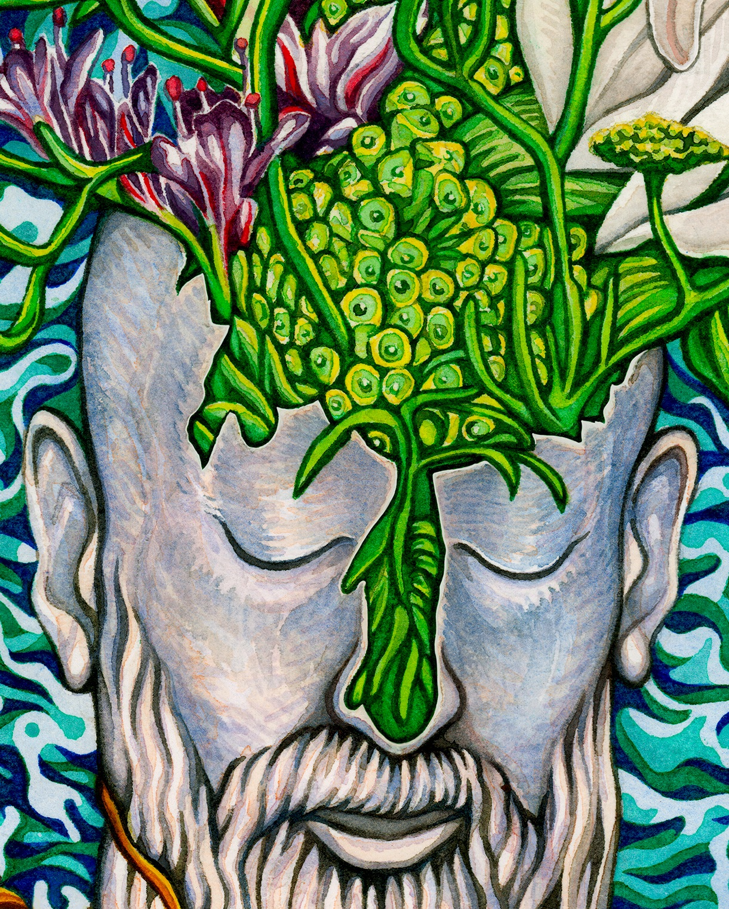

Title: Improtech @ Uzeste 2023 !
Status: hidden

#### Workshop - Festival : Uzeste, France 11-13 August 2023
 
 
**Improtech** is both a **musical festival** and an **interdisciplinary workshop** bringing together actors of research and creation from all over the world fostering **musical improvisation** in interaction with **digital intelligences**, in an assumed approach of human-machine **co-creativity**.

After praised editions in New York, Philadelphia and Athens, **Improtech @ Uzeste !** (ikUzeste'23) will be held from August 10 to August 13, 2023 at Uzeste, the beautiful occitan village place of the mythical Hestajada de les arts, the music festival founded by Bernard Lubat. Furthermore, it will be the **tenth anniversary** of the creation of Improtech, in NYC in 2012 (well anniversary should have been celebrated last year, but was cancelled as the workshop didn't take place this year and was postponed to 2023)

[Get a glimpse at Athens concerts and events videos !](https://improtech.ircam.fr/)

 

## A New alliance
 

Improtech is dedicated to the explosive alliance between the age-old art of improvisation and the emerging cultures of digital intelligence. It fosters the co-creative dynamics that can exist between humans and machines, and in so doing, creates new meeting grounds between people, artists and audiences of all backgrounds and levels.

Exploring the relationships between music and science, composition and improvisation, writing and performance, music and other performance arts in "cyber-human" settings, Improtech has established itself as one of the major events of contemporary research and creation.

For the first time, Improtech will be held in France : **Improtech @ Uzeste!**

 

## On the Menu
 

**ikUzeste'23** encompasses conferences, demonstrations, workshops, master classes, musical or multimedia performances / installations, and concerts bringing together some of the world's finest musicians and researchers in beautiful venues.

**ikUzeste'23** combines a great diversity of aesthetics, mixing musicians from the international jazz, contemporary, live electronics or traditional scene, and the young avant-garde scene of Uzeste.

**ikUzeste'23** brings artists, researchers, engineers, thinkers, students, inventors, DYI enthusiasts covering a broad spectrum of knowledge fields, from computer science to anthropology, from musicology to critical studies, from philosophy to artificial intelligence, from acoustics to mixed realities...

**Improtech @ Uzeste !** will focus on education and pedagogy with master classes, workshops, student projects and concerts under the direction of the great invited figures.

**[Read more about ImproTech philosophy and history]({filename}/pages/About.md)**

 

##Highlights
 

Cette édition d’IMPROTECH à Uzeste met notamment à l’honneur deux légendes de l’improvisation libre, **Evan Parker** et **Joëlle Léandre**. Le premier apparaît dans trois situations : en trio avec la violoniste virtuose américaine **Mari Kimura** et le percussionniste **Laurent Mariusse**, en duo avec son vieux compagnon **Jean-Marc-Foussat** aux synthétiseurs, et dans un double duo invitant outre ce dernier, Joëlle Léandre et **Gérard Assayag** opérant le logiciel d’IA musicale Somax2 pour une co-improvisation machinique dans l’esprit d'IMPROTECH. Joëlle Léandre donne une version spéciale pour Uzeste du spectacle REACHing OUT qui a enflammé le centre Georges Pompidou en juin, avec les **Who/Men** de l’IRCAM opérant Somax2.
Cette édition est aussi honorée de la présence de deux maîtres claviéristes **Benoit Delbecq** et **Jozef Dumoulin** dans leur duo "Plug & Pray" ainsi que de l’immense virtuose de la cithare malgache **Justin Vali** (qui a joué avec Peter Gabriel et Kate Bush) au sein du "Collectif Trans(e)-musical" regroupant **Charles Kely Zana-Rotsy**, autre Malgache virtuose de la guitare, **Lucas Lemoine** électronique, **Yves Chaudouët et Sabina Covarrubias** improvisations visuelles, et **Marc Chemillier** aux commandes du logiciel d’IA musicale Djazz dans le même esprit d’expérimentation qui signe ce festival.

IMPROTECH invite en “vedette américaine” **Mari Kimura** violoniste à l’extrême avant-garde des capacités techniques et expressives de l’instrument inventeuse d’un dispositif unique de captation gestuelle et de contrôle des traitements numériques. Mari participera à l’aventure “Rencontres du 7ème type” avec trois figures familières de l’improvisation aux instruments acoustiques et numériques, **Jean-Marc Montera** (le fondateur du Groupe de Recherche et d'Improvisation Musicales de Marseille), **Pierre Couprie** et **György Kurtag Jr**.

**Jaap Blonk** est une figure mondialement connue de la poésie sonore et des nouvelles vocalités qui explore librement les possibilités de l’électronique et de l’algorithmique. Avec le pianiste **Hervé Sellin**, Django d’or, qui a joué et enregistré avec Michel Legrand,  Chet Baker, Dizzy Gillespie ou Dee Dee Dee Bridgewater, ainsi que la cinéaste **Nurith Aviv** collaboratrice d’Agnes Varda, première femme chef opératrice en France, et figure renommée du cinéma documentaire expérimental, Jaap incarne diaboliquement la pièce multimedia ouverte de **Georges Bloch** "Paris bout-à-bout en abyme ».

La fibre uzestoise est active dans IMPROTECH avec **André Minvielle** (en duo avec le guitariste **Camel Zekri** qui opère la synthèse entre  les traditions africaines comme le Diwan de Biskra et l’improvisation libre avec technologie), le quatuor **Bernard Lubat**, **Sylvain Luc**, **Marc Chemillier** et **Gérard Assayag** dans leur désormais classique performance “Lubax Lux” articulant dans un tourbillon affolant improvisation instrumentale et célébrations machiniques (machiaveliques ?).

La jeune scène est comme toujours bienvenue dans IMPROTECH avec des live-codeurs qui projetteront le code de leurs constructions en temps-réel (**Raphaël Forment et Rémi Georges**), l’école italienne de **Marco Fiorini** (un des Who/Men), **Francesco Diodati** (guitares) et **Lorenzo Colombo** (percussions), jeunes musiciens aux confins de l’instrument et de l’intelligence numérique, **Rob Frye** et **Turner Williams**, autres invités d’Amérique explorant les nouvelles lutheries électriques en résonance avec le brillant percussionniste **Laurent Mariusse** déjà mentionné. Ce dernier n’ignore rien du répertoire des compositeurs du XXème siècle et de la musique contemporaine, ce qui ne l’empêche pas d’être un explorateur averti de l’improvisation et de l’interaction numérique.

Spécialistes de cette musique dite « savante » (l’improvisation est savante en un autre sens) **Benny Sluchin** de l’Ensemble Intercontemporain fondé par Pierre Boulez, **Pavlos Antoniadis**, pianiste virtuose et professeur à l’université de Ioannina en grèce, et **Mikhail Malt**, un des Who/Men de l’IRCAM, mettent l’improvisation sur un plan inédit en l’instituant prolongation versatile et infinie de ce répertoire, notamment Xenakis, Cage mais aussi Eliane Radigue ou Pauline Oliveiros.

Le saxophoniste et compositeur **Maciek Lasserre** invite son partenaire pro-verbe wolof, le rappeur sénégalais **Gaston Bandimic**, pour un duo alliant sampling, écriture jazz contemporaine et rap expérimental.
Tous deux sont membres du MCK Projekt et du collectif avant-rap Sélébéyone (portée par Steve Lehman, musicien majeur de la nouvelle scène jazz américaine).

Héraut de la jeune scène marseillaise, **Cyril Benhamou** (flûte, claviers) tente une fusion impromptue avec le compositeur et performer numérique **Stylianos Dimou**, le clarinettiste **Jean-Brice Godet** et l’inévitable **Laurent Mariusse**. **Shlomo Dubnov** dirige un centre de recherche au Qualcomm Institute à l'Université de Californie à San Diego, il tente de son côté une fusion des résultats les plus récents de l’IA générative et de la performance en y faisant participer le public d'Uzeste.

Outre les concerts du soir, Improtech propose un riche programme de conférences Keynotes, de présentations, de workshops et performances expérimentales dans la journée.

Consultez le [programme complet]({filename}/pages/Program.md).

IMPROTECH@ Uzeste ! :  c’est simplement de la dynamite !

 
 X

  

