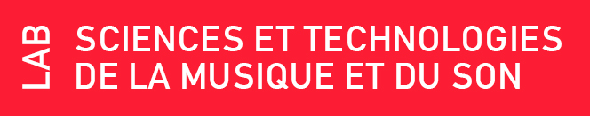
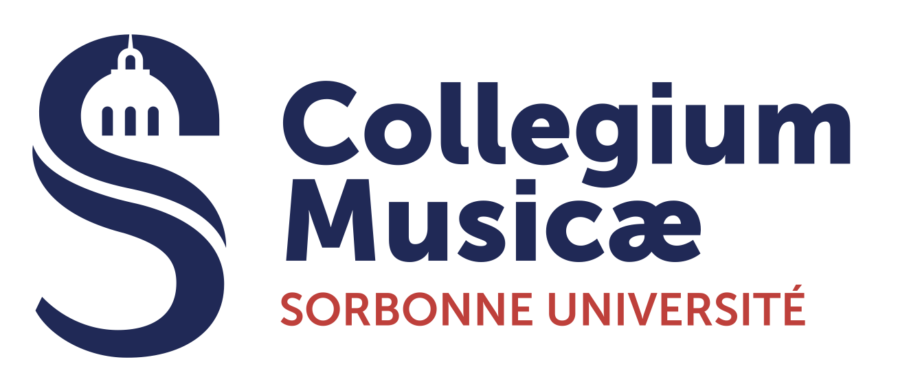
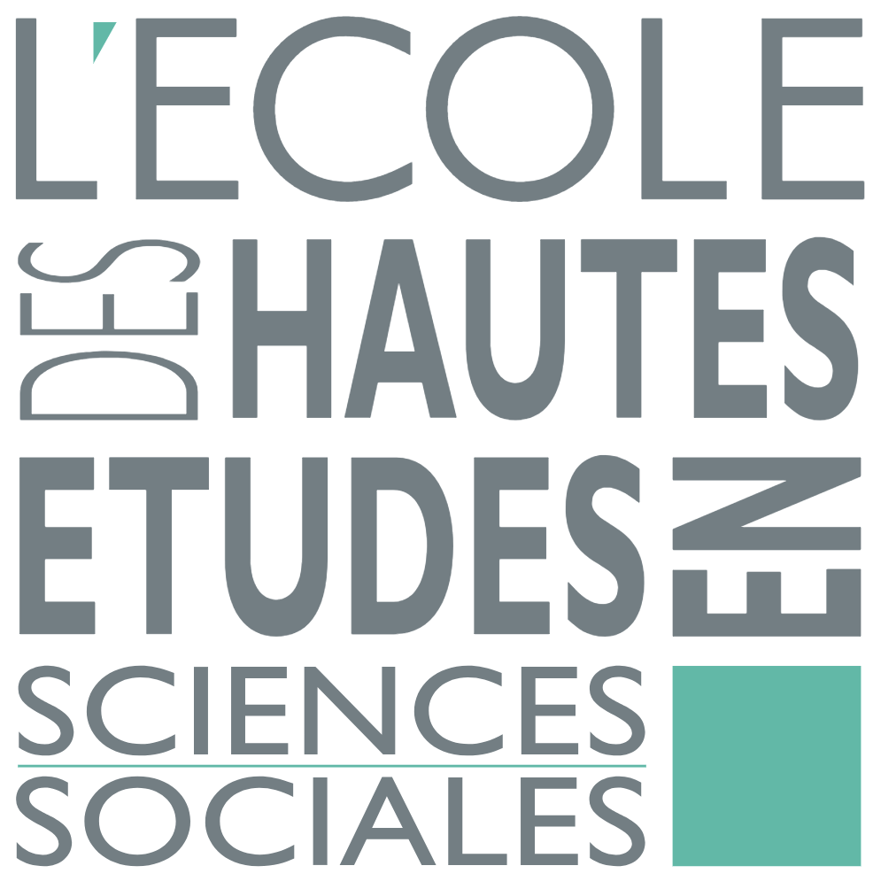
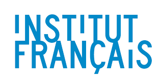
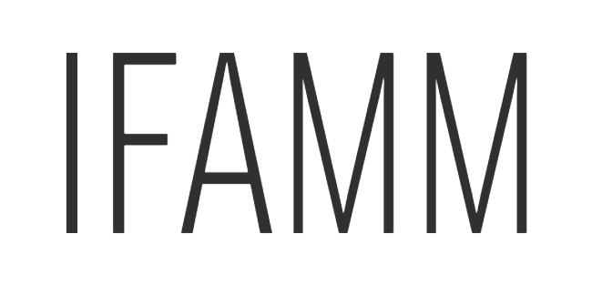
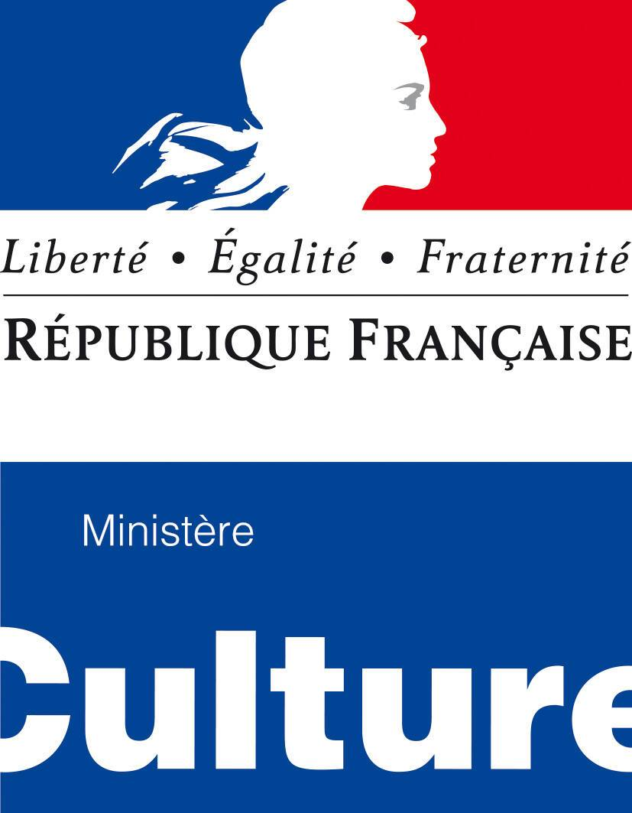
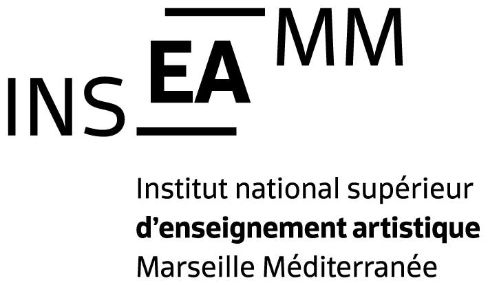

Title: Credits

---

**Improtech @ Marseille !** already receives the support of Ircam, the Agence Nationale de la Recherche, the European Research Council, the CNRS, the Ministry of Culture, the French Institute, Sorbonne Center for Artificial Intelligence, Conservatoire National à Rayonnement Régional Pierre Barbizet de Marseille, INSEAMM, IFAMM, ...

Improtech is an ERC REACH action supported by the European Research Council within the Horizon 2020 program (Convention No. 883313).

Produced & supported by

 

  

 

Supported by

 

 

Under the high patronage of

 

 

A Research & Creation Action of

 

**Improtech** workshop-festival is an original creation by © Gérard Assayag and Marc Chemillier.

 

[Art Work & Graphic Design] © [Turner Williams](https://turnerwilliamsjr.com/)

  
  

 

   
 

