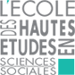
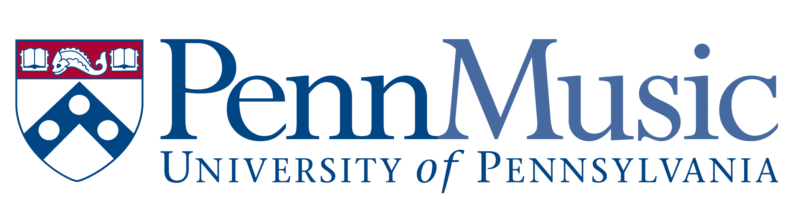
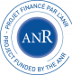
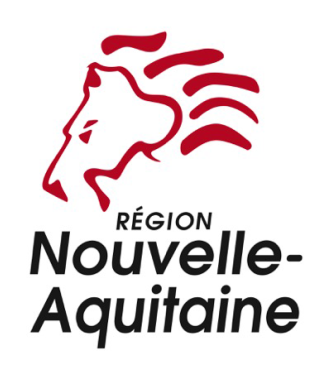
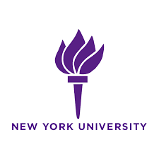
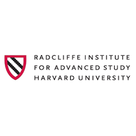
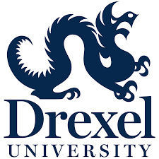
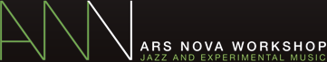
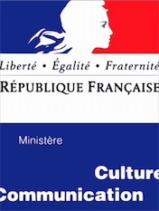
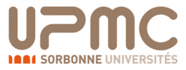

title: Partners

# Credits

ImproTech Paris - Philly (IK-PP) is a priority action of the **DYCI2 research project**, the **Collegium Musicae** Institute, and the  **Jazz augmenté project**, organised by  **Ircam, EHESS, IReMus** and **University of Pennsylvania**.

IK-PP is directly supported financially by **Sorbonne Universités** (Action financée par Sorbonne Universités), **Agence Nationale de la Recherche** (Grant ANR-14-CE24-0002-01) and **Région Nouvelle Aquitaine**.

IK-PP gets different kinds of support and sponsoring  from  :

- Princeton University Pr. Dmitri Tymoczko
- Harvard - Radcliffe institute Pr. Michelle Agnes Magalhaes, RI Fellow
- New York University Pr. Tae Hong Park
- University of California at Irvine Pr. Mari Kimura
- California Institute of Arts (CalArts) Pr. David Rosenboom
- Drexel University (ExCITe Center) Pr. Youngmoo Kim
- University of California at San Diego (UCSD) Pr. Shlomo Dubnov
- HyVibe, Adrien Mamou Mani, CEO
- Concordia University of Montreal, Pr. Sandeep Baghwati
- ICA - Institute for contemporary Art, Philadelphia,
- Annenberg Center, Philadelphia,
- Ars Nova Workshop, Philadelphia.  

Ircam STMS Lab is a joint Lab of IRCAM, Ministry of Culture, CNRS, and Pierre et Marie Curie University. The DYCI2 Project is operated by Ircam-STMS, Inria, and University of La Rochelle. The Jazz augmenté project is operated by Compagnie Lubat, EHESS, Ircam.

---
  

  
  

  

