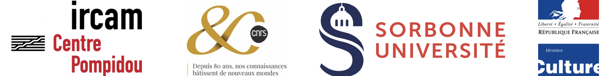

Title: Credits

---

IkPA'19 is brought by

 

 

IkPA'19 is supported by

 

 

IkPA is under the high patronage of

 

<a target="_blank" href="http://www.ircam.fr"> 200"> </a>

 

 [IKPA Art Work]({filename}/pages/Visuals.md) and Graphic Design © Turner Williams

---

     
  
     

