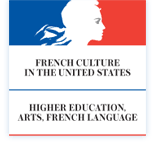
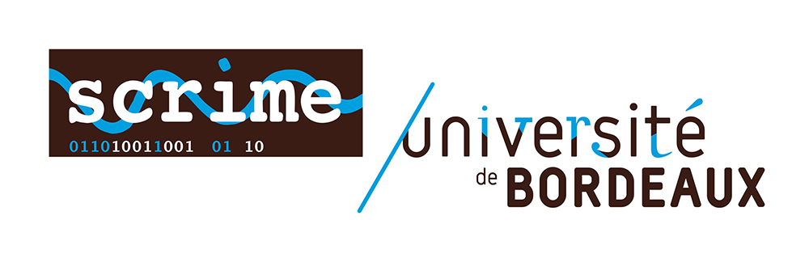
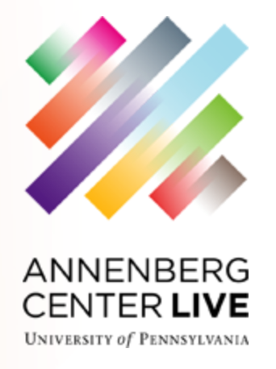
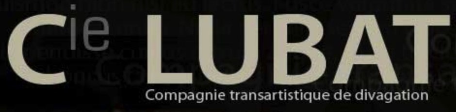
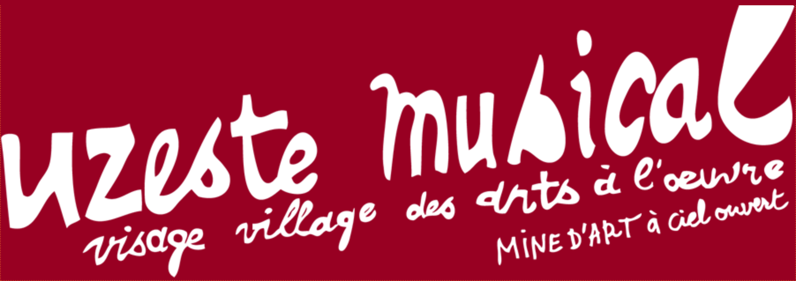

Title: Credits

---

ImproTech Paris - Philly 2017 (IK-PP) is brought by **Ircam** (DYCI2 project), **Collegium Musicae** (Public actions 2017-18),  **djazz** (Jazz augmenté project), **IReMus** and **University of Pennsylvania**.
  

  
IK-PP is directly supported financially by **Sorbonne Universités** (Action financée par Sorbonne Universités), **Agence Nationale de la Recherche** (Grant ANR-14-CE24-0002-01) and **Région Nouvelle Aquitaine - Cultures connectées**.
  

  
IK-PP gets a variety of support or sponsoring  from :

- Cultural Services of the French Embassy & FACE Foundation
- New York University, Pr. Tae Hong Park  
- Studio de Création et de Recherche en Informatique et Musique Électroacoustique (SCRIME), Pr. Györgi Kurtàg
- California Institute of Arts (CalArts), Pr. David Rosenboom  
- Drexel University (ExCITe Center), Pr. Youngmoo Kim
- Princeton University, Pr. Dmitri Tymoczko
- Stanford University CNMAT, Pr. Matthew Wright
- University of California at Irvine, Pr. Mari Kimura
- University of California at San Diego (UCSD), Pr. Shlomo Dubnov
- HyVibe, Adrien Mamou Mani, CEO
- ICA - Institute of Contemporary Art, Philadelphia,
- Annenberg Center for the Performing Arts, Philadelphia
- The Rotunda, Philadelphia
- Ars Nova Workshop, Philadelphia
  

&nbsp; &nbsp; 
&nbsp; &nbsp; 
&nbsp; &nbsp; 
 
&nbsp; &nbsp; 
&nbsp; &nbsp; 
&nbsp; &nbsp; 
&nbsp; &nbsp; 
 
&nbsp; &nbsp; 
&nbsp; &nbsp; 
&nbsp; &nbsp; 

  

---

Ircam STMS Lab is a joint Lab of IRCAM, Ministry of Culture, CNRS, and Pierre et Marie Curie University. The DYCI2 Project is operated by Ircam-STMS, Inria, and University of La Rochelle. The Jazz augmenté project is operated by djazz, Compagnie Lubat / Uzeste Musical, EHESS, Ircam.
SCRIME is a joint creation studio operated by Conservatoire National de Région de Bordeaux, ENSEIRB, and University of Bordeaux 1.
  

&nbsp; &nbsp; 
&nbsp; &nbsp; 
&nbsp; &nbsp; 
&nbsp; &nbsp; 
&nbsp; &nbsp; 
&nbsp; &nbsp; 

  

---

ImproTech Paris Philly 2017 [Art Work]({filename}/pages/Visuals.md) and Graphic Design © Turner Williams

---

     
   
     

